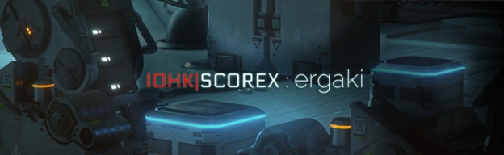

# Ergaki, the Next Scorex Testnet
 17 May 2016[ Alexander Chepurnoy](/en/blog/authors/alexander-chepurnoy/page-1/) 2 mins read

[ Ergaki, the Next Scorex Testnet - Input Output HongKong](https://ucarecdn.com/6a2ecb4a-b4c8-4803-91d0-fb86cd38ef89/-/inline/yes/ "Ergaki, the Next Scorex Testnet - Input Output HongKong")

### [**Alexander Chepurnoy**](/en/blog/authors/alexander-chepurnoy/page-1/)
Research Fellow

Team Scorex Manager

- 
- 
- 

A Scorex application is comprised if core, and Scorex itself is the core functions and module interfaces, and modules. The current testnet, Lagonaki, is made of Permacoin consensus protocol implementation and a simplest Nxt-like payments module. Next testnet release will be called Ergaki. It will be truly experimental and innovative blockchain system intended to be a performant public bulletin board for different protocol(voting, auctions etc). What will be inside Ergaki? 

1. New Proof-of-Work scheme based on [RollerChain](http://arxiv.org/abs/1603.07926). Rational behaviour will be switched on by default, so a node will remove blocks not needed for Proof-of-Work mining. We are also thinking about increasing throughtput with Ghost/Spectre or Bitcoin-NG/ByzCoin scheme. 
1. New transactional module. State will be comprised of [boxes](http://chepurnoy.org/blog/2016/03/cryptocurrency-minimal-state-representation-boxes-vs-accounts/), transactional model will be different from Bitcoin, so no stack-language scripts. 
1. New fees model. Basically, a minimal mandatory fee will be not calculated based on a transaction size, but on state increment. So if a transaction is about state size lowering, it is about minimal or no fee at all. And storing boxes in a state will be charged not for size only, but for life timespan also(with possible exception for a box of some minimal size). So, unlike all other blockchains, it would be not possible to store anything in the Ergaki blockchain forever paying only once. 
1. New improved difficulty adjustment algorithm. A paper on that is basically ready and will be published before release.

We will test Ergaki on some applications using large testbed against a private Ethereum network. The goal is outperform the latter by the orders of magnitude.

Planned testnet release time is about September, 2016.
## **Attachments**
[ Ergaki, the Next Scorex Testnet - Input Output HongKong](https://ucarecdn.com/6a2ecb4a-b4c8-4803-91d0-fb86cd38ef89/-/inline/yes/ "Ergaki, the Next Scorex Testnet - Input Output HongKong")
