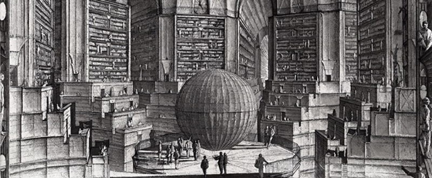

# Ode to the Contrarian Artifacts
 27 August 2016[ Charles Hoskinson](/en/blog/authors/charles-hoskinson/page-1/) 6 mins read

[ Ode to the Contrarian Artifacts - Input Output HongKong](https://ucarecdn.com/d5937e91-96ff-4925-a083-65888fe598d9/-/inline/yes/ "Ode to the Contrarian Artifacts - Input Output HongKong")

### [**Charles Hoskinson**](/en/blog/authors/charles-hoskinson/page-1/)
Chief Executive Officer

Founder

- 
- 
- 

**A Fistful of Pauls**

It was the night of January 3rd, 2008 in Des Moines Iowa. The temperature was a brutally cold ten degrees, yet over a hundred thousand caucus goers endured long lines, confusing rules and poorly organized events to express their political will in the republican primaries. Just days earlier, many internal and some local polls showed Ron Paul performing admirably in a dead heat with Mike Huckabee.

It seemed as if the revolution's recent fundraising wins would translate into votes. It seemed as if the entire republican establishment was going to endure a defeat harsher than the wars they inflicted on the American people over the last eight years. Yet when the results came in, each percent point was like a dagger in the heart of the movement. The end tally was roughly ten percent support for a total around 11,000 people. Some rallies attracted nearly that many people. Somehow Huckabee attracted 4 votes for each of Paul's.

It seemed as if the harsh defeat was now reserved for the Paul movement. Some campaigners, exhausted from running the full grassley twice in just a few of months cried. Other responded with rage. Some argued that the vote had been rigged- afterall, the University commitments alone were 15,000 votes. One campaigner sat silently on an outside bench without a coat carrying a grave thousand yard stare for several hours. It was an easy time to feel hopeless. The remainder of the primaries didn't help.

In the aftermath, many wrote the Ron Paul campaign off as a populist anomaly. An internet era federation of John Birchers marrying the Austrians to return the American people to the 19th century's deflationary horrors and isolationism. How dare a campaign inflict the banality of historical reflection upon the American people! How dare he ask his fellow candidates to [read books](https://www.amazon.com/gp/richpub/listmania/fullview/RJML1CA9L0NCZ) and think about the nature of money!

The appraisal couldn't be further from the truth. The contrarian arguments grew and now have created an entire generation of advocates who desire to end the fed, return to the gold standard, end foreign entanglements and embrace constitutional rights. In a more abstract sense, the contrarian always seems to be maligned, mocked and diminished; however, occasionally plants seeds that will eventually overcome whatever social paradigm they are fighting against.

**Dr. Infinity**

Another figure that comes to mind is Cantor. He is now regarded as one of the greatest mathematicians of the last few centuries including the company of Riemann, Euler and Gauss. Analogous to Paul's heresy of addressing the inconvenient and sensitive topic of monetary policy, Cantor dared to ask deep questions about the nature of infinity. He presented a [diagonalization argument](https://www.youtube.com/watch?v=elvOZm0d4H0) that demonstrated that while both the natural and real numbers are endless, they are somehow a different type of endlessness.

This work simultaneously led to extraordinary questions like the [continuum hypothesis](https://www.youtube.com/watch?v=ZC7wglkBWMM) and to Cantor's dreadful consternation at his peer's sharp dismissals ranging from "grave disease" to "scientific charlatan". While he has been posthumously vindicated, the treatment by his peers and Cantor's subsequent nervous breakdown demonstrates the social consequences of dissent. As a final irony, there are now some mathematicians such as [Norman Wildberger](https://www.youtube.com/watch?v=XKy_VTBq0yk) who are actually in the opposite position.

**Value of Dissent**

The value of contrarians isn't in their efforts to win over the crowd with their counterarguments to the norm- many are in fact completely wrong. Their value is more significant than a policy change or a scientific retooling. The power of contrarian thinking is that it forces a more fundamental appraisal of the axioms and heuristics we tend to use to navigate life.

For example, in the heroic age of medicine, blood letting and cocaine laced mercury were the common notions. Allopathy challenged the entire basis for having these thoughts. The methodology itself was flawed and needed a change.

On the same token, Ron Paul's movement was an electoral failure, but a massive success in the thoughts about money. Value is starting to be viewed more [socially](https://www.amazon.com/Social-Life-Money-Nigel-Dodd/dp/0691169179/ref=sr_1_1?ie=UTF8&qid=1472340537&sr=8-1&keywords=the+social+life+of+money) and globally than siloed, institutionally enforced magical units of account.

Some of Bitcoin's earliest and more ardent adopters were Paulites who already crossed the mental gap of seeing fiat for what it is- a social artifact. Now Bitcoin is a change engine forcing this humbling truth just by its continued growth and existence.

**Lex Ex Machina**

Smart contracts seem to me to be another contrarian mental artifact. They are eating at the roots of the common notions of law. Who should enforce laws? What are contracts? What is intent? How should arbitration be addressed?

We have socially constructed answers to these questions forming a corpus of knowledges hundreds of years old. No human could ever appreciate the totality of opinion and elegance of such a construction much less a mathematician ever read and understand the entire proof of the classification of the finite simple groups.

Yet this system is becoming increasingly more expensive to maintain, riddled with inequities and requires legions of domain experts to just interpret its arcane wisdom. Is it moral to propagate a system that hurts the poor, drains society of resources and favors a rich minority to manipulate at a whim?

Whether the effects of smart contracts have a real impact on commercial transactions and push us towards a private legal system for trade is as relevant as Ron Paul's loss. It's the attack on the fundamentals of the existing paradigm given alternatives that is much more meaningful. Contracts can become understandable open source, composable, templatable and in many cases don't require the heavy hand of government to resolve.

There is already a growing movement from Stanford's [CodeX group](https://law.stanford.edu/codex-the-stanford-center-for-legal-informatics/) to [IBM's Ross](http://www.techinsider.io/the-worlds-first-artificially-intelligent-lawyer-gets-hired-2016-5) providing AI driven legal assistance. As a corollary, I would be authorially negligent if I didn't mention Nick Szabo's recent writings on [Wet and Dry code](https://unenumerated.blogspot.com/2006/11/wet-code-and-dry.html).

Could we now be approaching a future where the government has a moral obligation to give us our own robot lawyer to interpret their Borgesian library of laws? Could we see people switching between legal systems as easily as multinational companies? Will we begin to expect an evolutionary nature in our legal system akin to the accelerating pace of technology? With the right contrarian artifacts perhaps.

**An Artifact in Every Thought**

The concise summary of my thoughts is that we live in a house of ideas, common notions, social conventions and biases inherited from people no smarter or better equipped than us. We cannot accept at face value their gifts and curses. We have an obligation to introduce contrarian artifacts wherever we can. In the attempt to destroy them, we will expose the naked truth of our constructed reality. It might not be pretty, but it always makes us better.
## **Attachments**
[ Ode to the Contrarian Artifacts - Input Output HongKong](https://ucarecdn.com/d5937e91-96ff-4925-a083-65888fe598d9/-/inline/yes/ "Ode to the Contrarian Artifacts - Input Output HongKong")
