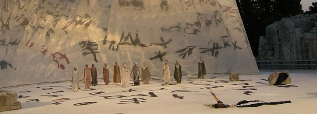

# Ethereum Classic: An Update
 9 September 2016[ Charles Hoskinson](/en/blog/authors/charles-hoskinson/page-1/) 8 mins read

[ Ethereum Classic An Update - Input Output HongKong](https://ucarecdn.com/d030cc0e-7ade-458e-8d86-3129b200f037/-/inline/yes/ "Ethereum Classic An Update - Input Output HongKong")

### [**Charles Hoskinson**](/en/blog/authors/charles-hoskinson/page-1/)
Chief Executive Officer

Founder

- 
- 
- 

I wanted to draft a brief update on IOHK's efforts on Ethereum Classic (ETC). We've had the opportunity to schedule more than three dozen meetings with developers, community managers and academic institutions. We've also managed to have several long discussions with several of the community groups supporting ETC to get a better sense of commitments, goals and philosophy. Overall, it's been a really fun experience getting to know a completely decentralized philosophical movement. It's also been illuminating to parse the challenges ahead for the fragile movement as it charts its own path forward. I'll break the report down into what we learned and what we are going to do.

**What We Learned**

Carlo Vicari and I have been trying to map out the total ETC community and also get some metadata about who they are (vocation, age, geography, interests...) so we can better understand the core constituencies. We will publish some preliminary stats sometime next week, but as a rough summary there are currently several meetup groups, a telegram group, a reddit, several Chinese specific hubs, a slack with over 1,000 members and a few other lingering groups.

Daily activity is growing and there is interest in more formal structure. With respect to developers, there are about a dozen people with development skills and knowledge of the EVM and solidity in the developer channel. They have been holding pretty deep discussions about potential directions and roadmaps. The biggest topics are currently pivoting consensus to PoW without the difficult bomb, new monetary policy and also safer smart contracts.

There is also interest in forming a pool of capital to pay for development efforts ranging from core infrastructure to DApps on top of the system. I haven't taken a position on this effort because we still need to address some governance and legal questions. Regardless of whether this pool materializes, IOHK's commitment of three full time developers will be funded solely by IOHK.

It seems that the price and trading volume of ETC has held relatively stable despite the virtual sword of damocles that is the DAO hacker and RHG funds. It seems that there is enough community interest in ETC to keep liquidity. I do think there will be tremendous volatility ahead and it's going to be impossible to predict when black swans are going to land in our laps, but I suppose that's what makes it fun?

**IOHK's Commitment**

After the initial conversations and analysis, we have determined the following serious deficits with ETC:

1. There isn't an official or reliable channel of information about the events of the ecosystem or commitments of various actors. This reality has lead to FUD, impersonations and attempts at market manipulation in the absence of clarity.
1. The roadmap of ETC needs to include at a minimum an emphasis on safety, sustainability and stability. There is a strong desire amongst the ETC community members we had discussions with to focus on reliable, high assurance applications that run on a network with proven fundamentals. Effectively, this needs to be the antithesis of move fast and break things.
1. There is a desire amongst several well capitalized actors to donate capital to a pool to fund the growth of ETC. This desire has been complicated by the lack of a clear governance structure that will avoid fraud or misuse of funds. Furthermore an open pool would allow funds to potentially become tainted by RHG or Dao hacker donating funds to it. While code is law covers the protocol level use of funds, it does not shield actors from the legal realities of their actions. It is unclear how these funds should be treated or if accepting them would constitute a crime.
1. The media is uncertain how to report on ETC outside of a referential curiosity to ethereum itself . There needs to be a re-branding and media strategy to ensure new users enter the ecosystem with a clear understanding of what ETC is about and how it differs from ETH.
1. Concepts like the replay attack and also new potential technology that could be adopted are not fully understood by ETC community members or general developers. There needs to be actors dedicated to education and explanation.
1. The Ethereum Foundation owns the Ethereum trademark. Further use of this branding could provoke a trademark infringement lawsuit to companies using the Ethereum brand and name. This complicates the formation of a centralized governance entity or steering committee if it chooses to use ethereum classic as its name. It also complicates business commitments to building on the ETC chain.

There are likely more problems, but these seem to be the most pressing for the time being. They are also compounded by the decentralized nature of the movement, which seems to be a boon for resilience, but a curse for agility. Given this fact, IOHK obviously cannot move unilaterally to address all of these problems; however, we can chart a course and invite the community to follow where they deem reasonable.

Thus IOHK is in the process of doing the following:

1. We have interviewed several community manager candidates and will make our final selection sometime next week. He or she will be responsible for assisting meetup group founders, managing social media channels, broadcasting accurate information, combating FUD, collecting feedback from the ETC community and dealing with media entities. My hope is this position will be defined by its interactions with the ETC community and give us a starting point for timely and credible information at the very least.
1. IOHK is going to subsidize an educator to produce content on ETC ranging from the replay attack to new proposals suggested in various roadmaps. We have one candidate in mind and are finalizing the contract and duration of the relationship. All content will be released under a creative commons license and our hope is to again let this role be community driven.
1. IOHK has had numerous discussions with academic partners about the consensus algorithm of ETC and also the smart contract model. We would like to see if the EVM can be improved to be more secure and that Typescript and Purescript could be used as ETC's smart contract languages representing both a functional and imperative approach to development that maps nicely onto the skillsets of existing developers. We are seeing what types of partnerships are possible in the next few months and will provide an update.
1. We've also spent quite a bit of time looking at Smart contract languages on the horizon. There are some excellent ideas coming from [Synereo](https://www.synereo.com/whitepapers/synereo.pdf) and [Juno's Hopper](https://github.com/hopper-lang/hopper). IOHK has entered into a partnership with Kent University to begin an analysis of Transaction Languages used in cryptocurrencies. We will have a survey report available sometime in Q4 of 2016. This report will form the basis of our organization's understanding of the interplay of smart contracts in cryptocurrencies. Once available we will release it to the general public as a whitepaper.
1. We have decided that [Scorex 2](https://github.com/ScorexFoundation/Scorex/tree/664d035d3a0f1b9580480cd29b15863e9b5cb654) will make a good base to build our ETC Main Client ([Read Alex's First Blog on It](http://chepurnoy.org/blog/2016/09/scorex-2-dot-0-a-full-node-view/)). The core is going through a massive refactoring that will be finished sometime this month. From this point, we will retain a scala specific team (our three developer commitment) to fork Scorex 2 and build a full ETC Node including a wallet with GUI. The architecture of Scorex should allow for much faster iterative improvements and also a great opportunity to test our new blockchain specific database [IODB](https://github.com/input-output-hk/iodb/blob/master/doc/authenticated_structures_and_database_layer.md) .
1. With respect to the developer hires in particular, we have taken quite a few resumes already, but also want to make the process open to the general public. Our new community manager will post the job ad on the ETC reddit once he's been hired. I expect the first developer to be announced sometime in September. Quality scala developers with the requisite skills to make meaningful contributions to Ethereum are rare and require careful vetting.
1. With respect to a technological steering committee to guide the roadmap process, we are proposing the formation of a federated group tentatively called the smart contract engineering taskforce (after the IETF). Ideally we could develop an RFC process to propose improvement proposals from the community without the need for a formal, centralized entity. We'd love to see this form as a DAO. There could be two tracks covering changes requiring forks and changes that are iterative in nature. We will start the discussion about this group sometime in early October.
1. IOHK cannot resolve the trademark issue, but will make a commitment to not use the Ethereum brand or name in its repos or company assets. This said, we would like to see some form of bilateral resolution to this situation. It seems pyrrhic to seek trademark enforcement on a decentralized movement. We also understand the confusion this issue is causing the general public and developers.

Overall, it's been a great two months and I look forward to the next few to see ETC continue to grow and become a strong, stable cryptocurrency. I'd like to thank the awesome community and all their help. I'd also like to thank the people who had enough patience to talk with Carlo and me despite the long meetings.

====== Edit: Special Shout out to the Ethereum Classic Russian Community: 

https://ethclassic.ru/
## **Attachments**
[ Ethereum Classic An Update - Input Output HongKong](https://ucarecdn.com/d030cc0e-7ade-458e-8d86-3129b200f037/-/inline/yes/ "Ethereum Classic An Update - Input Output HongKong")
