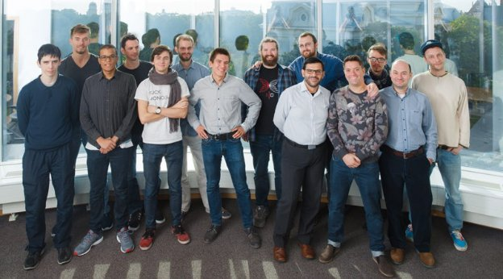

# IOHK | Latvia. Executive update
 19 October 2016[ Jeremy Wood](/en/blog/authors/jeremy-wood/page-1/) 3 mins read

[ IOHK | Latvia, Executive update - Input Output HongKong](https://ucarecdn.com/7b71e844-0cd2-46a6-84e8-080da1052582/-/inline/yes/ "IOHK | Latvia, Executive update - Input Output HongKong")

### [**Jeremy Wood**](/en/blog/authors/jeremy-wood/page-1/)
Founder

- 
- 
- 

For some of the IOHK team it was their first time meeting in person when we gathered in Latvia this month for an intensive working session to push forward several of our key projects. As a distributed company we usually collaborate remotely, across time zones, so coming together to exchange ideas was inspiring. For two weeks in the beautiful capital city of Riga, we advanced our groundbreaking work implementing the first [provably secure proof-of-stake protocol](/en/blog/research/Proof-of-Stake-Protocol-IOHK/). Our research fellow, [Bernardo David](/en/team/bernardo-david/), gave an earlier presentation on the protocol.

Our core developer team and partner, Serokell, is preparing a version of RS|coin to be used in a production system. We published our [implementation of RS|coin](https://github.com/input-output-hk/rscoin-haskell) - the central bank cryptocurrency conceived by University College London researchers - earlier this year.

It’s extremely exciting to know something we built will actually get used and be useful. Our team here in Latvia is working with our Japanese branch to help a client secure their information on the blockchain. The Serokell team, led by [Arseniy Seroka](/en/team/arseniy-seroka/) and [Jonn Mostovoy](/en/team/jonn-mostovoy/), includes expert developers and engineers drawn from Russia, Latvia, Croatia and Portugal. We've found exciting innovations that come from using Haskell. Serokell and the design team are putting the finishing touches to a block explorer for a major client.

Riga has also been very much about our ScoreX project. [Alexander Chepurnoy](/en/team/alexander-chepurnoy/), the director of the [ScoreX](/en/projects/scorex/) project and [Dmitry Meshkov](/en/team/dmitry-meshkov/), IOHK research fellow and ScoreX project developer, gave fascinating presentations on the latest developments of this pioneering framework: a prototype cryptocurrency that allows anyone to slot in and test parts of their own cryptocurrency code.

Both presentations covered the differences and considerations between a pedagogical implementation like ScoreX, meant to be used for research and education, and actually releasing a real cryptocurrency in the wild. In addition, many on the team took the opportunity to learn more about the ScoreX 2.0 release and what progress has been made in making it even more modular and flexible. Written in Scala, the project takes forward research in the area of authenticated data structures. Their findings are due to be published in an academic paper early next year.

Our creative team is here in Riga, and has been working to design the UI and UX for a big project coming next year. And our operations team has been hard at work laying the foundations for all our work. All in all, Riga has been extremely productive and very exciting, and we are very much looking forward to the launch of one of these projects for a major client in a few months.
## **Attachments**
[ IOHK | Latvia, Executive update - Input Output HongKong](https://ucarecdn.com/7b71e844-0cd2-46a6-84e8-080da1052582/-/inline/yes/ "IOHK | Latvia, Executive update - Input Output HongKong")
