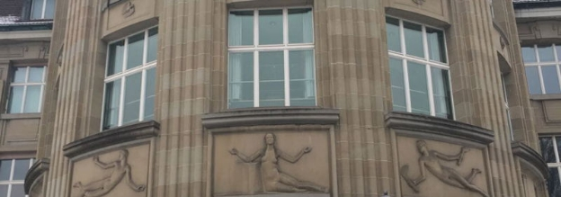
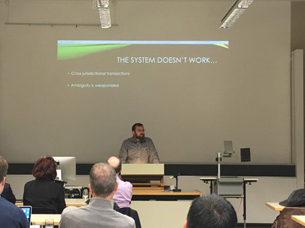

# Smart contracts will use code to reshape law
 20 January 2017[ Jane Wild](/en/blog/authors/jane-wild/page-1/) 2 mins read

[ Smart contracts will use code to reshape law - Input Output](https://ucarecdn.com/f3e9b710-47db-40f7-aec9-7c711dd9e822/-/inline/yes/ "Smart contracts will use code to reshape law - Input Output")

### [**Jane Wild**](/en/blog/authors/jane-wild/page-1/)
Content Director

- 
- 

On a frosty Friday morning in Switzerland’s commercial centre of Zurich, an audience arrived early at the university to learn about the emerging field of smart contracts in a presentation given by Charles Hoskinson. A completely new way of quantifying concepts like trust, reputation and ambiguity, smart contracts are a digital legal system – a computer protocol that facilitates, verifies or enforces the negotiation or performance of a contract.

The idea is now gaining new momentum from ventures including [Cardano](/en/projects/cardano/), and academic papers are also providing a driving force behind the development. These contracts aren’t written in legalese, but in computer code, and that gives them the flexibility to quickly adapt to society’s needs in a way legislation cannot.

 Charles outlined the five elements needed for smart contracts:
## **1. A secure distributed system
**
Who gets to design the protocol is an important question. Useful resources are offered in work by Tim Swanson, who has written a lot about private/public blockchains. [Rich Hickey’s lecture, the Value of Values](https://www.youtube.com/watch?v=-6BsiVyC1kM), is worth watching on YouTube.

## **2. A language in which to write the contracts
**
Cardano’s researchers have conceived Plutus to write its smart contracts. Creating a language is the easy part, but the question of how you deal with ambiguity must be addressed; who would you go to if there is a problem?

## **3. A secure way of performing computation
**
[“Verifiable computing”](https://en.wikipedia.org/wiki/Verifiable_computing) is the concept to explore here. There is a debate about hardware versus software – how can you be sure the system has had no backdoor installed?

## **4. A method of representing assets and value
**
This could be done by creating a token that is pegged to a value-stable currency such as the dollar. Another matter to consider is what jurisdiction the digital asset falls under.

## **5. Trustworthy data feeds
**
In traditional finance this might be supplied by a Bloomberg terminal. A smart contract needs a similar source, but there is no equivalent yet in this field to provide the necessary information stream.

This reimagining of how legal processes can work has the potential to solve some problems of current legal systems, offering a clarity of code in place of ambiguous legal clauses. If needed, a layer can be added to the protocol to allow for human judgement and arbitration. This all combines to sharply bring down the cost of legal services.
## **Attachments**
[ Smart contracts will use code to reshape law - Input Output](https://ucarecdn.com/f3e9b710-47db-40f7-aec9-7c711dd9e822/-/inline/yes/ "Smart contracts will use code to reshape law - Input Output")
