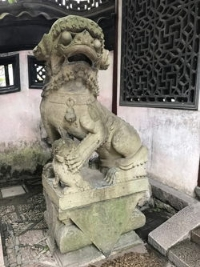
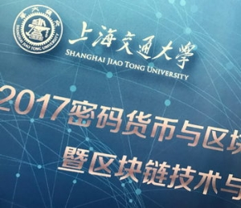
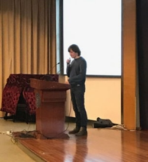
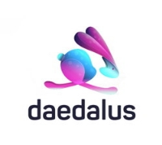

# Shanghai, New York and a hot pink rabbit: January IOHK news round-up
 3 February 2017[ Jane Wild](/en/blog/authors/jane-wild/page-1/) 4 mins read

[ Shanghai, New York and a hot pink rabbit January IOHK news round-up - Input Output](https://ucarecdn.com/c4998c9f-1025-4ee7-8c6b-ead85898008d/-/inline/yes/ "Shanghai, New York and a hot pink rabbit January IOHK news round-up - Input Output")

### [**Jane Wild**](/en/blog/authors/jane-wild/page-1/)
Content Director

- 
- 
## **Winter School on blockchain**
The year got off to an invigorating start for IOHK when a team of its researchers arrived in a chilly Shanghai for the first ever Winter School on cryptocurrency and blockchain technologies.

 The 121-year-old Jiao Tong University – one of China’s leading institutions with alumni including the former president of China Jiang Zemin – hosted the conference in step with a rising interest in blockchain in China, including in its capital of commerce, Shanghai. The winter school follows a similar event in Greece last year, the first Bitcoin Summer School, run by the International Association for Cryptologic Research.

The main hall at the university’s technology building was packed for the three-day event, with a cast of renowned cryptographers on the stage, including IOHK chief scientist [Aggelos Kiayias](/en/team/aggelos-kiayias/ "Aggelos Kiayias, IOHK"). Professor Kiayias presented a double session on his work on proving the security of blockchain protocols. Jonathan Katz from the University of Maryland spoke on game theory, as well as chairing the event.

 IOHK researcher [Alex Chepurnoy](/team/alexander-chepurnoy/ "Alex Chepurnoy, IOHK") gave a talk on [Scorex](/projects/scorex/ "Scorex, IOHK Project"), the prototype cryptocurrency he is working on with fellow IOHK developers [Dmitry Meshkov](/team/dmitry-meshkov/ "Dmitry Meshkov, IOHK") and [Jan Kotek](/team/jan-kotek/ "Jan Kotek, IOHK"). The project is open source, like all of IOHK’s projects, and it aims to speed up the development of blockchains.

A lively panel debate on bitcoin, blockchain and their future, saw IOHK co-founder Charles Hoskinson take to the stage with his former collaborator at Ethereum, Vitalik Buterin.

Other speakers included Andrew Miller from the University of Illinois, Loi Luu from the National University of Singapore, Joseph Bonneau from Stanford University, Vassilis Zikas from Rensselaer Polytechnic Institute and Hong-Sheng Zhou from Virginia Commonwealth University.

During a break in programming the IOHK delegation honed their taxi hailing techniques (Shanghai’s cabs may be empty but that doesn’t mean they will stop) to travel across town for filming. See the videos [here](https://www.youtube.com/channel/UCBJ0p9aCW-W82TwNM-z3V2w/feed "IOHK YouTube videos").
## **Cryptography comes out of the classroom**
Even earlier than Shanghai, IOHK researchers were already busy this January, at Real World Crypto in New York. The aim of the annual conference is to strengthen the links between academics and developers in the hope of bringing the latest research into commercial applications in areas such as the internet, the cloud and embedded devices.

Prof Kiayias, who is chair of Cyber Security and Privacy at the University of Edinburgh, is an organiser and member of the steering committee.

From its beginnings as a gathering of some 150 specialists a few years ago, the audience at Real World Crypto has now grown to almost four times that size.

“We’ve seen more people come each year,” says Prof Kiayias. “Our audience considers this to be the one of the primary events they go to, to get information about the applied aspects of cryptography.”

 

Alex Chepurnoy speaking

Russia-based Alex Chepurnoy also flew to the US for the conference for a [presentation](https://www.youtube.com/watch?v=PHY7JnLrK5o "Improving Authenticated Dynamic Dictionaries, YouTube") on a co-authored paper on blockchain efficiency.

The work, [Improving Authenticated Dynamic Dictionaries](https://eprint.iacr.org/2016/994.pdf "Improving Authenticated Dynamic Dictionaries at IACR"), is written with Leonid Reyzin, Dmitry Meshkov, Alex and Sasha Ivanov.

Topics tackled at the conference included passwords, blockchain, and TLS, the transport layer protocol through which data is exchanged on the internet.
## **Designing a brand**
 A leaping rabbit coloured in shades from hot pink to electric blue was the unlikely contender in the shortlist to become the logo for Deadalus, the wallet currently being put together by IOHK developers. Eight choices remain after designs were put to a popular vote. Designers took inspiration from locks, keys, and mazes in their draft visualisations of the Daedalus logo, referencing the high security of the wallet provided by Haskell code and the [Greek myth of Daedalus](https://en.wikipedia.org/wiki/Daedalus "Greek myth of Daedalus, Wikipedia") – father of Icarus and creator of the Labyrinth in Crete where the Minotaur was held.

Vote for the winner in our [public poll](https://99designs.co.uk/contests/poll/3ctcwt "99DESIGNS.CO.UK")
### **Links**
Visit the ADA faucet to join development on our test net: [tada.iohk.io](https://tada.iohk.io "Cardano ADA Faucet")

Read about Cardano SL: [cardano-docs.iohk.io](https://cardano-docs.iohk.io/ "Cardano SL Documentation")

Download the Daedalus wallet, available soon for OSX & Linux: [daedaluswallet.io](https://daedaluswallet.io "Cryptocurrency Desktop Wallet")
## **Attachments**
[ Shanghai, New York and a hot pink rabbit January IOHK news round-up - Input Output](https://ucarecdn.com/c4998c9f-1025-4ee7-8c6b-ead85898008d/-/inline/yes/ "Shanghai, New York and a hot pink rabbit January IOHK news round-up - Input Output")
