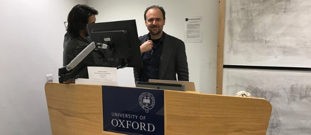
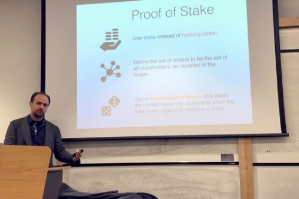

# A Proof-of-Stake lecture at Oxford university
 16 February 2017[ Jane Wild](/en/blog/authors/jane-wild/page-1/) 3 mins read

[ A Proof-of-Stake lecture at Oxford university - Input Output](https://ucarecdn.com/2908eb3c-4d42-41bb-b0e5-4d571219acf0/-/inline/yes/ "A Proof-of-Stake lecture at Oxford university - Input Output")

### [**Jane Wild**](/en/blog/authors/jane-wild/page-1/)
Content Director

- 
- 

Mathematicians with a curiosity about the algorithms behind blockchain came to hear [Aggelos Kiayias](/en/team/aggelos-kiayias/ "Aggelos Kiayias profile") speak at Oxford university’s Mathematical Institute on Wednesday. Professor Kiayias, Chief Scientist at IOHK, had been invited to the university to give a talk on his work on [Ouroboros, a provably secure Proof-of-Stake algorithm](/en/research/papers/a-provably-secure-proof-of-stake-blockchain-protocol/ "Ouroboros Proof-of-Stake paper") for blockchain.

It the first time such a cryptographic protocol has been devised and is significant because its use would enable blockchains to process many more transactions, giving the technology the muscle that would scale it up for far wider use than at present.

“Bitcoin is slow,” he said in the presentation, in an outline of the problem. “The transactions per second of Visa are in the order of many thousands, for Paypal in the order of hundreds, and Bitcoin is far less than that – clearly that’s something that can’t scale to a global level.”

In addition to the much greater efficiency of Ouroboros, Prof Kiayias explained a novel reward mechanism for incentivising the protocol and used game theory to show why attacks such as selfish mining and block withholding would be neutralised.

A Nash equilibrium is a prescription of a strategy for each rational player, with the property that if other players follow it, it does not make sense for a rational player to deviate from it.

Prof Kiayias described how Ouroboros can be proven to be an approximate Nash equilibrium, thus distinguishing this blockchain system from Bitcoin, which is known to be not incentive compatible.

The Ouroboros paper was first published last December with Alexander Russel, Bernardo David and Roman Oliynykov and Prof Kiayias presented the work at the [Alan Turing Institute](https://www.youtube.com/watch?v=whdUSchadEs "Aggelos Kiayias at the Alan Turing Institute") in London last year.

A new version of the Ouroboros technical report will be available as early as next week, and will contain updated benchmarks that illustrate the performance benefits of the protocol.

Among the audience was Hayyu Imanda, whose desire to specialise in cryptography for her PhD studies brought her to hear the presentation. The 22-year-old is currently in a class of 26 students at Oxford university studying for an MSc in Mathematics and Foundations of Computer Science.

“I come from a pure maths background and I find cryptography very interesting, in that it was relatively recently founded and there is so much research happening,” she says. “I see it as a bridge from pure maths into real life, with many uses in terms of security, and it’s going to be a growing field.”
## **Attachments**
[ A Proof-of-Stake lecture at Oxford university - Input Output](https://ucarecdn.com/2908eb3c-4d42-41bb-b0e5-4d571219acf0/-/inline/yes/ "A Proof-of-Stake lecture at Oxford university - Input Output")
