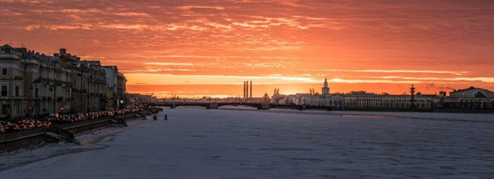

# Mission one – Destination St Petersburg and Warsaw
 22 February 2017[ Jeremy Wood](/en/blog/authors/jeremy-wood/page-1/) 3 mins read

[ Mission one – Destination St Petersburg and Warsaw - Input Output](https://ucarecdn.com/75f3aeb6-df55-4906-896e-6227f81509d5/-/inline/yes/ "Mission one – Destination St Petersburg and Warsaw - Input Output")

### [**Jeremy Wood**](/en/blog/authors/jeremy-wood/page-1/)
Founder

- 
- 
- 

One of my first priorities after coming onboard with the [Grothendieck team](/en/blog/ethereum-classic/introducing-the-grothendieck-team/ "Grothendieck team") to take forward Ethereum Classic was to get out and meet colleagues and IOHK’s developers, wherever they might be. That meant making a trip to St Petersburg and to Warsaw, which was an excellent opportunity to meet face-to-face, and all the more valuable given that we are usually spread out around the world and across timezones. When I arrived in St Petersburg at the end of January to see Alex Chepurnoy, IOHK Research Fellow and Scorex Team manager, the temperature outside was hovering below zero degrees celsius. Lunch involved Alex and I walking across a frozen lake, where a guy was fishing through the ice and another brave citizen in swimming trunks was going for a quick splash in the lake’s icy water. Later, Alex and I put our heads together to look at [Scorex](/en/projects/scorex/ "Scorex") and whether it would be compatible for our Scala implementation of the Ethereum Client. We got into detailed discussions on how consensus is formed in ETC and the differences between it and Scorex, before going on to consider the network layer, and I also learnt from Alex about some of the potential future attacks on Ethereum. By the end of the trip we concluded that Scorex was not the right fit for use on the ETC client, because Ethereum is specified to a much greater degree of detail than Scorex was designed to accommodate. It was a useful discussion to have. We also shared thoughts on the philosophy of how blockchains work and IODB, which Jan Kotek at IOHK has developed specifically as a blockchain database and which supports versioning and key value pairs. All in all, it was a productive trip, rounded off with a visit to the State Russian museum, which I highly recommend.

In early February I visited Warsaw, to get to know the part of the Grothendieck team based in Poland. They normally work from home, so we hired a co-working space in Warsaw. True to the spirit of remote working, we set up a laptop and the Grothendieck team’s Argentine contingent – Alan Verbner and Nicolas Tallar – joined online from Buenos Aires. It was a fun variation from our usual daily call to keep up to date.

So with the Polish part of the team – Radek Tkaczyk, Adam Smolarek, Lukasz Gasior and Jan Ziniewicz – we set out a timeline for our work on ETC and walked through all the functionality filling in gaps in each other’s knowledge as we went along. It was a very useful session followed by a well deserved team dinner and a beer (Thank you Pawel Marzec for organising!) On the second day, with the help of the whiteboard, we went through gas calculation, the architectural layer and architectural layering and components in the codebase.

Next stop, Argentina!
## **Attachments**
[ Mission one – Destination St Petersburg and Warsaw - Input Output](https://ucarecdn.com/75f3aeb6-df55-4906-896e-6227f81509d5/-/inline/yes/ "Mission one – Destination St Petersburg and Warsaw - Input Output")
