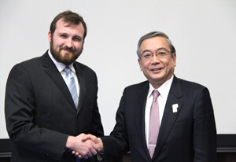

# Scotland and Japan launch IOHK's research network
 28 February 2017[ Jeremy Wood](/en/blog/authors/jeremy-wood/page-1/) 4 mins read

[ Scotland and Japan launch IOHKs research network - Input Output](https://ucarecdn.com/6884d14c-9947-4910-9b61-12d2cb7aca7e/-/inline/yes/ "Scotland and Japan launch IOHKs research network - Input Output")

### [**Jeremy Wood**](/en/blog/authors/jeremy-wood/page-1/)
Founder

- 
- 
- 

L-R: Nikos Bentenitis, IOHK Chief Operating Officer; Aggelos Kiayias, IOHK Chief Scientist; Charles Hoskinson, IOHK Chief Executive Officer and Co-Founder; Johanna Moore, Head of the School of Informatics, University of Edinburgh; Jon Oberlander, Assistant Principal for Data Technology, University of Edinburgh Research is at the core of what IOHK does so I am extremely proud of the company’s achievement in launching blockchain research centres at two world-class universities in February. This is a recognition of the pioneering work that IOHK is doing in advancing the science of cryptocurrencies, producing research that will all be open source and patent-free and progress the industry as a whole.

 We marked the launch of our [Blockchain Technology Laboratory at the University of Edinburgh’s](http://www.ed.ac.uk/informatics/news-events/recentnews/beyond-bitcoiniohk-and-university-of-edinburgh "IOHK and University of Edinburgh Blockchain Technology Lab") School of Informatics last week, which will be led by Professor Aggelos Kiayias, our Chief Scientist. It is Scotland’s first blockchain research partnership between academia and industry, and we are proud to open it at the UK’s leading university for computer science research. Starting immediately, the lab will train the next generation of cryptographers and computer scientists, from undergraduate to post doctoral and professor level. The lab will be interdisciplinary, bringing in experts from the fields that blockchain encompasses, from law to ethics, and from economics to distributed systems. The research centre will also serve as the headquarters for IOHK’s growing network of global university partnerships.

The lab will provide a direct connection between developers and researchers, helping to get projects live faster and will pursue outreach projects with entrepreneurs in Edinburgh’s vibrant local technology community. Recruiting and outreach will begin immediately, and the full facility will be operational from summer 2017, located in the School of Informatics’ newly refurbished Appleton Tower.

Professor Kiayias says: “We are very excited regarding this collaboration on blockchain technology between the School of Informatics and IOHK. Distributed ledgers is an upcoming disruptive technology that can scale information services to a global level. The academic and industry connection forged by this collaboration puts the [Blockchain Technology Lab at Edinburgh](http://uk.businessinsider.com/iohk-sponsors-blockchain-research-lab-at-the-university-of-edinburgh-tokyo-tech-2017-2 "IOHK and University of Edinburgh Blockchain Technology Lab, Business Insider") at the forefront of innovation in blockchain systems.”

 And it was only two weeks earlier that IOHK celebrated another significant deal, at [Tokyo Institute of Technology](http://www.titech.ac.jp/english/news/2017/037573.html "IOHK and Tokyo Institute of Technology blockchain partnership"), a prestigious Japanese university and a leader in technology. Our partnership with them in setting up a Cryptocurrency Collaborative Research Chair is the first time the university has done such a deal and we are honoured to receive this distinction.

Two of our top researchers, Mario Larangeira and Bernado David will be embedded into a team led by Professor Tanaka at Tokyo Tech’s main site, the Ookayama campus. The team, along with professors and graduate students, will tackle industry challenges in this rapidly developing area of research into cryptocurrencies and provide education for the Japanese market. The partnership also includes support for students and researchers to attend international conferences.

 

Charles Hoskinson and Yoshinao Mishima, 
President of Tokyo Tech

Tokyo Tech President, Yoshinao Mishima, says: “This agreement is important because Tokyo Tech is seeking to enhance the collaboration with industries and universities in Japan and abroad by producing groundbreaking results in research and engineering which will be published in internationally renowned scientific journals and conferences.”

These launches are just the beginning of a global network of research centres that IOHK is building, to drive collaboration between the world’s best cryptographers and developers to create the cutting edge blockchain technology that will revolutionise the world’s financial services. Further centres are planned in the US, Europe and beyond. Expect more news this year and in 2018.
## **Attachments**
[ Scotland and Japan launch IOHKs research network - Input Output](https://ucarecdn.com/6884d14c-9947-4910-9b61-12d2cb7aca7e/-/inline/yes/ "Scotland and Japan launch IOHKs research network - Input Output")
