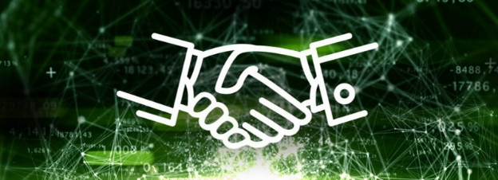

# Thoughts on an ontology of smart contracts
 6 March 2017[ Charles Hoskinson](/en/blog/authors/charles-hoskinson/page-1/) 6 mins read

[ Thoughts on an ontology of smart contracts - Input Output](https://ucarecdn.com/c0c9901b-cfdb-4983-8f1b-aa12e7e7a36b/-/inline/yes/ "Thoughts on an ontology of smart contracts - Input Output")

### [**Charles Hoskinson**](/en/blog/authors/charles-hoskinson/page-1/)
Chief Executive Officer

Founder

- 
- 
- 

The concept of smart contracts has grown considerably since the birth of Ethereum. We've seen an explosion of interdisciplinary research and experimentation bundling legal, social, economic, cryptographic and even philosophical concerns into a rather strange milieu of tokenized intellect. Yet despite this digital cambrian explosion of thought, there seems to be a lack of a unified ontology for smart contracts. What exactly is an ontology? Eschewing the philosophical sense of the word, an ontology is simply a framework for connecting concepts or groups alongside their properties to the relationships between them. It's a fundamental word that generally is the attempt at bedrock for a topic. For example, it's meaningful to discuss the ontology of democracy or the [ontology of mathematics](https://philpapers.org/browse/ontology-of-mathematics "ontology of mathematics").

Why would one want to develop an ontology for smart contracts? What is gained from this exercise? Is it mostly an academic exercise or is there a prescriptive value to it? I suppose there are more questions to glean, but let's take a stab at the why.

Smart contracts are essentially two concepts mashed together. One is the notion of software. Cold, austere code that does as it is written and executes for the world to see. The other is the idea of an agreement between parties. Both have semantical demands that humans have traditionally had issues with and both have connections to worlds beyond the scope in which the contract lives.

Much of the focus of our current platforms, such as Ethereum, is on performance or security, yet abstracting to a more ontological viewpoint, one ought to ask about semantics and scope.

From a semantical perspective, we are trying to establish what the authors and users of smart contracts believe to be the purpose of the contract. Here we have consent, potential for *non est factum* style circumstances, a hierarchy of enforceability and other factors that have challenged contract law. What about cultural and linguistic barriers? Ambiguity is also king in this land.

Where normal contracts tend to pragmatically bind to a particular jurisdiction and set of interpretations with the escape hatch of arbitration or courts to parse purposeful ambiguity, decentralized machines have no such luxury. For better or worse, there is a pipeline with smart contracts that amplifies the semantical gap and then encapsulates the extracted consensus into code that again suffers from its own gap ([Loi Luu](http://www.comp.nus.edu.sg/~loiluu/ "Loi Luu, National University of Singapore") demonstrated this recently using [Oyente](https://eprint.iacr.org/2016/633.pdf "Making smart contracts smarter")).

Then these structures presume dominion over something of value. Whether this dominion be data, tokens or markers that represent real life commitments or things such as deeds or titles. For the last category, like software giving recommendations to act on something in physical world, the program can tell one what to do, but someone has to do it.

So we have an object that combines software and agreements that has a deep semantic and scope concern, but one could add more dimensions. There is the question of establishing facts and events. The relationship with time. The levels of interpretation for any given agreement. Should everything be strictly speaking parsed by machines? Is there room for human judgement in this model (see Nick Szabo, [Wet and dry code](https://unenumerated.blogspot.com/2006/11/wet-code-and-dry.html "Wet and dry code - Nick Szabo") and [this presentation](https://www.youtube.com/watch?v=tWuN2R2DC6c "Nick Szabo on smart contracts"))?

One could make a fair argument that one of the core pieces of complexity behind protocols like Ethereum is that it actually isn't just flirting with self-enforcing smart contracts. There are inherited notions from the Bitcoin ecosystem such as maximizing decentralization, maintaining a certain level of privacy, the use of a blockchain to order facts and events. Let's not even explore the native unit of account.

These concepts and utilities are fascinating, but contaminate attempts at a reasonable ontology that could be constructive. A less opinionated effort has come from the fintech world with both Christopher Clack's work on [Smart Contract Templates](https://arxiv.org/abs/1608.00771 "Smart contract templates: foundations, design landscape and research directions") and Willi Brammertz’s work on [Project ACTUS](https://www.stevens.edu/research-entrepreneurship/research-centers-labs/hanlon-financial-systems-center/research/actus-algorithmic-contract-types-unified-standards "Algorithmic contract types unified standards"). Here we don't need immutability or blockchains. The execution environment doesn't matter as much. It's more about consensus on intent and evaluation to optimize processes.

What about the relationship of smart contracts with other smart contracts? In the cryptocurrency space, we tend to be blockchain focused, yet this concept actually obfuscates that there are three data domains in a system that uses smart contracts.

The blockchain accounts for facts, events and value. There is a graph of smart contracts in relation to each other. Then there is a social graph of nodes or things that can interact with smart contracts. These are all incredibly different actors. Adding relays into the mix, one could even discuss the internet of smart contract systems.

Perhaps where an ontology could be most useful is on this last point. There seems to be economic value in marrying code to law for at least the purpose of standardization and efficiency, yet the hundreds of implicit assumptions and conditions upon which these systems are built need to be modelled explicitly for interoperability.

For example, if one takes a smart contract hosted on Rootstock and then via a relay communicates with a contract hosted on Ethereum and then connects to a data feed from a service such as Bloomberg offers, then what's the trust model? What assumptions has one made about the enforceability of this agreement, the actors who can influence it and the risk to the value contained? Like using dozens of software libraries with different licenses, one is creating a digital mess.

To wrap up some of my brief thoughts, I think we need to do the following. First, decouple smart contracts conceptually from blockchains and their associated principles. Second, come to grips with the semantic gap and also scope of enforcement. Third, model the relationships of smart contracts with each other, the actors who use them and related systems. Fourth, extract some patterns, standards and common use practices from already deployed contracts to see what we can infer. Finally, come up with better ways of making assumptions explicit.

The benefits of this approach seem to be making preparations for sorting out how one will design systems that host smart contracts and how such systems will relate to each other. There seems to be a profound lack of metadata for smart contracts floating around. Perhaps an ontology could provide a coherent way of labeling things?

Thanks for reading,

Charles
## **Attachments**
[ Thoughts on an ontology of smart contracts - Input Output](https://ucarecdn.com/c0c9901b-cfdb-4983-8f1b-aa12e7e7a36b/-/inline/yes/ "Thoughts on an ontology of smart contracts - Input Output")
