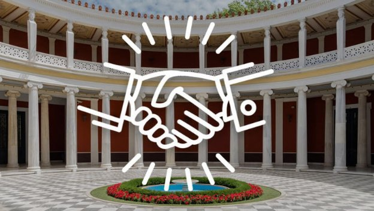

# Smart contracts conference starts in Athens
 31 March 2017[ Jeremy Wood](/en/blog/authors/jeremy-wood/page-1/) 4 mins read

[ Smart contracts conference starts in Athens - Input Output](https://ucarecdn.com/4553482e-aba0-40d4-bf4b-4cb75af5cbcc/-/inline/yes/ "Smart contracts conference starts in Athens - Input Output")

### [**Jeremy Wood**](/en/blog/authors/jeremy-wood/page-1/)
Founder

- 
- 
- 

Experts in law and cryptography are speaking today at a [smart contracts](/en/blog/thoughts-on-an-ontology-for-smart-contracts/ "Thoughts on an ontology for smart contracts") day in Athens, organised by IOHK chief scientist [Aggelos Kiayias](/en/team/aggelos-kiayias/ "Aggelos Kiayias, IOHK profile"), chair of cyber security and privacy at the University of Edinburgh as well as director of its Blockchain Technology Laboratory. Smart contracts are an emerging technology that run on the same infrastructure that supports Bitcoin: a blockchain. They are digital legal contracts between parties that rely not on the traditional rule of law and institutions such as legal offices and courts, but on cryptography. Professor Aggelos Kiayias says: "To understand the technology it is useful to contrast cryptography and law. Law regulates interactions between persons ensuring fairness and basic rights. In this way, law offers protection from other persons with conflicting interests by relying on rule of law and social institutions. On the other hand, cryptography is the science of redistributing trust in any system that emerges from the interaction of multiple persons. It also protects people from other persons with conflicting interests but its protection is achieved by relying on hard mathematical problems."

So how do smart contracts work? Prof Kiayias again: "A smart contract is a piece of code written in a formal language that records all terms for a certain engagement. It has the power to self execute when certain conditions are triggered and can enforce its outcomes in a cryptographic sense. There is a multitude of smart contract applications in areas such as intellectual property, financial instruments, rental and leasing agreements and others."

Also speaking at the conference are [Charles Hoskinson](/en/team/charles-hoskinson/ "Charles Hoskinson, IOHK profile"), IOHK CEO and Co-Founder; Burkard Schafer, Professor of Computational Legal Theory and director of the SCRIPT Centre for IT and IP law at the University of Edinburgh; Peter Van Valkenburgh, Director of Research at Coin Center; and Christoph Sorge, holder of the juris professorship of legal informatics, co-director of the Institute for Law and Informatics, and member of the Center for IT Security, Privacy and Accountability at Saarland University.

[Darryl McAdams](/en/team/darryl-mcadams/ "Darryl McAdams, IOHK profile"), IOHK's Team Plutus manager is working on a new programming language for smart contracts (Plutus) and is in Athens for the conference. According to Darryl, "A smart contract is a program which can implement an agreement of one form or another between multiple parties. They can be simple transfers of money, contracts in the traditional sense involving rights and obligations of various parties, or things more complex such as a game of chess, a distributed library, or a decentralized DNS system. In all of these cases, the purpose and behaviour of the system needs to be well understood, and in many cases, such as financial contracts with large sums of money involved, the correctness of the program is absolutely vital. In my talk, I will discuss the design of the Plutus language, a new programming language for authoring smart contracts, and demonstrate its use. I'll also discuss the motivation behind its design, especially with a view towards correct implementation of a contract's purpose and behaviour."

The event – "Smart Contracts Day, Cryptography & Law: Information, Privacy and Smart Contracts" – is taking place at the Hotel Divani Caravel, in central Athens. It is highly anticipated and currently sold out with more than 200 participants. Here’s more information: [law.bitcoinschool.gr](https://law.bitcoinschool.gr "law.bitcoinschool.gr")

Prof Kiayias concludes: "In the near future, this technology will give rise to "cryptolegal" frameworks, that, by merging cryptography and law, will be able to regulate interactions of persons at a global scale. In this way, such frameworks will transcend geographic and jurisdictional boundaries and create a dynamic global social institution that belongs to all and can be abused by none."
## **Attachments**
[ Smart contracts conference starts in Athens - Input Output](https://ucarecdn.com/4553482e-aba0-40d4-bf4b-4cb75af5cbcc/-/inline/yes/ "Smart contracts conference starts in Athens - Input Output")
