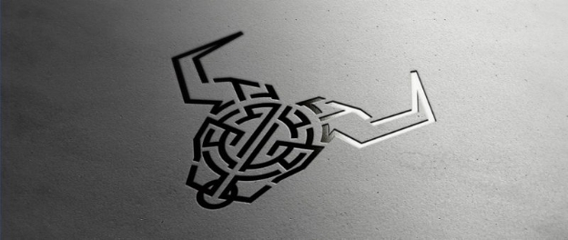
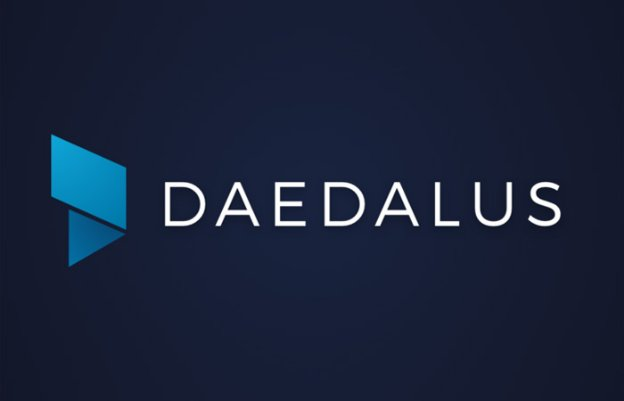
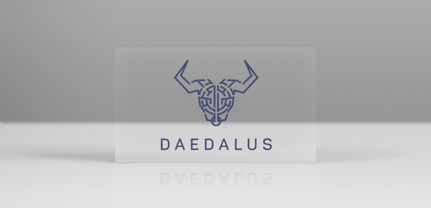
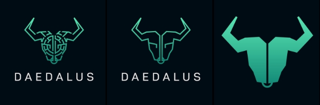
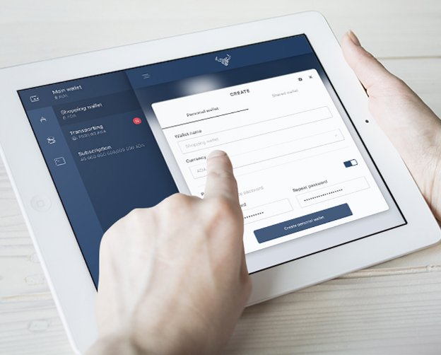

# Finding a brand for Daedalus
 26 April 2017[ Richard Wild](/en/blog/authors/richard-wild/page-1/) 6 mins read

[ Finding a brand for Daedalus - Input Output](https://ucarecdn.com/82a6bef9-c159-4da4-96f1-254a930d738f/-/inline/yes/ "Finding a brand for Daedalus - Input Output")

### [**Richard Wild**](/en/blog/authors/richard-wild/page-1/)
Creative Director

Creative

- 
- 

Just who was Daedalus? It was the first of many questions the design team had to answer when we started work to find a logo for the [digital wallet](http://daedaluswallet.io/ "Daedalus wallet") that will store the Ada cryptocurrency. Daedalus is an unusual name. We were in Riga, on an IOHK working sprint last autumn, when we got the brief to develop the visual identity and brand for the wallet, so the first thing we did was some [research online](https://en.wikipedia.org/wiki/Daedalus "Daedalus, Wikipedia.org").

It turns out that the name was chosen with good reason for a cryptocurrency wallet. An important figure in Greek mythology, Daedalus was the father of Icarus, a great artist, an innovator… as well as the creator of the labyrinth that kept the minotaur forever captive.\_

IOHK wants the wallet it is creating to be the best cryptocurrency wallet out there. Not just a place to store, send and receive cryptocurrency (the first of which it will hold is Ada) but a place where you can later access plug-ins and other developer tools/SDKs, anything from managing your mortgage to splitting a bill between people. The vision is that it will become a platform full of applications, and be as important a product as Internet Explorer was for Microsoft.\_

The creative team needed to find an identity that would connect to that vision, to the meaning behind the name Daedalus and his story, and to what IOHK is as a company and the technology it builds.\_

We got together to discuss it and an idea came out.\_

According to the myth, the minotaur never escapes the maze – that’s how good a craftsman Daedalus was.\_

We argue creatively that the minotaur is your money, or your digital identity. The minotaur is forever held in an infinite prison where only you control your keys. We have a lot of clever cryptography powering the security of the wallet, and like the minotaur in his maze, your money will never be able to escape our wallet, so Daedalus represents our expertise in security, and in building methodically and securely.\_

[Tomas Vrana](/en/team/tomas-vrana/ "Tomas Vrana, IOHK profile") and [Alexander Rukin](/en/team/alexander-rukin/ "Alexander Rukin, IOHK profile"), both part of the design team, came up with some early concepts. Among many different designs, Tom produced a minotaur; Alexander came up with a contemporary “D” design. They came up with creative sketches and drawings, trying to gauge how best to approach the form and the function of the logo. Some of their early designs are below.

 Ribbon variant

 Flat maze variant

 Ribbon variant

 Origami Minotaur variant

 Gothic “D” variant

 Minotaur variant

Then we threw open the design challenge to a competition, connecting to a community of designers to offer their solutions. This would provide us with a wealth of ideas and give us interesting feedback. We had about 100 entries from graphic designers, ranging from the bad, to the good, to the funny. There were solid corporate identities, also very creative executions. There were lots of designs based on the letter “D”. And lots based on keys (with a nod to public key cryptography). However, that was too obvious. We are a crypto wallet, yes we have keys. A simple key in a logo didn’t covey a strong brand message, it didn’t set us apart. None was quite right.\_

We were looking for something that would connect to the Daedalus story and have a huge potential for creative story telling in being a brand we could develop.\_

So we updated the brief and asked the designers to focus on the story of Daedalus. There were about 30 entries this time. A maze in the shape of a key was good, but not excellent. And there were lots of minotaurs. On some, the execution was not great. There was one that looked like a pixelated deer.\_

The one we finally chose, with the help of IOHK’s two founders, was by a designer called Zahidul Islam. It’s contemporary, it feels modern and fresh yet connects to a very old story. It has the minotaur. It’s a well crafted form, it’s balanced, and yet still has the maze motif in it – it reflects the identity of our brand.\_

There was one issue, it was quite complex, which meant it didn’t work at smaller sizes. So we worked with the designer to develop a brand hierarchy – which comprises a primary, secondary and tertiary form for the identity to be used in various situations as the rules dictate.\_Below are the primary, secondary and tertiary images, each with successively less complexity.

The primary logo will be the larger formats, for example to be used on T-shirts, or on main focal areas such as loading screens. (We have a plan to develop the identity, to make it a “living” brand that is dynamic, so you see it moving if you have to wait for the screen to load for instance.)

The secondary logo will be more of a symbol and used at smaller sizes. Some of the complexity has been removed, and it will be used if the requirements are for 64 pixels or smaller. And then we produced a tiny icon, to be used for example as a security feature on paper wallets.

The colours you see might change. The colour palette of the brand has only black and green in it now.

So why did we go to all this effort over five months?

Behind the Daedalus wallet is so much time, money, skill and effort. You wouldn’t want to represent all that hard work with a mark that is unconsidered, or one that lacks capacity to carry the story of Daedalus. You want to bring enigma, some creation to the symbol that represents your quest. This is about more than a platform, it is a brand and about building brand allegiance. It has to stand out, be different and make people think of you. This brand has a lot of runway, a lot of potential for development creatively. The design may change as the brand evolves, but the current identity will scale and develop into something wonderful from this point on.\_
## **Attachments**
[ Finding a brand for Daedalus - Input Output](https://ucarecdn.com/82a6bef9-c159-4da4-96f1-254a930d738f/-/inline/yes/ "Finding a brand for Daedalus - Input Output")
