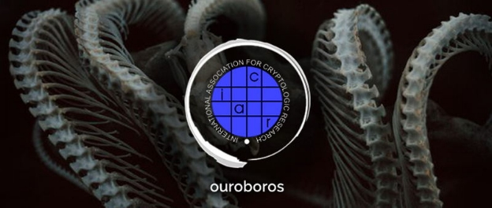

# Proof-of-stake protocol, Ouroboros, at Crypto 17
 19 June 2017[ Jeremy Wood](/en/blog/authors/jeremy-wood/page-1/) 3 mins read

[ Proof-of-stake protocol, Ouroboros, at Crypto 17 - Input Output](https://ucarecdn.com/08d43ed2-8744-43be-a22c-394c13939677/-/inline/yes/ "Proof-of-stake protocol, Ouroboros, at Crypto 17 - Input Output")

### [**Jeremy Wood**](/en/blog/authors/jeremy-wood/page-1/)
Founder

- 
- 
- 

I am delighted to see the recent [news coverage](http://www.econotimes.com/IOHKs-proof-of-stake-blockchain-protocol-accepted-to-Crypto-2017-759913 "EconoTimes, IOHK’s proof-of-stake blockchain protocol accepted at Crypto 2017") about the [Ouroboros paper](/en/research/papers/#9BKRHCSI "Ouroboros paper, iohk.io") being accepted to Crypto 17, the most prestigious cryptography event of the year. No other blockchain protocol, apart from Bitcoin, has achieved this level of academic peer review. This is recognition from the academic community that this paper is a serious contribution to cryptography, in being the first Proof-of-Stake protocol to be provably secure. In computer science, what matters in terms of gaining a stamp of approval for new research is not being published in journals, as is the case in many other fields. Instead, what is most important is having the paper accepted by conferences to be scrutinised by fellow academics. This is why we are very proud that our researchers’ work has been admitted to [Crypto 17](https://www.iacr.org/conferences/crypto2017/ "IACR, Crypto 17").

The conference takes place in California during August and topics covered include all aspects of cryptography, not only Bitcoin and blockchain.

Developing a secure Proof-of-Stake protocol is one of the big problems to solved in cryptography. It is the key to blockchains being scaled up to handle many more users than it can at the moment. You only have to look at the hurdles that Proof-of-Work based Bitcoin is facing, as it undergoes a struggle to upgrade its technology, to see why Proof of Stake is important.

Proof-of-Stake protocols have the advantage of avoiding the huge computer processing resources demanded by Proof-of-Work systems – one study showed that the energy required to run Bitcoin’s blockchain was equivalent to the power consumed by a small country.

It is highly unusual for a new protocol to progress this quickly from research to implementation, with publications usually taking years to mature for real-world use. Our researchers know of no other cryptography paper that has progressed through peer review this fast. Ouroboros is already being applied to industry use – it is going into Cardano, a blockchain platform being developed by IOHK.

Professor Aggelos Kiayias, who led the research, says: "Building a secure Proof-of- Stake blockchain is an important open problem and I am very happy that we will share our progress towards its resolution with fellow cryptographers at Crypto this year. In Ouroboros, we flesh out for the first time the combinatorial nature of proving the security of Proof of Stake blockchain protocols and I anticipate that our methodology will be valuable widely to blockchain researchers.

"By developing a provably secure Proof-of- Stake protocol, we can now confidently build a blockchain that can handle many more users, resolving many of the scalability and performance issues faced by proof-of- work based protocols like Bitcoin. We have already implemented Ouroboros and tested it with a cloud deployment with very good results."

"With Ouroboros, as well as the upcoming version of our protocol [‘Ouroboros Praos’](/en/research/papers/#XJ6MHFXX "Ouroboros Praos") that will be released soon, IOHK is at the forefront of efficient and secure blockchain research and development," Prof Kiayias adds.

Crypto 17 is the 37th International Cryptology Conference. It will be held from August 20 to 24 this year, at the University of California, Santa Barbara, and is sponsored by the International Association for Cryptologic Research (IACR).

Further information on the Ouroboros paper is also available in a [series of videos](https://www.youtube.com/watch?v=Nlmv4fg4NQk&list=PLnPTB0CuBOBw9H7dynFu9U25vqFWRw1UX "Ouroboros, Youtube").
## **Attachments**
[ Proof-of-stake protocol, Ouroboros, at Crypto 17 - Input Output](https://ucarecdn.com/08d43ed2-8744-43be-a22c-394c13939677/-/inline/yes/ "Proof-of-stake protocol, Ouroboros, at Crypto 17 - Input Output")
