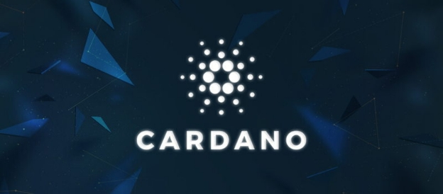

# Why we are building Cardano
 10 July 2017[ Charles Hoskinson](/en/blog/authors/charles-hoskinson/page-1/) 3 mins read

[ Why we are building Cardano - Input Output](https://ucarecdn.com/098df8e0-c492-4615-ad2f-350d595be382/-/inline/yes/ "Why we are building Cardano - Input Output")

### [**Charles Hoskinson**](/en/blog/authors/charles-hoskinson/page-1/)
Chief Executive Officer

Founder

- 
- 
- 

I’m delighted to announce the release of [Why Cardano](http://whycardano.com/ "Why we are building Cardano, IOHK"), a document explaining the philosophy behind the design and development of [Cardano](/en/projects/cardano/ "Cardano project, IOHK"). Publishing this is a key milestone for the project and I hope it helps with explaining why we are building Cardano. The document is fully translated to Japanese, Chinese and Korean, also join the community by visiting Cardano community social channels via [cardanohub.org](https://cardanofoundation.org/ "Cardano Foundation's website").
### **Introduction**
Cardano is a project that began in 2015 as an effort to change the way cryptocurrencies are designed and developed. The overall focus beyond a particular set of innovations is to provide a more balanced and sustainable ecosystem that better accounts for the needs of its users as well as other systems seeking integration.

In the spirit of many open source projects, Cardano did not begin with a comprehensive roadmap or even an authoritative white paper. Rather it embraced a collection of design principles, engineering best practices and avenues for exploration. These include the following:

- Separation of accounting and computation into different layers
- Implementation of core components in highly modular functional code
- Small groups of academics and developers competing with peer reviewed research 
- Heavy use of interdisciplinary teams including early use of InfoSec experts
- Fast iteration between white papers, implementation and new research required to correct issues discovered during review
- Building in the ability to upgrade post-deployed systems without destroying the network
- Development of a decentralized funding mechanism for future work
- A long-term view on improving the design of cryptocurrencies so they can work on mobile devices with a reasonable and secure user experience
- Bringing stakeholders closer to the operations and maintenance of their cryptocurrency
- Acknowledging the need to account for multiple assets in the same ledger
- Abstracting transactions to include optional metadata in order to better conform to the needs of legacy systems
- Learning from the nearly 1,000 altcoins by embracing features that make sense
- Adopt a standards-driven process inspired by the Internet Engineering Task Force using a dedicated foundation to lock down the final protocol design
- Explore the social elements of commerce
- Find a healthy middle ground for regulators to interact with commerce without compromising some core principles inherited from Bitcoin

From this unstructured set of ideas, the principals working on Cardano began both to explore cryptocurrency literature and to build a toolset of abstractions. The output of this research is IOHK’s extensive [library of papers](/en/research/library/ "IOHK Research Library"), numerous survey results such as this recent [scripting language overview](/en/research/papers/#J8N6AMPU "Scripting smart contracts for distributed ledger technology, IOHK Paper") as well as an [Ontology of Smart Contracts](/en/research/papers/#GSU52TA9 "Ontology of Smart Contracts, IOHK Paper"), and the [Scorex project](/en/projects/scorex/ "Scorex project, IOHK"). Lessons yielded an appreciation for the cryptocurrency industry’s unusual and at times counterproductive growth.

Read More »
## **Attachments**
[ Why we are building Cardano - Input Output](https://ucarecdn.com/098df8e0-c492-4615-ad2f-350d595be382/-/inline/yes/ "Why we are building Cardano - Input Output")
