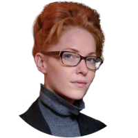
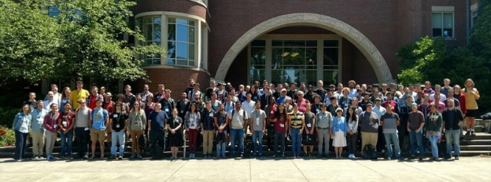
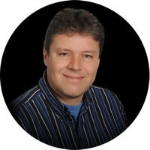
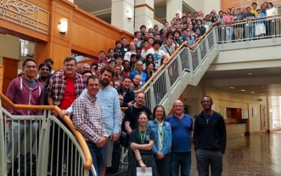

# First Hand Experiences of the Oregon Programming Languages Summer School
 27 July 2017[ Tamara Haasen](/en/blog/authors/tamara-haasen/page-1/) 11 mins read

[ First Hand Experiences of the Oregon Programming Languages Summer School - Input Output](https://ucarecdn.com/ec94b2fe-7939-4a71-a84a-ac7b22530473/-/inline/yes/ "First Hand Experiences of the Oregon Programming Languages Summer School - Input Output")

### [**Tamara Haasen**](/en/blog/authors/tamara-haasen/page-1/)
President & Chief of Staff

Human Resources

- 
- 
- 

The Oregon Programming Languages Summer School (OPLSS) takes place annually at University of Oregon, and brings together academics and professionals who are interested in programming language theory. The goal of the school is to provide an opportunity for participants to understand the current landscape in programming language research.

During this two-week program, professors [lecture](https://www.youtube.com/channel/UCDe6N9R7U-RYWA57wzJQ2SQ/playlists "OPLSS lectures, YouTube") on a mix of the fundamentals and recent research in the field. Since its start in 2002, OPLSS has covered a [range of topics](https://www.cs.uoregon.edu/research/summerschool/archives.html "Topics, OPLSS"), including logic, language semantics, and mathematical proofs about language properties.

This year, the theme was "A Spectrum of Types". This focuses on programming languages that can feature a type system to help programmers detect and prevent errors early in the development process.

Toward the end, lecturers explored how typed languages can safely interface with untyped languages using contracts or proofs about the behavioral equivalence of programs implemented in different languages.

Here are the experiences of three of our team members who attended the OPLSS:

[**Lars Brünjes](/en/team/lars-brunjes/ "Lars Brünjes, IOHK profile") **is a Cardano SL Developer within Team Haskell at IOHK**

When I flew to Eugene, Oregon, to attend the OPLSS 2017, the Oregon Programming Languages Summer School, I was both very excited and a bit apprehensive.

I was excited for the chance to play student again, immerse myself into an academic environment and learn new things. I was also apprehensive because I had no formal background in type theory and was afraid that all the lectures would be well above my head.

The first lecture by Bob Harper, the "God" of type theory, seemed to confirm my worries. I could barely read his handwriting on the whiteboard (my wife claims I’m too vain to wear glasses, maybe she has a point), and most of the things he mentioned in passing as something everybody knew were actually new to me. Bob Harper also doesn’t like Haskell – a fact that made me like his lecture even less.

However, things went steeply uphill from there.

The next two lectures of the day were much easier to follow; I understood almost everything. In the afternoon "handson session", I started working on an exercise put forward by Bob, implementing a type checker and interpreter for "Gödel T", and programming Euclid’s Algorithm in that language.

We were encouraged to do that exercise in ML, but of course I did it in Haskell (take that, Bob!), and actually working with the material made things a lot clearer for me.

The next day’s lecture by Bob was actually fascinating and a lot of fun. I finally understood how different ingredients come together to endow a language with features like polymorphism, inductive, dependent types, or general recursion.

Over the next two weeks, I learnt a lot about dependent types, gradual types, session types, and secure compilation.

I also received an introduction to Idris, the "dependently typed Haskell", by Edwin Brady, the creator of the language himself! After that, I spent every idle moment hacking in Idris.

 This is what made OPLSS 2017 a great experience for me: not only did I learn lots of new things, I also felt inspired. Being surrounded day and night by highly motivated and intelligent people does that to you.

Speaking of people – they were great! Both the instructors, who all tried very hard to deliver excellent lectures, and the participants, who all shared their excitement for the material and their willingness to learn, no matter how tired and jetlagged they were. There were people from all over the world, and talking to them, exchanging stories, ideas, and experiences, was wonderful.

I also really enjoyed getting to know my colleague Jake Mitchell better. Over many beers at the nearby pub, we talked about everything, ranging from Idris and dependent types, to politics and religion. I love working for a remote company like IOHK, but sometimes it is really nice to be in the same room with a colleague and be able to have a beer with him!

After the two weeks were over and we had to start thinking about travel arrangements home, we were all very sad. One Chinese PhD student even cried and couldn’t be comforted when she had to say goodbye. It was a fantastic experience for me, and I am very grateful for IOHK for giving me the chance to attend. I would be even more grateful if I could attend again next year (pushing my luck here)!

 \*\*Kawin Worrasangasilpa is a PhD student working on formal verification of Proof of Stake at IOHK\*\*

I attended both the review sessions and the main program of OPLSS 2017 over the course of three weeks. With only self-taught knowledge that I had about type theory, I was slightly worried about understanding these lectures.

The first three days were allocated for the review sessions for those who hadn’t had proper training in type theory. One of the lecturers, Paul Downen, prepared us with 11 presentations, so we could be confident enough to jump to the main sessions after this. I felt calm and prepared when I finished these three days, and most of my main questions were answered.

The content provided during the three-day session, and the academic atmosphere naturally created by all of the participants who were eager to learn new things, was fantastic. We all had a chance to share our experiences and interests, what kind of work we had been doing, and why we attended the school.

The real challenge began on the the first day of the main programme. Each day, we had to consume and digest three different 80-minute lectures. Most of the students and I felt overwhelmed initially. However, after the third lecture of the day, the hands-on session with exercises helped us to understand the concepts in practice. During this session, at least one lecturer was present to answer any questions participants asked.

Apart from lectures and hands-on sessions, there were activities for participants nearly every day. One of the activities was a group presentation, and participants were given the opportunity to present their work. Many people took part by sharing their ideas and asking questions, leading to improvements in their work and the wider view of how we can apply type theory to feasible research questions.

Aside from the friendly atmosphere, I learned about a range of interesting topics. These included Dependent Type and Linearity, Contracts and Gradual Types, Substructural Type Systems and Concurrent Programming, and techniques of using Idris and Racket.

The one that I want to share is the series of lectures, "Contracts and Gradual Types", by Sam Tobin-Hochstadt. Contracts are about how to identify who to "blame" if a program has errors within its many modules. For example, Alice builds a program containing Function f and provides a contract that f has ‘int’ as a domain, but then Bob calls f applying it to a string leading to an error, so Bob is to be blamed in this case because he breaks the contract. This situation would be reversed if Alice didn’t write the contract specifying the domain of Function f but f only works on ‘int’, which makes Alice the one to blame since Bob calls f correctly but f doesn’t work.

At first, Sam showed us a useful message system using Racket, which can detect the specific module that is responsible for dynamic errors. Then, in subsequent lectures, he explained more precisely how contracts work by introducing contract semantics. In my opinion, this is a very practical topic for real-world problems because we work with other developers and plug in pieces of code from modules we don’t own most of the time. Therefore, it would save time if we could always identify who must take responsibility for programs’ errors and fix only the modules which work incorrectly. For more details on this topic and others, please see this [list](https://www.cs.uoregon.edu/research/summerschool/summer17/topics.php "List of Lectures, OPLSS") of all OPLSS lectures.

I sincerely recommend this OPLSS programme to anyone who works specifically in programming language theory, uses a functional programming language regularly, or just wants to be exposed to this field. I am certain it will not disappoint and dare to promise that it will be worth participating.

[**Jacob Mitchell](/en/team/jacob-mitchell/ "Jacob Mitchell, IOHK profile") **is a DevOps Engineer at IOHK**

OPLSS began with an optional three-day review session on type theory. One of the lecturers, [Paul Downen](http://ix.cs.uoregon.edu/~pdownen/ "Paul Downen"), gave presentations based on chapters from [Benjamin C. Pierce’s](https://www.cis.upenn.edu/~bcpierce/ "Benjamin Pierce") [Types and Programming Languages](https://www.seas.upenn.edu/~bcpierce/tapl/index.html "Types and Programming Language") and [Bob Harper's](https://www.cs.cmu.edu/~rwh/ "Bob Harper") [Practical Foundations for Programming Languages](https://www.cs.cmu.edu/~rwh/pfpl.html "Practical Foundations for Programming Languages").

Before arriving I had already studied TAPL and other similar material. Living like a student again was shocking since it's been a while, but the familiar lecture content helped me re-acclimate to academic life. I enjoyed meeting so many students and professionals who were also interested in type theory yet wanted to be sure they grasped the basics. It encouraged us to meet others who were eager dissect the core material before moving on to more advanced topics.

The following two weeks were a whirlwind of material. When one of the lecturers, Professor Van Horn, recalled his experience attending OPLSS as a student he compared it to drinking from a firehose. I can relate. It was all interesting, but admittedly there was a lot I didn't fully grasp. I love that now I have a lot more interesting material to study and connect to what I already know about type theory!

For now I'll touch on some concepts that interested me most:

**1. Idris and Dependent Types**

[Idris](https://www.idris-lang.org/ "Idris") is a relatively new language with many similarities to Haskell, but one major difference is it's designed to support dependent types. Idris allows programmers to more precisely describe what the program may or may not do, and get helpful and rapid feedback from the computer when any code contradicts with those descriptions. This powerful type system prevents a lot of bugs and encourages clean, coherent designs.

Let's consider a useful application for dependent types.

Engineering is largely about getting different pieces to interact with each other to solve a problem none of them could handle on their own. Interactions between components are often dictated by [state machines](https://en.wikipedia.org/wiki/Finite-state_machine "State machine, Wikipedia"). When a system breaks down it can frequently be traced to a part that went off script from a specified state machine. Software developers routinely face these problems, both when using a dependency that has unclear or cumbersome state machine requirements, and when designing a library to have clear and simple state machine expectations. Unfortunately, these kinds of bugs can be difficult to detect and often get deployed only to cause a disaster later on. It would be much better if the compiler could catch these bugs and convey them to the developer.

Professor Brady, the creator of Idris, suggested how dependent types can address exactly this problem. In particular, library developers can encode state machines using dependent types, and then users of those libraries get compile-time checks that verify whether their code is compatible with the upstream state machines. To learn more I recommend reading Brady's [Type-Driven Development with Idris](https://www.manning.com/books/type-driven-development-with-idris "Type-Driven Development with Idris, Manning Publications") and studying the state machine implementation for an ATM.

**2. PLT Redex and Abstracting Abstract Machines**

Type theorists need a language for communicating about programming languages because they do it frequently. Although conventions exist, the precise details of the metalanguages used can vary from one researcher to the next. Worse, sometimes a single researcher's descriptions of a programming language are incoherent due to inconsistent use of metalanguage or typos.

PLT Redex attempts to fix that problem by giving researchers a simple language to specify the semantics of a programming language. After implementing the language specification the researcher can even interactively test the language's behavior and typeset the specification for publication. As Professor Van Horn demonstrated, it is a useful tool for building abstract machines and interpreters, and discovering runtime properties of programs compatible with those abstractions.

**3. Correct and Secure Compilation for Multi-Language Software**

Much of the foundational software used in industry is implemented in languages which aren't optimized for verification. As much as we'd like everything to be rigorously verified, at least for now the practical reality is we must rely on components which are difficult to verify. To make matters worse, the verified properties about our software are usually invalidated when linked with unverified code.

Professor Ahmed's research frames these problems precisely and introduces general strategies and, in specific scenarios, offers concrete solutions. I'm looking forward to doing a close reading of a paper she coauthored called "[FunTAL: Reasonably Mixing a Functional Language with Assembly](http://www.ccs.neu.edu/home/amal/papers/funtal.pdf "FunTAL: Reasonably Mixing a Functional Language with Assembly")".
## **Attachments**
[ First Hand Experiences of the Oregon Programming Languages Summer School - Input Output](https://ucarecdn.com/ec94b2fe-7939-4a71-a84a-ac7b22530473/-/inline/yes/ "First Hand Experiences of the Oregon Programming Languages Summer School - Input Output")
