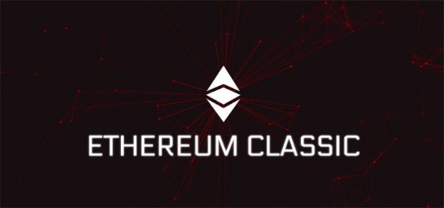

# Mantis – Ethereum Classic Beta Release
### **A command line interface client for the ETC community**
 8 August 2017[ Jeremy Wood](/en/blog/authors/jeremy-wood/page-1/) 4 mins read

[ Mantis – Ethereum Classic Beta Release - Input Output](https://ucarecdn.com/177749ef-1a6e-412a-868a-0037c4ff3a30/-/inline/yes/ "Mantis – Ethereum Classic Beta Release - Input Output")

### [**Jeremy Wood**](/en/blog/authors/jeremy-wood/page-1/)
Founder

- 
- 
- 

We are excited to announce that there is now an Ethereum (ETH) client built specifically for the Ethereum Classic (ETC) community. The [release of this beta client](https://github.com/input-output-hk/etc-client/releases "Mantis, Ethereum Classic client, GitHub"), Mantis, will take place today and is the culmination of seven months of work by the Grothendieck Team, the IOHK developers dedicated to Ethereum Classic. There are three reasons for the client. First, IOHK wants to demonstrate that it has the technical competency and culture to be a leader for the development of ETC. Second, IOHK wants to dispel the myth that ETC is a “copy and paste” coin that uses other people's code, and show that it is an independent and viable alternative to Ethereum. Third, the client is built in Scala, which is a functional programming language that offers security guarantees that other languages do not.

This release is comprised of the four [functional milestones](/en/blog/a-trip-to-malta-and-a-grothendieck-milestone/ "A trip to Malta and a Grothendieck milestone, IOHK") we have been working on since January.

- Blockchain download
- [Transaction execution](/en/blog/team-grothendieck-move-closer-to-ETC-goal/ "Team Grothendieck move closer to ETC goal, IOHK")
- Command and query interface
- Mining integration

However, please be aware that this is an early release – the important thing is that we get the Mantis client into the hands of ETC community members who can provide valuable feedback. Tell us what you think, and how we can improve Mantis. We want to stress that this is not yet production ready and has not been optimized for performance, so there will be bugs. \*\*Anyone using the beta release of the Mantis client should be using it on a testnet only, please do not use the Mantis client with actual funds.\*\*

These are some of the features that made it into the beta release for the Mantis client:

- Mist Integration
  Connect the Mist browser to the Mantis client over HTTP.
- Multi-platform
  We have tested the application on recent versions of Linux (16.02), Mac OS (El Capitan, Sierra) and Windows (10, 8).
- Testnet and Private Chain Support
  The client supports synchronizing with the Morden testnet and also creating private chains.
- Documented Configuration
  Our client uses neatly formatted configuration files in the “conf” folder to configure the client, all the keys and values have descriptions to help the user optimize the client's utility.

We are also able to include a “Fast Sync” feature in this release. From start-up, the Mantis client (using default settings) will attempt to discover existing ETC nodes on the internet and fast sync the ETC chain from them. Fast Sync is fantastic feature for a blockchain client because it downloads a recent snapshot of the blockchain and this speeds up the process of setting up a properly functioning full node. It also downloads the entire blockchain history to have this available to other peers on request. Fast Sync is faster, and more convenient than downloading all of the blocks from peers, although this is also supported and can be switched using a flag in the configuration file.

Although Fast Sync is quicker, it is still slow by today's internet standards. For those who would like to get a node synchronized as fast as possible a “bootstrap database” has been provided. This database contains the whole chain up until August 2nd 2017. Users can download this large file, unzip it in their data folder and then start the Mantis client.

The Mantis client is now being passed into the hands of technically savvy community members. Enthusiasts, who are comfortable with a command line interface and are willing to install code that has not been fully tested, will have a lot of fun using the Mantis client and can provide us with valuable feedback. We would like to encourage anyone with the necessary technical skills to try out the client and report any bugs to the [ETC Slack channel](https://ethereumclassic.herokuapp.com/ "ETC Slack channel").

We will have more updates and news coming soon, and will share our progress with the community in the upcoming weeks. Please stay tuned for more details!
## **Attachments**
[ Mantis – Ethereum Classic Beta Release - Input Output](https://ucarecdn.com/177749ef-1a6e-412a-868a-0037c4ff3a30/-/inline/yes/ "Mantis – Ethereum Classic Beta Release - Input Output")
