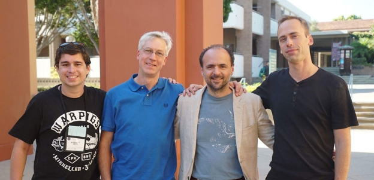

# Ouroboros at Crypto 2017
### **IOHK presents first provably secure proof of stake algorithm at flagship event**
 24 August 2017[ Jane Wild](/en/blog/authors/jane-wild/page-1/) 3 mins read

[ Ouroboros at Crypto 2017 - Input Output](https://ucarecdn.com/9a58efb5-e664-4a5b-bbc9-16ed312ee1a1/-/inline/yes/ "Ouroboros at Crypto 2017 - Input Output")

### [**Jane Wild**](/en/blog/authors/jane-wild/page-1/)
Content Director

- 
- 

Developing a secure proof of stake algorithm is one of the big challenges in cryptocurrency, and a proposed solution to this problem won the attention of the academic community this week in California. Several hundred cryptographers from around the world arrived at the University of California Santa Barbara on Sunday for the flagship annual event of their field, Crypto 2017. Over several days, they present cutting edge research for the scrutiny of their peers, while in the evenings they continue discussions with friends and colleagues over dinner on the university campus, with the inspiring backdrop of the Santa Ynez mountains meeting the Pacific ocean behind them.

Ouroboros, developed by a team led by IOHK chief scientist Aggelos Kiayias, made it through a tough admission process for the prestigious conference. This year, 311 papers were submitted and of those 72 were accepted. Only three papers at the conference were on the subject of blockchain. All three papers were supported by IOHK funding.

Speaking after his presentation, Professor Kiayias said: "We’re very happy that we had the opportunity to present Ouroboros at the conference. The protocol and especially its security analysis were very well received by fellow cryptographers."

"Our next steps will be to focus on the next version of the protocol, [Ouroboros Praos](/en/research/papers/#XJ6MHFXX "Ouroboros Praos, iohk.io") which improves even further the security and performance characteristics of the protocol."

The Ouroboros protocol stands out as the first proof of stake algorithm that is provably secure, meaning that it offers security guarantees that are mathematically proven. This is essential for a protocol that is intended to be used in cryptocurrency, an infrastructure that must be relied on to carry billions of dollars worth of value. In addition to security, if blockchains are going to become infrastructure for new financial systems they must be able to comfortably handle millions of users. The key to scaling up is proof of stake, a far more energy efficient and cost effective algorithm, and as such this research represents a significant step forward in cryptography. Ouroboros also has the distinction of being implemented – the protocol will be an integral part of Cardano, a blockchain system currently in development.

There were two other papers presented at the bitcoin session on Monday. The [Bitcoin Backbone Protocol with Chains of Variable Difficulty](https://eprint.iacr.org/2016/1048.pdf "The Bitcoin Backbone Protocol with Chains of Variable Difficulty, Eprint, IACR"), was produced by a team of three researchers and included Prof Kiayias. It is a continuation of previous research into Bitcoin, which was itself the first work to prove security properties of its blockchain.

A third paper on the subject of bitcoin was presented, [Bitcoin as a Transaction Ledger: A Composable Treatment](https://eprint.iacr.org/2017/149.pdf "Bitcoin as a Transaction Ledger: A Composable Treatment, Eprint, IACR").

Other notable talks at the conference included a presentation by John Martinis, an expert on quantum computing and former physics professor at the University of California Santa Barbara, who is now working at Google to build a quantum computer.

Leading cryptographers at the conference included Whitfield Diffie, pioneer of the public key cryptography that made Bitcoin possible, and Ron Rivest, Adi Shamir, and Leonard Adleman, who came up with the RSA public-key cryptosystem that is widely used for secure data transmission.

 Ouroboros Praos researchers, left to right: Bernardo David, Alexander Russell, Aggelos Kiayias, Peter Gaži
## **Attachments**
[ Ouroboros at Crypto 2017 - Input Output](https://ucarecdn.com/9a58efb5-e664-4a5b-bbc9-16ed312ee1a1/-/inline/yes/ "Ouroboros at Crypto 2017 - Input Output")
