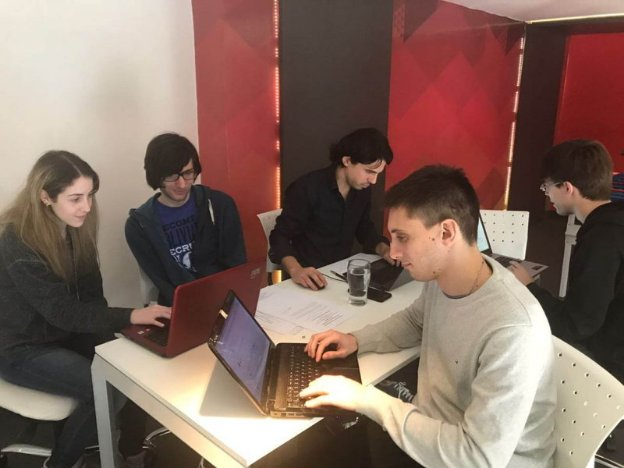

# IOHK Spotlight – Alan Verbner
### **Building a future for Ethereum Classic in Argentina**
 21 September 2017[ Laurie Wang](/en/blog/authors/laurie-wang/page-1/) 4 mins read

[ IOHK Spotlight – Alan Verbner - Input Output](https://ucarecdn.com/863740a3-5013-4ca9-9971-3bb70e5b5feb/-/inline/yes/ "IOHK Spotlight – Alan Verbner - Input Output")

### [**Laurie Wang**](/en/blog/authors/laurie-wang/page-1/)
Social Media Lead

Marketing and Communications

- 
- 
- 

What is money and how is it created? And how can we make a better financial system? Alan Verbner, an Ethereum Classic developer on Team Grothendieck at IOHK, started asking these questions as he lived through the volatile [economic crisis in Argentina](https://en.wikipedia.org/wiki/Economic_history_of_Argentina#Economic_crisis_.281998_-_2002.29 "Economic history of Argentina, Wikipedia") from 1998 to 2002. During this time, Argentina had defaulted on [billions of dollars worth of debt](http://www.nytimes.com/2001/12/24/world/argentine-leader-declares-default-on-billions-in-debt.html "Argentine leader declares default on billions in debt, The New York Times"). People protested in the streets and roared their disapproval of the government. 

“I no longer believed that banks and money were necessary. Society will find a way to survive without them,” Alan said. He saw that local citizens in his country were unable to take their money out of the bank to [access their savings](http://www.bbc.co.uk/news/world-latin-america-15981406 "Argentines recall economic crisis 10 years on, BBC"), and long queues formed outside banks across Argentina as people desperately tried to get hold of their money. In January 2002, the government decided to devalue the peso, and [abandon the peg to the US dollar](https://en.wikipedia.org/wiki/Convertibility_plan "Convertibility plan, Wikipedia"), which resulted in the peso rapidly losing its value with respect to the US currency over just a few months. 

Alan explains that this was when his interest in blockchain and cryptocurrencies began. He despised corruption and wanted to find an alternative solution for the citizens of his country.

Alan started to read more about Bitcoin, and researched the white paper by its creator, Satoshi Nakamoto. He was hooked, joined Argentina’s growing blockchain community, and the rest is history. 

Since then, Alan focused his efforts on getting into the blockchain industry. Following his interest in computers, developed at an early age from the influence of his mother’s technology career as a bank IT professional, Alan studied at the Engineering University of Buenos Aires and became a software engineer.

After graduation, Alan created Atix, which is a company he co-founded with three friends from university. They work on software development, and half the company are working in the area of blockchain. Alan decided to base his company at Bitcoin Embassy, a key meeting place for many of the leading minds in bitcoin development in the country.

He is optimistic about the future of crypto in Argentina’s bustling blockchain community. "Our country has the ideal conditions for crypto development. We have highly skilled and passionate people looking to contribute to the industry. For example, our office is located in a building where about eight crypto companies have their space and meetups are held every week with interesting debates taking place," Alan said.

It was at Bitcoin Embassy where Alan met Charles Hoskinson, the CEO of IOHK, and he was given the opportunity to work in Team Grothendieck on Ethereum Classic development. They built and recently launched the beta version of an Ethereum Classic client, [Mantis](https://bitcoinmagazine.com/articles/ethereum-classic-forges-its-own-identity-new-mantis-client/ "Ethereum Classic forges its own identity with new Mantis client, Bitcoin Magazine"), in the functional programming language Scala.

On the programming language of choice for ETC development, Alan is a fan of functional programming because it has allowed him to create less verbose, more readable and secure code. For him, Scala is a solid and fun language to work with. It has a lot of tools and useful libraries, for example Akka). Last but not least, it runs on a Java virtual machine so he is able to support different platforms (see the [Mantis documentation](http://mantis.readthedocs.io/en/latest/ "Mantis documentation, Mantis wiki") for instructions) without any extra effort.

Being a remote team based in Argentina, and working with other distributed teams in IOHK globally, has been less complicated than most would expect. Alan and the team ensures that they have the discipline and precision to make everything work like a Swiss watch. This includes two main goals, one is communicating successfully with daily standup meetings to discuss tasks and key blockers, and the second is a strong and well defined code review process to catch bugs and establish a consistent coding style.

As someone who lived through pivotal moments in a country where corruption and poverty have been two big themes in society, Alan envisions a future where blockchain can address these issues. He would love to see a world where blockchain technology is being applied to areas such as voting transparency, microlending and fair access to financial services, immutable government data release, and trusted financial systems for all. “We are yet to see the various use cases blockchain technology can contribute to. I'm confident that the ecosystem will mature and become part of our daily life,” Alan said.

To find out more about Alan and our other talented Team Grothendieck members working on the ETC development of [Mantis](/en/blog/mantis-ethereum-classic-beta-release/ "Mantis – Ethereum Classic beta release, IOHK blog"), check out our [IOHK team page](/en/team/ "Team profiles, IOHK").
## **Attachments**
[ IOHK Spotlight – Alan Verbner - Input Output](https://ucarecdn.com/863740a3-5013-4ca9-9971-3bb70e5b5feb/-/inline/yes/ "IOHK Spotlight – Alan Verbner - Input Output")
