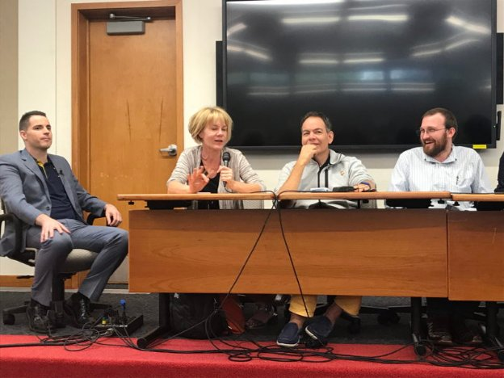
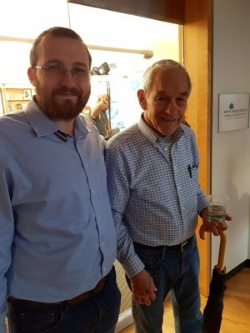

# Blockchain meets big ideas in Aspen
### **Ron Paul among speakers discussing the future of finance and decentralisation at three-day event**
 28 September 2017[ Jane Wild](/en/blog/authors/jane-wild/page-1/) 7 mins read

[ Blockchain meets big ideas in Aspen - Input Output](https://ucarecdn.com/cd0a4e13-a74d-4d86-a329-3343189f5868/-/inline/yes/ "Blockchain meets big ideas in Aspen - Input Output")

### [**Jane Wild**](/en/blog/authors/jane-wild/page-1/)
Content Director

- 
- 

No taxes, no government and the principle of doing others no harm are the founding ideals for a proposed new sovereign country where citizens can live as they choose. This vision of a libertarian utopia created through the purchase of sovereign land was laid out last week in Aspen, by early bitcoin investor Roger Ver, who told an audience that he was in talks to buy land. Rules for the proposed sovereign territory were few, such as no exporting of weapons or drugs and that there would be an age of consent. There would be no membership of the United Nations and no nuclear weapons. "As long as it’s peaceful, you can do whatever you want," said Ver, calling for libertarians and constitutional experts to join his plan. "Even if you love government control, you should love our project," he said, "so all us crazy libertarians can go off and create our own land. All you government loving people can sit back and say to us ‘look how you screwed things up’. But I don’t think we are going to fail," he concluded to applause from the audience.

Ambitious ideas like Ver’s Free Society weren’t in short supply during the three-day Nexus conference at Colorado’s Aspen Institute. The institute – surrounded by mountain peaks carpeted in red and gold fall colours – is more used to hosting the global elite rather than the dreamers and doers pushing for new ways of doing things at Nexus, whose conversations centred around liberty, decentralisation and the future of finance. Blockchain was a core theme of the event, with a predictable number of attendees planning an ICO, but there was also discussion of the future of cryptocurrencies.

 Panel at Nexus 2017. Left to right: Roger Ver, Stacy Herbert, Max Keiser, Charles Hoskinson.

Charles Hoskinson, CEO of IOHK, explained how [cryptocurrencies would have to develop](https://www.youtube.com/watch?v=n1fNLSjAgHg "Charles Hoskinson talk at Nexus 2017, IOHK YouTube") before they could fulfil some of the transformative roles that have been predicted for them. "The third generation of cryptocurrencies that are coming are really going to be valuable, to change things and allow us to grow," said Hoskinson. "And allow these things to get enough users where they can really start influencing law and governments and central banks. Those cryptocurrencies will require governance, scalability, interoperability." Governance would mean that there would be a democratic way to make improvement proposals and changes to the blockchain, Hoskinson said. And cryptocurrencies of the future would have metadata attached to them, to allow financial transactions to reveal more about the story behind them than simply showing that A sent money to B. Interoperability would allow new blockchains to interact with legacy financial systems. "Interoperability’s incredibly important," he said, "otherwise you have two financial systems which are at war with each other."

Summing up, Hoskinson said: "the good news is that within three to five years, almost all of these problems can actually be rigorously solved." And some of the most exciting developments would relate to the social aspect of cryptocurrencies, where people would have to find new ways to get consent, around issues like voting. "Cryptocurrencies are societal evolution happening in real time," he said. Later, Charles was also part of a [lively panel](https://www.youtube.com/watch?v=wB5lKhN4uoY "Panel discussion at Nexus, IOHK YouTube") that included the hosts of the Keiser Report show – Stacy Herbert and Max Keiser – as well as Roger Ver and Rob Viglione, founder of ZenCash. Discussion topics included why there was less drama about the Ethereum chain split compared to Bitcoin scaling, ICOs, and the claims from Jamie Dimon, CEO of JP Morgan, that Bitcoin was a fraud. Dimon was ridiculed for his lack of understanding of cryptocurrency, with Ver offering to give Dimon a tutorial. A focus on the future united most conference attendees, but equally important was the historical context that brought them to where they were. Ron Paul, who Hoskinson worked for during Paul’s 2008 bid for the Republican candidacy, came on stage to a standing ovation and chants of "End the Fed".

 

Charles Hoskinson and Ron Paul

Despite admitting he had much to learn about how blockchain worked, the libertarian politician who is now in his eighties praised the industry’s creativity. Technology should not be an arm of the government, he warned, and the internet was being coopted by commercial interests. "Technology is helping us, in a free society it helps improve our living condition," he said. In a tour de force through libertarian thought, he recounted his early career in medicine eventually brought to an end by his interest in how the monetary system worked. Saying that there had been decades of monetary policy failure, from the collapse of Bretton Woods system in the 1970s, Paul attacked the march of Keynesian ideology and a system swollen with debt, leading to the 2008 global financial crisis. "We do want to get rid of the Fed and we should start with auditing the Fed and understanding why we need to know about it," Paul said. "The American people deserve to know what’s going on." Central banking was a relatively new concept, he said, predicting the end of a system that would self destruct as it sank under the weight of debt.

 Jesse Ventura and Ron Paul

Backing what Paul said afterwards, Jesse Ventura, ex-wrestler and former governor of Minnesota, told IOHK that personal debt kept people from being free, in a system designed to lock people into debt. "If you are in debt you can be controlled," Ventura said. "If people ran their finances like the government run theirs you’d be a homeless person living on the street out of a bag. You can’t live in a world of negative money." Paul cut a humble figure as fans queued to have their picture taken with him, and later held a television studio discussion with Ventura, a tall and imposing presence sporting a Rolling Stones bomber jacket and a US Navy Seals cap – both former employers of his. Other speakers at the conference included early Bitcoin adopter and investor Eric Voorhees, and Patrick Byrne, CEO of Overstock, who spoke about his new blockchain exchange that would list ICOs, and which he said had approval to operate from the US Securities and Exchange Commission. Longtime gold bug and Bitcoin sceptic Peter Schiff debated with crypto advocate Max Keiser, who in trademark showman style tore up US dollar bills on stage.

Colin Cantrell, one of the organisers of the event, said that one of the aims of Nexus was to bring great minds together and inspire change. "We’re going through a very difficult time globally, there’s a financial crisis. At times like this we need to bring people together, to inspire people to see that we have options, not to worry about the problems but focus on the solutions. We wanted to keep it balanced, everyone has their own skills to bring to the table." Music was never far away, with bands playing on site, and in the evenings a roster of acts played at venues in the centre of Aspen. Some of those who walked round the compact town centre would chance across bears that had come down from surrounding mountains to search for food ahead of their winter hibernation.

On the last night the IOHK team saw a classic American taxi pull up in Aspen. A closer inspection into the cab revealed the unlikely sight of a keyboard, drum pad and a kaleidoscope of coloured beams, and an interior of multi coloured lights and naturally, lasers. Destination unknown, the music kicked in, with Jon Barnes drumming along with a twirl of his sticks, or hammering the keyboard, whilst also managing to drive and talk. Hunter S Thompson, Aspen's countercultural son had taken a ride in Barnes's [Ultimate Taxi](http://www.ultimatetaxi.com/ "Ultimate Taxi, Aspen"), of course.

"Remember what Hunter said," said Barnes. "Yesterday's weirdness is tomorrow's reason why", a quote that may resonate with many blockchain fans. We stepped out of the taxi, and he had one last trick. Holding a fan of one dollar bills, he snapped his fingers and instantly they each became 20 dollar bills. And with that he drove off into the night.
## **Attachments**
[ Blockchain meets big ideas in Aspen - Input Output](https://ucarecdn.com/cd0a4e13-a74d-4d86-a329-3343189f5868/-/inline/yes/ "Blockchain meets big ideas in Aspen - Input Output")
