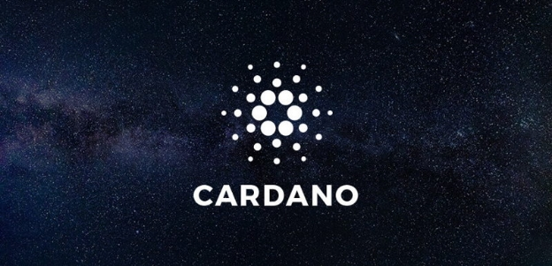

# Thank you all for being a part of Cardano
 10 October 2017[ Charles Hoskinson](/en/blog/authors/charles-hoskinson/page-1/) 3 mins read

[ Thank you all for being a part of Cardano - Input Output](https://ucarecdn.com/e405440a-25bd-411d-94c5-f0911f478d43/-/inline/yes/ "Thank you all for being a part of Cardano - Input Output")

### [**Charles Hoskinson**](/en/blog/authors/charles-hoskinson/page-1/)
Chief Executive Officer

Founder

- 
- 
- 

Over two years ago IOHK joined a movement to build a truly unique collection of technology that married the best engineering principles with the dreams of scientists in far removed universities. It was a tremendously ambitious and complex project to grasp. Tens of millions of dollars would need to be gathered, long term roadmaps developed, research institutions established and properly managed as well as numerous entities staffed. In short, it was an insane project to attempt. Yet we attempted it. 

Now there are well over 100 people working full time on the [Cardano project](https://www.cardanohub.org/ "Cardano hub"), three research centers drafting peer reviewed papers, a legion of haskell developers pushing the limits of the language and three well capitalized entities with a mandate and funding to build Cardano until 2020 - IOHK, the [Cardano Foundation](https://cardanofoundation.org/ "Cardano Foundation") and [Emurgo](http://emurgo.io/ "Emurgo").

It’s both unbelievable and humbling to see how far we have gone in such a short time. Cardano is literally evolving computer science from semantics based compilation to entirely new cryptographic protocols to formal verification of code. Cardano also managed to build an amazing community more than 10,000 strong in a slow and methodical way. 

We [launched the mainnet](https://bitcoinmagazine.com/articles/iohk-launches-cardano-blockchain-ada-now-trading-bittrex/ "IOHK launches Cardano blockchain Ada now trading on Bittrex") recently with very little fanfare and marketing. Rather it seems to be a small stop on a much longer and more elegant journey. While it’s certainly a challenging sojourn, I’m confident that we have come to know it and have developed the endurance to survive. 

In reflection, I’ve been to over 30 countries since we started our journey. I’ve met thousands of people ranging from the bizarre to the saintly with a few notorious ones littered in between. The most remarkable thing so far has been experiencing the near unlimited excitement and youth regardless of where I went. 

The world really does seem like it’s ready for a new financial system. It’s hard to say if Cardano can get us there, yet we aren’t alone any more. There’s now an army of some of the best throughout the world on this journey. Leaderless, inspired and brilliant, it’s an honor to be among them. I never believed I could be part of something like this movement. 

Thank you all for being part of Cardano. Thank you for your patience when we have fallen. Thank you for your support and kind words. Thank you for your dreams. Now let’s get back to the road ahead. I’ve come to know this place for the first time.
## **Attachments**
[ Thank you all for being a part of Cardano - Input Output](https://ucarecdn.com/e405440a-25bd-411d-94c5-f0911f478d43/-/inline/yes/ "Thank you all for being a part of Cardano - Input Output")
