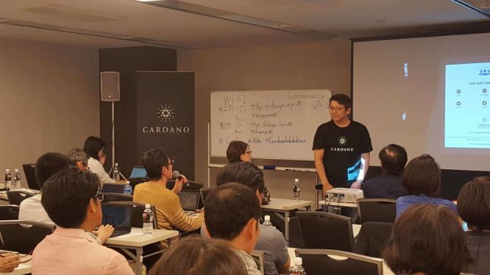
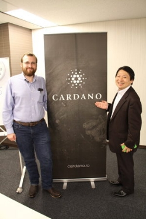
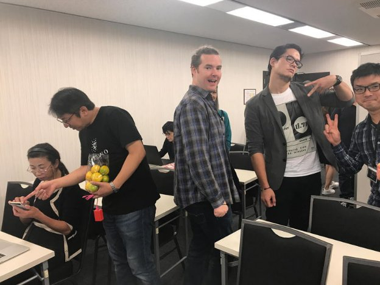

# Cardano help desk tour arrives in Tokyo
### **Customer service team reach last of five Japanese destinations**
 12 October 2017[ Jeremy Wood](/en/blog/authors/jeremy-wood/page-1/) 6 mins read

[ Cardano help desk tour arrives in Tokyo - Input Output](https://ucarecdn.com/c4478ec4-0c9a-4632-b841-46600237179a/-/inline/yes/ "Cardano help desk tour arrives in Tokyo - Input Output")

### [**Jeremy Wood**](/en/blog/authors/jeremy-wood/page-1/)
Founder

- 
- 
- 

The launch of Cardano brings to an end an exciting first phase of development for us at IOHK, after more than a year spent planning and developing the technology. Now we’ve handed the product over to users and they are getting to know how it works. Using new software can be tricky – some people won’t need any help, but there will be those who need a little assistance. To make sure that people know how to use the software and aren’t experiencing any problems, IOHK and Cardano Foundation organised a help desk tour around Japan. As far as we know, this is the first time there has been a customer service tour for a cryptocurrency.

Over two weeks, starting from the end of September, the team visited five cities in Japan: Osaka, Nagoya, Hiroshima, Fukuoka and Tokyo, where we are holding three days of seminars. To figure out where we should go, the [Cardano Foundation](https://cardanofoundation.org "Cardano Foundation") had previously sent out a questionnaire to find out who needed our help, and what kinds of questions people had. This helped us plan the tour accordingly.

 

IOHK founder Charles Hoskinson 
with an Ada holder

We started out on a Saturday at the end of September in Osaka before moving on to Nagoya and making our way around Japan. Being able to meet and talk to the community of Ada holders was a really good experience. People were excited, eager to learn and had lots of positive comments and feedback. There was a mix of different ages, with the youngest people aged about 20 and the very oldest about 70. There were men and women, and there was a good turn out – sessions were nearly always just about full. Kondo, aged 45, heard about Cardano through Facebook and joined the online community to learn more. "I think Cardano’s future is very bright," Kondo said at a help desk seminar. "I brought my PC today and managed to redeem my Ada. I don’t think I could’ve done that without the staff’s help. I’m glad that everything’s solved."

Some people came along to meet other members of the community. New "crypto friends" swapped details so they could use talk about cryptocurrency using Line. Others were excited and wanted to share their thanks with the team and good wishes for the future of Cardano. Each Cardano help desk programme lasted a full day, over which we ran several sessions. The most popular presentation was on exchanges, and explained cryptocurrency markets and [Bittrex](https://bittrex.com "Bittrex Digital Currency Exchange"), the exchange that Ada launched on. That session included a demonstration of how to use Bittrex, given by Daniel Friedman, a Japanese speaking IOHK staff member based in Osaka, and Toshiaki Miyatake, a Cardano community moderator from Tokyo, and the presentation was followed by a question and answer session. Aside from making sure that people had no technical problems, another objective of the help desk tour was to inform and educate. Cardano has attracted many people who are discovering an interest in cryptocurrency, so we want to help them get started by providing them with high quality resources and information.

Another presentation covered the [Daedalus wallet](https://daedaluswallet.io "Daedalus Wallet"). This wallet is where Ada is stored, and where users send and receive Ada. Step by step, we walked people through using Daedalus, including showing them how to store their private keys, how to add their Ada to the wallet and send it to the exchange. This session included offering one-to-one technical help, for anyone who needed personal assistance. People brought their laptops and we had memory sticks to install Daedalus for them if they hadn’t installed it already. There was also a popular presentation for people who wanted to join the growing Cardano community on social media. Miyatake showed people the Twitter accounts, the official Facebook group and how to join the conversation taking place in channels on Slack, with both Japanese and English language accounts available to join. Meeting Cardano users was enjoyable and hopefully provided them with all the help they needed, but it was also helpful for us too.

 IOHK founder Jeremy Wood at the help desk tour

During the course of the sessions and meeting and talking to so many users, we uncovered a couple of small bugs in Daedalus, which our developers could begin work on fixing. Some of the bugs or issues we discovered were:

- Using Japanese characters when naming the wallet could cause the wallet to crash. A fix for this is due to be made soon. 
- Daedalus now requires Windows users to synchronise the clock on their PC to the time on the internet.
- Windows users may find that when they try to connect to the network for a second time after quitting the application, they are stuck connecting to the network. Developers are looking into issue, which can sometimes can be fixed by restarting the computer. 
- For a small number of people, transactions may not seen in the wallet despite being registered on the blockchain when they try to make a withdrawal from Bittrex. A fix for this is being worked on by developers.
- We have had reports that Daedalus may be wrongly identified as malware by the machine leaning algorithms used in some anti virus software. With time, this should change. Please be cautious if you are unsure and file a bug report. If you have a problem, first make sure your wallet is backed up, then download Daedalus again and reinstall it on your computer. 
- Windows users may not be able to use a tablet and instead should use a desktop computer.

It was a busy but rewarding two weeks, now finishing up in Tokyo, where high demand means we had three full days booked at TKP Garden City in Shibuya. Now that Cardano is in the hands of the community there will be a special event in Tokyo this week to mark the successful launch. All three partners who are responsible for Cardano – IOHK as its developers, the Cardano Foundation as the standards body and guardian, and Emurgo, the venture builder for decentralised applications – will come together to talk about what users can expect to see with Cardano over the next three years. For coverage of the event, and to join the community, follow our social channels on [Facebook](https://www.facebook.com/groups/CardanoCommunity/ "Cardano Community, Facebook"), [Twitter](https://twitter.com/cardanocom "Cardano Community, Twitter"), and [Slack](https://cardano.herokuapp.com/ "Cardano, Slack").
## **Attachments**
[ Cardano help desk tour arrives in Tokyo - Input Output](https://ucarecdn.com/c4478ec4-0c9a-4632-b841-46600237179a/-/inline/yes/ "Cardano help desk tour arrives in Tokyo - Input Output")
