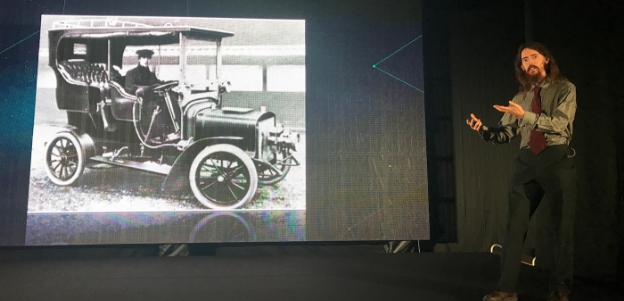
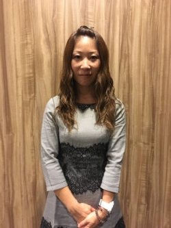
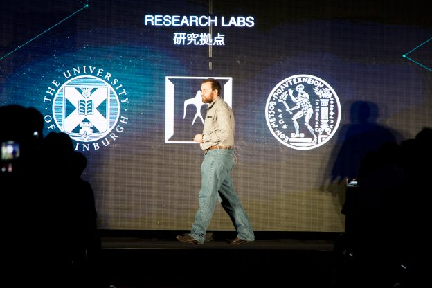

# Cardano marks its launch with Tokyo event
### **Hundreds of fans celebrate bright future for the cryptocurrency**
 16 October 2017[ Jane Wild](/en/blog/authors/jane-wild/page-1/) 8 mins read

[ Cardano marks its launch with Tokyo event - Input Output](https://ucarecdn.com/f0080953-1a94-4089-b719-ed69ecf2ad07/-/inline/yes/ "Cardano marks its launch with Tokyo event - Input Output")

### [**Jane Wild**](/en/blog/authors/jane-wild/page-1/)
Content Director

- 
- 

The technology was conceived in an Osaka restaurant more than two years ago and from that small beginning Cardano has been built into a leading cryptocurrency. The project has amassed a team of experts in countries around the world, has generated more than 67,000 lines of code, and has a strong and growing community in countries across Asia and beyond. Along the way, Cardano has set new standards for cryptocurrencies with best practices such as peer review and high assurance methods of software engineering. The official launch was held in the district of Shibuya in Tokyo on Saturday October 14 for an audience of about 500 people, who had each won a ticket through a lottery held on social media. Excited cryptocurrency enthusiasts, Ada holders and business people from across Japan queued to get Cardano t-shirts and souvenir physical Ada coins, before going into the main hall to hear about how Cardano was created and the vision for its future. "The first thing we did when we knew the project was real was to build great partnerships," Charles Hoskinson, founder and CEO of IOHK, told the audience. "Our chief scientist is based at University of Edinburgh, it is a wonderful place, where they built the heart of Cardano. We have a lot of wonderful people at the University of Athens, they are rigorous, making sure that the theory works. And we have people at Tokyo Tech who work on multi party computation and look to the future, and work out how to make Cardano last a long time." The vision for Cardano, Hoskinson said, was that it would pull together academic research and bright ideas from computer science to produce a cryptocurrency capable of much more than its predecessors.

[This "third generation" cryptocurrency](https://www.bitsonline.com/video-hoskinson-cardano/ "Time for ‘Third Generation’ Blockchains, Says Cardano’s Charles Hoskinson, Bitsonline") would be able to scale to a billion users, using a proof of stake algorithm, Ouroboros, which avoided the huge energy consumption of proof of work cryptocurrencies. Features that would be added to Cardano to help it scale included sidechains, trusted hardware, and RINA, or recursive internetwork architecture. Sustainability would be part of the design by way of a treasury system to fund development indefinitely, allowing stakeholders to vote on proposed changes to the protocol. Meanwhile, the computation layer of the technology, would be innovative in using a tool called [K Framework](https://coinjournal.net/kevm-wins-ic3-ethereum-crypto-boot-camp-2017-competition/ "KEVM Wins IC3-Ethereum Crypto Boot Camp 2017 Competition, Coin Journal") to allow developers to write smart contracts in the programming language of their choice, he said. Security is paramount to cryptocurrency because flaws in code increase the risk of hacks and the loss of coin holder funds, unfortunately witnessed too often. With that in mind, Duncan Coutts, head of engineering at IOHK, explained how the company approaches software development: cryptography research papers are translated into code using the technique of formal specification. This involves a series of mathematical steps that progressively take the cryptography closer to the code that the developers write, a process that allows checks to be made that the specifications are indeed correct.

 Duncan Coutts, IOHK Director of Engineering, presenting at the Cardano launch event

"I’m passionate about bringing clever ideas from computer science and using them in Cardano," Coutts said. "And I’m obsessive about software quality. Beautiful software is like beautiful mathematics or poetry." Aside from engineering, the other twin pillar of IOHK is research, and Bernardo David went on stage to talk about the rigour supporting the papers that IOHK produces. David is an assistant professor at Tokyo Tech where IOHK has a research partnership, and was one of the team that produced Ouroboros, a provably secure proof of stake algorithm. On the question of whether people should accept the quality of the research, he pointed to the paper’s peer review through its acceptance to [Crypto 2017](https://www.forbes.com/sites/amycastor/2017/08/23/at-crypto-2017-blockchain-presentations-focus-on-proofs-not-concepts/1 "Blockchain Projects Tighten Security with Math, Forbes"), the annual cryptography conference held in California. "This is the first proof of stake paper that was published in a big conference so you can trust the largest and most respected cryptography conference in the world," he said. "You don’t have to take my word, you can trust all the other cryptographers."

 Michael Parsons, Chairman of Cardano, speaking at the Cardano launch event

The launch event introduced the other important organisations supporting Cardano, such as the Cardano Foundation. The Swiss-based standards body acts as the guardian of the protocol and its duties include providing information to the community and working with governments to shape regulation. Michael Parsons, chairman, announced that Ada holders would be able to store their coins in the Ledger hardware wallet and integration was being worked on. Plans for the future included working with a respected London think-tank to produce blockchain research. Thanking the community, he said: "Cardano is a blockchain protocol with integrity. We are dedicated to helping it derive its full potential and make the world a better place. You supported us to help make Cardano what it is, so thank you." The third organisation supporting Cardano is Emurgo, which is based in Japan and extends support and advice to anyone wishing to build applications on the software.

 

Cardano fan Naomi Nisiguchi

Ken Kodama, CEO of Emurgo, emphasised the advantages of Cardano’s technology over older cryptocurrencies, and said: "Emurgo sees a bright future that Cardano will provide a more trustable way of identifying individuals and also a reasonable, and faster payment method to people who don't have them now. Emurgo will play an important role in plugging developers and startups to the Cardano ecosystem." Kodama, along with Darren Camas, senior adviser to Emurgo, spoke about how a network was being established in other Asian countries to support its growth. Camas said: "The question for us is how do we help Ada become the fuel that powers financial technology, not only in the developed world but in Malaysia, Vietnam, Argentina, Nigeria… How do we bring more people from across the globe to transact in the Cardano ecosystem?"

After the presentation crowds formed outside the hall to have their photos taken with the Cardano team. Some people who came along were longstanding supporters of the project, such as Naomi Nisiguchi, from Mie Prefecture. She works as a manager in the construction industry and has had an interest in cryptocurrency for four years. "Around two years ago I heard about Ada and that Charles Hoskinson was involved," she said. "I’ve been following the news on Facebook and I’m very interested to learn how the project will move on."

 Ken Kodama, CEO of Emurgo, speaking at the Cardano launch event

Many people had plans regarding Cardano. Takashi Kawaguchi set up Fintech Academia last month to give Japanese people information about cryptocurrencies, and came along because he believes Cardano has the potential to rise up and be on par with Bitcoin and Ethereum. His website would provide educational resources that would help people understand and trust crypto, he said, and learn that it wasn’t an enemy, but represented the future.

Other people at the event were planning business interests, such as Nobuyoshi Hayashi from Tochigi prefecture, who owns a consultancy and wants to begin offering cryptocurrency advisory services. The launch itself is only the beginning for Cardano, with many new features to be added during the next three years that will cement its position as the leading cryptocurrency. Mario Larangeira, specially appointed associate professor at Tokyo Tech, was in the audience, and said it was a great time to be working in cryptography. "To be part of this project is challenging, complex but also very exciting," he said. "Now we are working on multi party computation and putting even more cryptography into Cardano, for example with [Kaleidoscope](/en/research/papers/#P684RSHV "IOHK Papers, Kaleidoscope"), new research that is being produced at Tokyo Tech with Bernardo David and Rafael Dowsley."

 Bernardo David, IOHK Research Fellow, speaking at the Cardano launch event

There was much hard work ahead, agreed Charles Hoskinson, and holding an event in Tokyo with Cardano partners was a very special occasion. "This is a really fun event," he said. "Cardano has its largest community here in Japan and we felt it was so important to have a launch event to thank the community for being so supportive, loyal and patient. The point of this event has been to talk about where we came from and where we plan on going, and meet some new people and make new friends."

## **Attachments**
[ Cardano marks its launch with Tokyo event - Input Output](https://ucarecdn.com/f0080953-1a94-4089-b719-ed69ecf2ad07/-/inline/yes/ "Cardano marks its launch with Tokyo event - Input Output")
