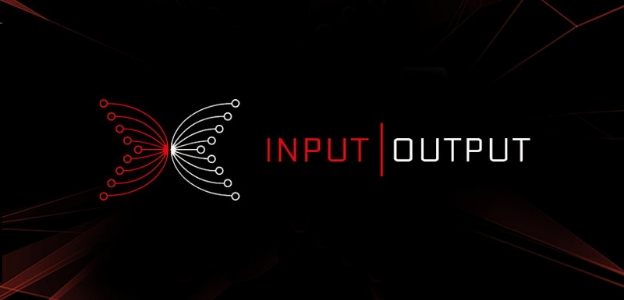

# Statement on IOHK's Ada Holdings
 17 October 2017[ Charles Hoskinson](/en/blog/authors/charles-hoskinson/page-1/) 2 mins read

[ Statement on IOHK's Ada Holdings - Input Output](https://ucarecdn.com/532de2c0-d7bf-4838-b70e-2551cf806e32/-/inline/yes/ "Statement on IOHK's Ada Holdings - Input Output")

### [**Charles Hoskinson**](/en/blog/authors/charles-hoskinson/page-1/)
Chief Executive Officer

Founder

- 
- 
- 

IOHK received both Bitcoin and Ada for its contract to work on the Cardano project. IOHK converted most of its Bitcoin at the time of receiving it to fiat in order to ensure project stability. With respect to IOHK's holdings of Ada, IOHK does not expect a need to liquidate any of its Ada to cover immediate costs related to the Cardano project until 2019. However, like most ventures in the cryptocurrency space, we have made certain payroll commitments in Ada to several IOHK personnel, contractors and third party firms.

Therefore, IOHK will voluntarily adopt the following vesting schedule for its Ada. A third of IOHK's Ada holdings will be immediately available to IOHK. A third will be made available after June 1st of 2018. The final third of IOHK's Ada will be made available after June 1st of 2019.

Charles Hoskinson will not receive any Ada until the final third of supply unlocks in June of 2019. When the computation layer of Cardano is released next year, IOHK will move its total Ada supply into a custom vesting contract to reflect the above policy.

In the spirit of full disclosure, IOHK's initial Ada address is: 

fa2d2a70c0b5fd45cb6c3989f02813061f9d27f15f30ecddd38780c59f413c62

. We will make a follow-up statement when funds are moved to a custom vesting address.

As for Emurgo and the Cardano Foundation, we have requested both partners to make a similar statement about use of funds. As they are independent businesses, they will do so at a time and manner of their choosing.
## **Attachments**
[ Statement on IOHK's Ada Holdings - Input Output](https://ucarecdn.com/532de2c0-d7bf-4838-b70e-2551cf806e32/-/inline/yes/ "Statement on IOHK's Ada Holdings - Input Output")
