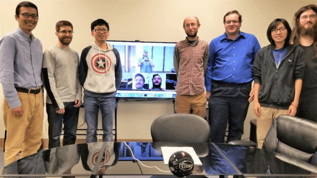

# Designing a new virtual machine and universal language framework
### **Guest blog from Professor Rosu explains the work being done in a partnership between Runtime Verification and IOHK**
 26 October 2017[ Grigore Rosu](/en/blog/authors/grigore-rosu/page-1/) 8 mins read

[ Designing a new virtual machine and universal language framework - Input Output](https://ucarecdn.com/45a7832c-8350-4075-bafc-d4e6b7f002bd/-/inline/yes/ "Designing a new virtual machine and universal language framework - Input Output")

### [**Grigore Rosu**](/en/blog/authors/grigore-rosu/page-1/)
President/CEO Runtime Verification

The IELE and K team Mathematical rigor and good design of programming languages and underlying virtual machines are critical for the success of blockchain technologies and applications. Indeed, decades of accumulated evidence show that formal techniques and their early adoption in the design of computing systems can significantly increase the safety, security and dependability of such systems. Moreover, when paired with good user interfaces that hide the mathematical complexity, such techniques can also increase the effectiveness, elegance and quality of code development. A good example is the recent success of functional programming languages and of automated theorem provers or constraint solvers.

[Runtime Verification](https://runtimeverification.com/ "Runtime Verification Website"), a University of Illinois start-up founded by computer science Professor Grigore Rosu, has been recently awarded a research and development contract by [IOHK](https://iohk.io "IOHK Website") to design a next generation virtual machine and a universal language framework to be used as core infrastructure for future blockchain technologies. The formal analysis and verification technology employed in this project was initiated by Prof. Rosu and his collaborators back in 2001, when he was a NASA scientist, and has been improved over more than 15 years of research and development both in his [Formal System Laboratory (FSL)](http://fsl.cs.illinois.edu/ "Formal System Laboratory, University of Illinois") at the University of Illinois at Urbana-Champaign and at Runtime Verification, with generous funding of more than $10M from organisations including NSF, NASA, DARPA, NSA, Boeing, Microsoft, Toyota, and Denso. It is about time that aircraft grade, software analysis technology used for mission critical software gets deployed to smart contracts, the blockchain and cryptocurrencies. The project will be executed by a team of Runtime Verification experts led by Prof Rosu, who will work closely with students at the University of Illinois – also funded by IOHK – and with the IOHK research and development team.
## **IELE – A Register-Based Virtual Machine for the Blockchain**
Based on learnings from defining [KEVM](https://github.com/kframework/evm-semantics "K Semantics of the Ethereum Virtual Machine (EVM)"), our semantics of EVM in [K](http://www.kframework.org/ "K Framework"), we will design and define a new VM, which we call IELE (after the [Mythological Iele](https://en.wikipedia.org/wiki/Iele "Iele, Wikipedia")). Unlike the EVM, which is a stack-based machine, IELE will be a register-based machine, like [LLVM](http://llvm.org/ "The LLVM Compiler Infrastructure"). It will have an unbounded number of registers and will also support unbounded integers. There are some tricky but manageable aspects with respect to gas calculation, a critical part of the design.

Here are the forces that will drive the design of IELE:

1. To serve as a uniform, lower-level platform for translating and executing smart contracts from higher-level languages, which can also interact with each other by means of an ABI (Application Binary Interface). The ABI will be a core element of IELE, and not just a convention on top of it. Also, unbounded integers and an unbounded number of registers will make compilation from higher-level languages more straightforward and elegant and, looking at the success of LLVM, more efficient in the long term. Indeed, many of the LLVM optimizations are expected to carry over. For that reason, IELE will follow the design choices and representation of LLVM as much as possible. The team includes an advanced PhD student from Vikram Adve’s lab at the University of Illinois, where LLVM was created, and who is an expert in LLVM.
1. To provide a uniform gas model, across all languages. The general design philosophy of gas calculation in IELE is “no limitations, but pay for what you consume”. For example, the more registers a IELE program uses, the more gas it consumes. Or the larger the numbers computed at runtime, the more gas it consumes. The more memory it uses, in terms of both locations and size of data stored at locations, the more gas it consumes. And so on. 
1. To make it easier to write secure smart contracts. This includes writing requirements specifications that smart contracts must obey as well as making it easier to develop automated techniques that mathematically verify/prove smart contracts correct wrt to such specifications. For example, pushing a possibly computed number on the stack and then jumping to it regarded as an address makes verification hard, and thus security weaker, with current smart contract paradigms. We will have actual labels in IELE, like in LLVM, and structured jumps to those labels. Also, avoiding the use of a bounded stack and not having to worry about stack or arithmetic overflow will make specification and verification of smart contracts significantly easier.

Like [KEVM](https://github.com/kframework/evm-semantics "K Semantics of the Ethereum Virtual Machine (EVM)"), the formal semantics of EVM that we previously defined, validated and evaluated using the [K framework](https://coinjournal.net/kevm-wins-ic3-ethereum-crypto-boot-camp-2017-competition/ "KEVM Wins IC3-Ethereum Crypto Boot Camp 2017 Competition, Coin Journal"), the design of IELE will also be done in a semantics-based style, using K. Together with a fast (LLVM-based) execution backend for K, it is expected that the interpreter obtained automatically from the semantics of IELE will be sufficiently efficient to serve as a reference implementation of IELE.
## **K as a Universal Language for the Blockchain**
Besides EVM, several languages have been given a complete formal semantics in K, including C, Java, and JavaScript. Several others will be given K semantics as part of this project, including IELE itself, Solidity and Plutus. We want to allow all these languages, and possibly more as they are given K semantics, to be used for writing smart contracts. For that, we need to enhance the capabilities and implementation of the K platform itself, which will increase the practicality of all new and existing K semantics. We will implement several performance improvements not yet taken beyond proofs of concept, and develop production-quality implementations of analysis features such as the K symbolic execution engine, the semantics-based compiler (SBC), and the program verifier, which currently have only prototype-quality implementations in the academic K project.
### **Faster Execution**
We plan to develop a concrete execution backend to K that will be at least one order of magnitude faster than the current one. The current one is based on translation to OCaml; we plan on translating to LLVM and specializing the pattern matcher to the specific patterns that occur in semantics. We believe it will be possible to execute programs against our KEVM semantics as efficiently as the reference C++ EVM implementation(!). If that will indeed be the case, and we strongly believe it will, then this will mark an unprecedented moment in the history of programming languages, when a language implementation automatically derived from a formal semantics of the language can serve as a realistic implementation of that language. While this was proved as a concept with toy languages, it has never been proven to work with real languages in practice. The K technology has reached a point where this is possible now. And not only to execute programs, or smart contracts, but also to reason about them, because a formal semantics, unlike an interpreter, can also be used for formal verification.
### **Semantics-Based Compilation**
One of the most challenging components of the K framework that will be built in this project is what we call semantics-based compilation. The following picture shows how SBC works:

We have implemented a rough prototype and were able to make it work with a simple imperative language, which we call IMP. Here is an example:

The program to the left is transformed, using the semantics, into a much simpler program that looks like an abstract machine. The four states represent the “instructions” of the new language L’, and the edges are the new semantic rules of L’. As seen, the semantics of the various sequences of instructions has been symbolically summarized, so that the amount of computation that needs to be done at runtime is minimized and everything that can be done statically is hardwired in the new semantics of L’, so all done before the program is executed. Preliminary experiments are encouraging, confirming our strong belief that the resulting SBC programs will execute one order of magnitude, or more, faster:

These improvements to the K framework will not only yield a reasonably efficient prototype of executing smart contracts on IELE, but, more importantly, will give us an approach to write smart contracts in any programming languages that have a formal semantics in K.

We, the K team at RV and at UIUC, are very excited to pursue this new project with IOHK. This gives us a unique chance to demonstrate that the K technology is ready to transit to the real world, in a space where security and trust in computation are paramount. It almost feels like smart contracts are the opportunity that K was waiting for all along, like what it was designed and implemented for.
## **Attachments**
[ Designing a new virtual machine and universal language framework - Input Output](https://ucarecdn.com/45a7832c-8350-4075-bafc-d4e6b7f002bd/-/inline/yes/ "Designing a new virtual machine and universal language framework - Input Output")
