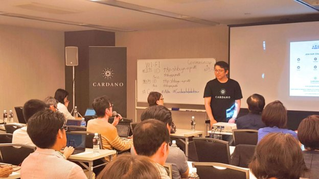
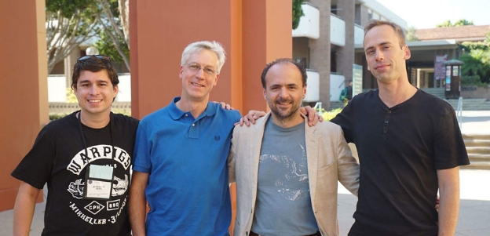

# Introducing the Cardano roadmap
### **Next steps of development are charted ahead of further information releases**
 31 October 2017[ Charles Hoskinson](/en/blog/authors/charles-hoskinson/page-1/) 9 mins read

[ Introducing the Cardano roadmap - Input Output](https://ucarecdn.com/ef815a25-071a-4376-9a66-f3c4912bf85a/-/inline/yes/ "Introducing the Cardano roadmap - Input Output")

### [**Charles Hoskinson**](/en/blog/authors/charles-hoskinson/page-1/)
Chief Executive Officer

Founder

- 
- 
- 

Cardano has been an incredibly challenging and fun project to work on involving many teams throughout the world with different skills and opinions on design, process and quality. Our core technology team consists of Well Typed, Serokell, Runtime Verification, Predictable Network Solutions and ATIX, with IOHK leading them. Then we have external auditors such as Grimm, RPI Sec and FP Complete ensuring quality and holding us accountable to delivering what we have promised. When dealing with a consortium, it’s important to be aligned not only on day to day affairs, but on the broader engineering philosophy of why and how things should be constructed, as well as the pace of development. I’d like to spend a few paragraphs exploring the principles that guide [our roadmap](https://cardanoroadmap.com "Cardano Roadmap").

First, we can only grow as fast as our community. At the moment, more than half of our community has never used a cryptocurrency before. This reality means that while it would be awesome to introduce complex features like stake pools, blockchain based voting and subscribable checkpoints, they would be underutilized and therefore ineffective until the community catches up. To this end, we’ve provisioned resources towards a [help desk tour](/en/blog/cardano-help-desk-tour-arrives-in-tokyo/ "Cardano help desk tour arrives in Tokyo, iohk.io"), a dedicated support channel and trying to interact with our community as much as possible as they grow. This is tremendously time consuming, but it really does force our software to become simpler and more useable.

 Cardano help desk tour, Tokyo sessions.

This effort challenges design assumptions, such as what the capabilities of the average node in our system should be. Throughout the next few months, a large part of our focus will be on answering questions, debugging software, improving the user experience and community education. The output will be that more people use Daedalus comfortably and back up their Ada, are able to use exchanges according to best practices, and understand why Cardano is a special project. It also means our software will slowly become more bug free and compatible with different configurations.

Second, we believe firmly in the vision of Satoshi that these networks must be resilient and distributed. Resilience means we cannot optimize around a collection of trusted or usually reliable nodes to maintain the network. Distributed means that wherever possible, every node contributes to propagating the network and its DNA. This creates tremendous design challenges. One is at the mercy of the weakest links when replication is the tool used for resilience because it dramatically slows the network as more users come online. While we feel that a protocol like Ouroboros is perfectly suited to properly balance these conflicting demands, we admit that general network and database capacities aren’t quite ready for this task. The sole – and temporary – advantage that Cardano enjoys here is that we are new and won’t feel the pain of scale for the next year.

Yet we must remain vigilant in our efforts to address these concerns systematically as we have done with Ouroboros. Therefore, many of the most significant network improvements will be scheduled for deployment in late 2018 and throughout 2019. Third, there is a difficult balance between research and deployment. We have great protocols and protocol developers. We also have a unique advantage in being able to quickly submit papers for peer review in order to promptly validate them or fail fast, instead of enduring difficult lessons of hindsight that can result in the loss of funds. However, we cannot allow the urge to have something ready soon for commercial advantage to drown out proper process. With Ouroboros for example, we have a serious and ongoing [formal specification](/en/blog/cryptocurrencies-need-a-safeguard-to-prevent-another-DAO-disaster/ "Cryptocurrencies need a safeguard to prevent another DAO disaster, iohk.io") effort using Psi Calculus to model and remove all ambiguity from our consensus protocol. This effort has been fruitful in dramatically increasing our understanding of all the benefits and sins of Ouroboros, but will not yield working code until the second half of 2018.

 Ouroboros Praos researchers, left to right: Bernardo David, Alexander Russell, Aggelos Kiayias, Peter Gaži

We deployed a rigorously built protocol for Byron, but one that does not enjoy a formal specification. There is always the chance we did something wrong, as with all software projects. There is always the chance we haven’t followed the intent of the scientists, despite our best engineering efforts. The broader point is that as our protocols increase in complexity, interdependence and with the use of more exotic cryptographic primitives, finding a balance will become more challenging. The saving grace we have is that many of our security assumptions are somewhat composable, we use great methods like Red-Black teams, peer review and formal specs, and using Haskell forces deeper conversations about intent.

The question of when to introduce smart contracts has become the most difficult issue of our roadmap. IOHK has brought some of the best minds from the programming language theory world, such as Professor Rosu and Professor Wadler, into the area of smart contracts. They have watched the world evolve from simple computers measuring performance in the megahertz and kilobytes of RAM to the internet age of big data, AI on demand and nearly unlimited processing power.

It’s an extraordinary honor and privilege to work with people with so much wisdom, hindsight and proven contributions to the fabric of computer science. Yet we also have the demands of Ethereum and the other systems that while lacking rigorous foundations have proven to attach a large following and much mindshare. We won’t accept the model of smart contracts is a closed matter and that these issues are now just a matter of optimization. We won’t accept that society is anywhere close to mass adoption of this new paradigm. It’s the beginning and it would be foolish to say Ethereum’s model is the one to back. Yet we acknowledge the need for something like that model. Therefore, we’ve decided to increase our allocation of resources towards two parallel tracks of research.

One is focused on fixing the issues that Ethereum’s hastily driven design process has yielded to the despair of those who have lost funds as a result. The other is focused on the [ontology of smart contracts](/en/blog/thoughts-on-an-ontology-for-smart-contracts/ "Thoughts on an ontology for smart contracts, iohk.io") in general as well as different computational models that achieve similar ends without necessarily involving the new complexity or cost that Ethereum introduces. Professor Rosu’s team at the University of Illinois and the partnership with Runtime Verification is focused on the former effort. The work of Professor Wadler’s team is focused on the future and broader theory. We hope to establish more foundational research in the field of smart contracts, as Professor Aggelos Kiayias did with the [GKL model](https://eprint.iacr.org/2014/765.pdf "The Bitcoin Backbone Protocol: Analysis and Applications, iacr.org") and [Ouroboros](https://eprint.iacr.org/2016/889.pdf "Ouroboros: A Provably Secure Proof-of-Stake Blockchain Protocol, iacr.org").

Next, there is the interplay between good partners like [Bittrex](https://bittrex.com/Market/Index?MarketName=BTC-ada "Ada on Bittrex"), Ledger and others who are consumers of our APIs and have to deploy our software for thousands to use. The reality is that all interfaces are best guesses until they are used and then must change to conform with reality, not best intentions. We’ve already seen lots of room for improvement for our middleware layer, Daedalus’s design and also new features that would be helpful in making integration simpler and more cost effective. To this end, we’d like our first light clients to come from third parties instead of directly from IOHK, to force our documentation to improve and our software to become less arcane. Much of the effort towards Shelley (Cardano’s next major release) will be focused towards these types of improvements. They create a wonderful feedback loop that helps us make better decisions that benefit larger groups of users. Finally, the Cardano roadmap isn’t the property of IOHK, Cardano Foundation or Emurgo. It belongs to the community. When a cryptocurrency is new, it needs good shepherds to guide and steer, but we cannot allow the ecosystem to be ruled by a beneficent dictator or oligarchy.

This requirement creates some issues about scope. We have a clear idea of what needs to be done over the next 18 months to realize some of the technical requirements of Cardano from scalability to interoperability, but we cannot operate as a dictatorship pushing along and telling everyone to accept it. Cardano belongs to those who hold Ada. Thus we’ve decided to execute with three parallel paths. First, Shelley is our path to the full decentralization of Cardano. This must be done and we have decided to publish in full what Shelley entails. Next, there is the issue of Cardano Improvement Proposals (CIPs) and gathering consent for moving forward on whichever one is decided upon. We have invested a great deal of effort into building a solid voting system and will be releasing it for public review soon. This includes a standard for CIPs.

After Shelley, we will be proposing all changes to Cardano as CIPs and adding increasingly better democratic mechanisms to gather consent for these changes. The burden should be on us to inform and rally the community behind a direction. We cannot allow a technocracy to form alongside a cult of personality of the good leaders. Cardano must have the legitimacy of consent from its users. Finally, the roadmap needs to be often reviewed and updated. It cannot be a static document so we are going to run a monthly clock and update it frequently. We are also going to create a channel for people to proposal alternative roadmaps. As our users become more sophisticated and we accrue more enterprise partnerships, we fully expect divergent paths to be proposed and our hope is that they are better than our own. As a last thought, a cryptocurrency is only as good as the community behind it. We’ve been humbled by how amazing, patient and helpful our community has been. Our hope is that the roadmap is something we can build together over time and it becomes one of our strongest pillars.

To learn more about the project see the [recent whiteboard video](https://youtu.be/Ja9D0kpksxw "Cardano whiteboard with Charles Hoskinson"). Filmed on location at IOHK's Blockchain technology lab, Tokyo Institute of Technology - 東京工æ¥大å¦
## **Attachments**
[ Introducing the Cardano roadmap - Input Output](https://ucarecdn.com/ef815a25-071a-4376-9a66-f3c4912bf85a/-/inline/yes/ "Introducing the Cardano roadmap - Input Output")
