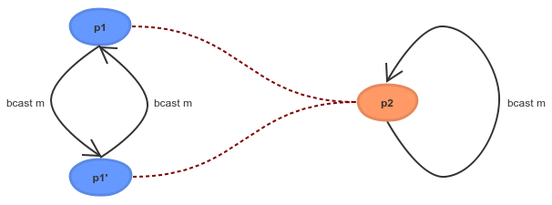

# Writing a High-Assurance Blockchain Implementation
### **Guest blog from Edsko de Vries, who is working on the high assurance implementation of the Ouroboros blockchain protocol**
 3 November 2017[ Edsko de Vries](/en/blog/authors/edsko-de-vries/page-1/) 9 mins read

[ Writing a High-Assurance Blockchain Implementation - Input Output](https://ucarecdn.com/ccc9e08c-f362-44fb-be67-369e8edb3f35/-/inline/yes/ "Writing a High-Assurance Blockchain Implementation - Input Output")

### [**Edsko de Vries**](/en/blog/authors/edsko-de-vries/page-1/)
Software Engineer

Well-Typed

- 
- 
- 

In our previous blog post [Cryptocurrencies need a safeguard to prevent another DAO disaster](/en/blog/cryptocurrencies-need-a-safeguard-to-prevent-another-DAO-disaster/ "Cryptocurrencies need a safeguard to prevent another DAO disaster, IOHK blog") we discussed the need for high assurance development of cryptocurrencies and their underlying blockchain protocols. We also sketched one way in which one might go about this, but we did not give much detail. In this follow-up blog post we delve into computer science theory a bit more, and in particular we will take a closer look at process algebras. We will have no choice but omit a lot of detail still, but hopefully we can develop some intuition and provide a starting point for reading more.
## **Compositionality**
When we want to study computer programs as mathematical objects that we can manipulate and analyze, we need to write them in a programming language for which we have a well understood mathematical theory. If this mathematical theory inherits much of what we know from elementary mathematics, that's an additional benefit. For example, we learn in school that:

for every number n, n + n = 2 \* n

Shockingly, in many programming languages even this most basic of equations does not hold. For example, in the language C, when we define

int f() {

` `return 5;

}

int g() {

` `int x;

` `scanf("%d", &x);

` `return x;

}

we have that while f() + f() is the same as 2 *f() (both equate to 10), g() + g() is certainly not the same as 2* g(): the former asks the user for two numbers and adds them together, the latter asks the user for a single number and multiplies it by two. In the language Haskell this distinction between an honest-to-goodness number, and a program that returns a number is explicit (this is what we mean when we say that Haskell is a pure language), and for numbers basic mathematical equations such as the above hold true. Knowing that for every number n, n + n = 2 *n in Haskell would still not be particularly useful without another property of Haskell: when we see the expression n + n anywhere in a program, we can (almost) always replace it with 2* n and know that our program still behaves in the same way: we say that Haskell is referentially transparent. This is key: it means that we can analyze bits of our program at a time and know that our conclusions are also correct in the wider context of the whole program. In other words, it means that we can do compositional reasoning: we can understand the larger program by understanding its components individually. This is essential when dealing with anything but toy examples.
## **Process Algebra**
Of course, even in Haskell we can read from files, write to network sockets, etc. and while the type system makes sure that such programs are distinguished from pure values, reasoning about such programs is nonetheless more difficult because we do not have a good mathematical theory that covers all of these "effects". It is therefore useful to identify a subset of effects for which we do have a mathematical theory. Different kinds of applications need different subsets of effects. For some applications a process algebra is a good match. A process algebra is a programming language in which we can express systems of concurrent programs that communicate with each other, along with a mathematical theory. There are many different kinds of process algebras, and they differ in the details. For example, some provide synchronous point to point communication, others asynchronous; a few provide broadcast communication. So what would be an analogue to a law like n + n = 2 \* n in such a language? Well, there are multiple answers, but one answer is bisimilarity, which intuitively allows us to say that "two processes behave the same". For example, consider the two following processes

p1 m = forever $ do

`        `bcast m

`        `bcast m

p2 m = forever $ do

`        `bcast m

Both p1 and p2 consist of an infinite loop; p1 broadcasts message m twice within that loop, and p2 only once. While these two processes may look different, they really aren't: both broadcast message m indefinitely. To make "they aren't really different" more precise, we can try to prove that p1 and p2 are bisimilar. Intuitively, this means that we have to show that any action that p1 can take, p2 can also take, and they are still bisimilar after taking those actions. The proof for p1 and p2 would look something like this, where a red line indicates "can do the same action here":

So why is this useful? When two processes are bisimilar, you know three things: they can do the same actions, they will continue to be able to do the same actions, and most importantly, this is compositional: if p1 is bisimilar to p2 then we can replace p1 with p2 in (most) contexts. As before, this is essential: it means we can understand and analyze a larger program by understanding and analyzing its components.
## **Psi-calculus**
Process algebra is a large field in computer science, and many different kinds of algebras have been studied and are being studied. Some of the earliest and perhaps most well-known are the [Calculus of Communicating Systems (CCS)](https://en.wikipedia.org/wiki/Calculus_of_communicating_systems "Calculus of communicating systems, Wikipedia") and [Communicating Sequential Processes (CSP)](https://en.wikipedia.org/wiki/Communicating_sequential_processes "Communicating sequential processes, Wikipedia"). These days one of the most important process algebras is the [pi calculus](https://en.wikipedia.org/wiki/%CE%A0-calculus "Ï€-calculus, Wikipedia"); argueably, the pi calculus is to concurrent programming what the lambda calculus is to functional programming. While the lambda calculus forms the theoretical basis for functional programming, nobody actually writes any code in the lambda calculus; it would be akin to writing in assembly language. Instead we write programs in a much more sophisticated functional language like Haskell. Similarly, the pi calculus is a "core" calculus, good for foundational research but not so good for actually writing programs. Instead, we will use the [psi calculus](https://www.it.uu.se/research/group/concurrency/publ "Some publications by the Concurrency Group, Uppsala University") which is a generalization of the pi calculus with more advanced features, but still with a well understood theory. Let's consider an example of bisimilarity in the psi calculus, similar to the previous example but slightly more interesting. Do you think we should regard processes p3 and p4 as "behaving the same"?

p3 m = forever $ do

`        `k  <- newKey ; bcast (encrypt k  m)

`        `k' <- newKey ; bcast (encrypt k' m)

p4 m = forever $ do

`        `k  <- newKey ; bcast (encrypt k m)

What about process p5 and p3?

p5 m = forever $ do

`        `k <- newKey

`        `bcast (encrypt k m)

`        `bcast (encrypt k m)

It turns out process p3 and p4 are bisimilar, and the proof is almost the same as before

They both send out an infinite number of messages, each message encrypted with a new key. Although p3 and p4 will generate different keys, from the outside we cannot tell them apart because we don't know anything about those keys. Process p5 and p4 are however not bisimilar:

After p5 sends out a message encrypted with some key k, it then sends that message again encrypted with the same key; p4 cannot follow.
## **Ouroboros Praos**
One of the nice things about the psi calculus is that we can embed it as a domain-specific language (DSL) in Haskell. We use this to define a model of the Ouroboros Praos blockchain protocol, which we can both execute and run (it's just Haskell after all), and even test using [QuickCheck](https://hackage.haskell.org/package/QuickCheck "The QuickCheck package, Haskell.org") (Haskell's randomized testing tool), but moreover is also amenable to formal verification using the psi calculus metatheory.

We start by expressing the algorithm as it is defined in the [Ouroboros Praos paper](/en/research/papers/#XJ6MHFXX "Ouroboros Praos: An adaptively-secure, semi-synchronous proof-of-stake protocol, IOHK") in our Haskell psi calculus embedding. Although we cannot formally verify that this algorithm matches the one in the paper, the correspondence is close enough that it can easily be verified by hand. We can run this implementation and experiment with it. This first implementation will do various things that, while we can implement them, we would not want to do in a real implementation. So we then make a number of small, incremental adjustments, that get us closer and closer to an actual high performance implementation. Each of the individual adjustments should be small enough that a human reader can understand how we go from one implementation to the next and convince themselves that we haven't changed anything fundamental.

Each of these algorithms can be run, so that we can test that all of the adjustments we make to the original algorithm don't change any fundamental properties. Since we express the algorithm in terms of a well-understood process calculus, we can also take some of these adjustments and formally prove that we haven't changed anything fundamental. Bisimulation is but one tool in the theoretical toolbox here; there are many others. The end result is that we have a bridge from the high level specification of the algorithm in the academic literature to the actual low level implementation that we implement, with high assurance that what we actually run indeed corresponds to the algorithm defined and proved correct by the cryptographers.
## **Download and Contributing**
If you want to follow the work in progress, you can find the psi calculus development of the Praos blockchain protocol at [Praos Formalization](https://github.com/input-output-hk/ouroboros-spec "Praos formalization, Github"). One way in which you could contribute would be to read the document, compare it to the Praos algorithm in the literature, and convince yourself that indeed they do the same thing; after all, this is a step we cannot formally prove. Although the subsequent adjustments are in principle formally provable, in practice we may only have resources to do that for a few steps; so here too the more people read the document and try to poke holes in the arguments, the better. If you want to do more than verify what we have done, we would be happy to discuss the possibilities; contact us [here](mailto:duncan@iohk.io). We look forward to hearing from you!
## **Attachments**
[ Writing a High-Assurance Blockchain Implementation - Input Output](https://ucarecdn.com/ccc9e08c-f362-44fb-be67-369e8edb3f35/-/inline/yes/ "Writing a High-Assurance Blockchain Implementation - Input Output")
