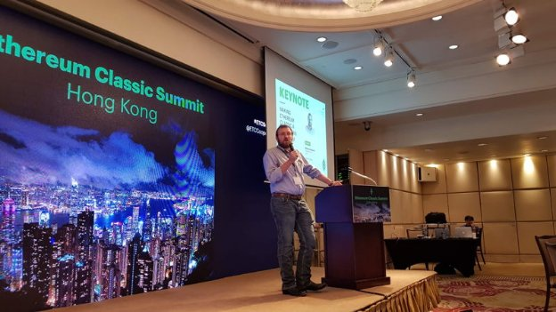
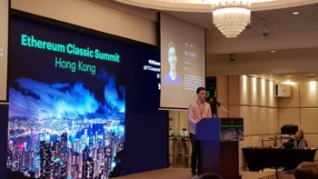

# Ethereum Classic community comes together at successful Hong Kong summit
### **Principles and plans for growth unite participants at event organised by Grayscale**
 22 November 2017[ Jeremy Wood](/en/blog/authors/jeremy-wood/page-1/) 10 mins read

[ Ethereum Classic community comes togeth](https://ucarecdn.com/5c3a1417-0a48-4500-8fab-6baeaa5d50d1/-/inline/yes/ "Ethereum Classic community comes togeth")

### [**Jeremy Wood**](/en/blog/authors/jeremy-wood/page-1/)
Founder

- 
- 
- 

Since day one, Ethereum Classic has been driven by principles. What began as a disparate group of people who came together after the DAO hack and the consequent hard fork on Ethereum has now become a strong and growing community, united by a belief in immutability and that code is law. So it was tremendously exciting to see everyone gather at the first Ethereum Classic Summit held last week and watch the community move beyond the realm of instant messaging to interacting in person and making new friends. There were many highlights of the two day summit in Hong Kong. It was a moment to reflect on how much Ethereum Classic has achieved in a little over a year, developing its identity, building its technology and securing its future. Grayscale, which provides Bitcoin and Ethereum Classic investment trusts, has provided much momentum by organising this event.

Barry Silbert, founder, explained that Grayscale will put a third of its ETC fees for three years into supporting the growth of ETC though development, marketing and the community, and the ETC Cooperative has been established to do this. Barry told IOHK: “We wanted to do our part and help support increased communication, collaboration and bring together all the various stakeholders at least once a year. I’ve been super excited to see the participation, the level of engagement, the quality of the speakers and participants and think this year has been a huge success.”

 Charles Hoskinson giving his keynote speech

What might come a surprise to some is that Ethereum Classic is not a direct competitor to Ethereum. In [his keynote speech](https://www.youtube.com/watch?v=eUqdgEzKZMg "ETC Summit, Charles Hoskinson, CEO, IOHK") on the first day of the summit, Charles Hoskinson, founder and CEO of IOHK, and former CEO of Ethereum, said: “Frankly, we compete far more with Bitcoin. To me, Ethereum Classic is basically a digital commodity, it’s digital gold. It’s really exciting because it can give us a very interesting design space that we can explore that’s totally independent of the design space that Ethereum is pursuing. We don’t have to embrace proof of stake, Plasma or the fork of the week. Instead we can start with principles and we can grow from principles.”

Charles argued that two separate philosophies had always sat uncomfortably together in Ethereum, even before the community split. “We actually had two Ethereums from the beginning but we didn’t know that. We had two philosophies at the same time. One was this notion that code is law, that code can’t care, it doesn’t matter what you’re running and it doesn’t matter about the consequences. But there was this other philosophy, the notion of a world computer, the idea that you could have universal infrastructure that would be a beautiful computation layer that could be added to the internet. But the fundamental problem is that these things are philosophically so different they can’t coexist. When you’re the world computer you have to fork, you have to embrace mutability and have a lot of flexibility in your platform.”

Now more than a year after the split, Ethereum Classic has developed its own identity. It had a great asset in its principled and warm spirited community, Charles pointed out and championed the development work being done. “We see a lot of great things coming down the pipeline. It’s got to a point where we can prove beyond reasonable doubt that we can keep up with Ethereum Foundation and in some cases we’re writing better software. As a comparison, Bitcoin Core has about 110,000 to 120,000 lines of C++ code. The [Mantis client](https://github.com/input-output-hk/mantis "Mantis, Github") does more and it’s 10,000 lines of code. It’s twelve times more concise. “The Sputnik VM, pulling the VM out and having it as a standalone, is a phenomenal idea, it’s a great piece of engineering. It’s far better than anything coming out of the Ethereum Foundation.”

A highlight of the conference was hearing about the steady pace of development of the ETC protocol. The eight-strong team of engineers that make up ETCDEV team are working on implementing the monetary policy, a flexible software developer kit that can be used to build applications on Ethereum Classic, and making performance and reliability improvements to the Ethereum Virtual Machine. Isaac Ardis, Go developer from ETC Dev, outlined the direction and purpose of the Emerald Project, which is not just a wallet but a library and suite of tools for third party developers. Licensing projects under Apache 2.0 makes them commercial-friendly, and easy to implement.

Igor Artamanov, CTO of ETCDEV, told IOHK that he believed Ethereum Classic would rise to be in the top three cryptocurrencies. “We’ll continue our work on open tools for developers who will build apps on top of ETC blockchain. Our goal is to set up development processes and help with building various tools for engineers and open source libraries around ETC.” A theme of the conference was formal verification, and on that topic Igor said: “It will be cool to have. We are not experts in formal verification, but if someone will decide to introduce it to SputnikVM, we’ll appreciate that.” On monetary policy, Matt Mazur, advisor to the ETC Dev team, gave a clearly explained presentation on ECIP 1017, the proposal that contains changes such as capping the amount of ETC that can be created, in contrast to Ethereum’s uncapped supply.

 

Alan Verbner speaking at ETC Summit

The [ETC monetary policy](/blog/ethereum-classic/a-joint-statement-on-ethereum-classics-monetary-policy/ "ETC monetary policy, iohk.io") is modelled on Bitcoin’s monetary policy, and is designed to reduce risk, create simplicity, and encourage investors. Every 5 million blocks, there is a 20 per cent reduction in block rewards. The question of how Ethereum Classic will scale has always been an issue of debate. Igor shared insights on how sidechains could be deployed, making use of public and private sidechains and having the main chain for security. Cody Burns, ETCDEV adviser, talked about cross-chain interoperability and how [cross-chain atomic swaps](https://medium.com/@DontPanicBurns/ethereum-cross-chain-atomic-swaps-5a91adca4f43 "Cody Burns, Medium") could allow people to exchange coins in a trustless manner.

There was news from the Grothendieck team, the IOHK developers that are dedicated to ETC and who have over the past year built the Mantis client for Ethereum Classic. Alan McSherry, team lead, gave details about integration with the Daedalus wallet. It will be fantastic for the community to have another option for a wallet, where they can securely store their ETC. “The Daedalus release is going to happen hopefully in December. That’s taking the Daedalus wallet, the UI that was built for [Cardano](http://cardanohub.org/ "Cardano Hub"), and putting it on top of our Mantis client, our ETC node, so you’re able to use a familiar UI with Ethereum Classic.”

Alan McSherry also offered a look at what the team are thinking about in terms of Mantis development in 2018. With regard to [K Framework](https://github.com/runtimeverification/k "K Framework, Github"), the important research to create formal semantics of the EVM done by Professor Grigore Rosu at the University of Illinois, and funded by IOHK, he said: “With any luck, that will result in the possibility of writing Scala contracts that can be compiled to run on the EVM, or a slightly different version of the EVM, and we’ll have the formal verification and it’ll be a question of trying to create formal proofs around those contracts.” [IOHK research into sidechains](/en/research/papers/#67CHCNP8 "Non-Interactive Proofs of Proof-of-Work, iohk.io") could allow the possibility of creating contracts to allow interactions between ETC and Ethereum and ETC and Bitcoin, while other features on the horizon for ETC include zero knowledge proofs and anonymous addresses, he said.

And Alan Verbner, developer on the team, gave a reminder of why the team use Scala. “Functional programming allows you to create less and more secure code and that’s why we are trying to build in Mantis compact code that is safe and you can check its correctness. Our client has 10,000 lines of code, it’s easier to read and easier to access. We are building open source software so we like people to look into it and analyse it to look for bugs and security issues. You have fewer lines of code to test.”

The theme of principles arose again when it came to hearing from Ethereum Classic miners. We heard how mining pools chose ETC because of the core principles of the community, proving the attractiveness of the code is law philosophy. There was good news from the 91Pool, the first group that ever mined on ETC, when Meicy Mei announced the group has purchased a building in Shanghai to serve as a dedicated hub for the ETC community in China, with a cafe and bar that will host meet ups.

 

ETC Summit key stakeholders on stage

A final reminder of the principles that brought the Ethereum Classic together came during an impassioned keynote speech from Meredith Patterson, an expert in programming language security. She recounted the scorn that Ethereum had responded with when formal methods of software development were suggested as a good idea. She argued that Ethereum Classic still had the chance to adopt formal methods – an approach that IOHK is a strong advocate of and actively pursues during its development process. For code to be law, she said, the meaning of the code must be unambiguous, and users must have the same understanding of it that machines do. Steps to get there include adopting a rigorous formal semantics, like KEVM. Deficits in test suites should be found and the problem corrected. Solidity should be replaced.

The importance of coming together as a community to debate these issues cannot be underestimated. The results of these discussions will drive the development of Ethereum Classic. Sharing this view, Barry told IOHK: “I think in the digital currency space there’s a little too much interaction done through social media and through anonymous forums and it’s important to get people together to meet each other, challenge each other, and do it in a way that is respectful and that fosters communication and collaboration. So I do think it’s important to have summits like this. I absolutely expect that we’ll do it again next year and hopefully the year after that will become an annual event that everybody in the community looks forward to.”

"Ethereum Classic is the most decentralized coin, and the most distributed without a significant holder of the token supply." - via Meicy Mei from 91 Pool [#ETCSummit](https://twitter.com/hashtag/ETCSummit?src=hash&ref_src=twsrc%5Etfw) [#etc](https://twitter.com/hashtag/etc?src=hash&ref_src=twsrc%5Etfw)

— Ethereum Classic (@eth\_classic) [14 November 2017](https://twitter.com/eth_classic/status/930317743013933056?ref_src=twsrc%5Etfw)

Over 29K views from our global community who tuned in to our live stream.[#ETCSummit](https://twitter.com/hashtag/ETCSummit?src=hash&ref_src=twsrc%5Etfw) was trending on Twitter in Hong Kong during the summit with the amount of engagement from our community. 
Thank you all for the support and we are excited about the future. [#ETC](https://twitter.com/hashtag/ETC?src=hash&ref_src=twsrc%5Etfw) [#ETCisComing](https://twitter.com/hashtag/ETCisComing?src=hash&ref_src=twsrc%5Etfw) [pic.twitter.com/ncGL1CHWJ2](https://t.co/ncGL1CHWJ2)

— Ethereum Classic (@eth\_classic) [15 November 2017](https://twitter.com/eth_classic/status/930808055876419584?ref_src=twsrc%5Etfw)
## **Attachments**
[ Ethereum Classic community comes togeth](https://ucarecdn.com/5c3a1417-0a48-4500-8fab-6baeaa5d50d1/-/inline/yes/ "Ethereum Classic community comes togeth")
