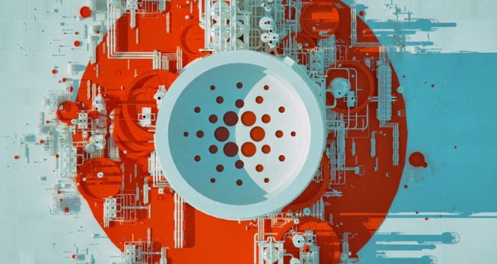

# What is our release strategy for Cardano?
### **A new development approach from IOHK engineers will bring benefits to users**
 1 December 2017[ Jeremy Wood](/en/blog/authors/jeremy-wood/page-1/) 4 mins read

[ What is our release strategy for Cardano - Input Output](https://ucarecdn.com/bfb745ae-c236-4721-8d72-a730e164ec32/-/inline/yes/ "What is our release strategy for Cardano - Input Output")

### [**Jeremy Wood**](/en/blog/authors/jeremy-wood/page-1/)
Founder

- 
- 
- 

Since the release of mainnet, IOHK engineers have not only started work planning the new features of Shelley, the next big release, but have also been evolving the way they work. The biggest change is that the team developing Cardano will follow a new release cycle where updates are more regularly made to the live software. This is now possible because we have the foundation of Byron to build on. This approach will benefit the community because it means we can deliver features to users sooner, and also has other advantages, such as allowing us to design very detailed tests for the code. Considerable planning has been under way to help the team shift to this approach, and we are confident it will bring good results. This blog post explains what is happening behind the scenes. [Cardano](https://cardanohub.org "Cardano Hub") involves collaboration from several development teams working towards a common vision following the same [roadmap](https://cardanoroadmap.com/ "Cardano Roadmap"). The development teams collaborating on the project include Core SL (Settlement Layer), Networking, Cardano Blockchain Explorer, Wallet Backend, and [Daedalus](https://daedaluswallet.io/ "Daedalus Wallet"). Development follows the agile software development approach, which allows us to continuously inspect, adapt and improve the way we build and ship Cardano. Agile is an iterative approach where software is built incrementally from the start of the project, instead of delivering it all at once near the end, as we did with Byron, the launch of mainnet.

The development teams working on Shelley now follow synchronized two-week sprints, which are a set period of time during which specific work has to be completed and made ready for review. There are daily meetings to coordinate the teams and resolve any issues. The product backlog – where the prioritized list of features are stored and is essentially all the work that needs to go into developing Cardano – is being managed in an issue tracker tool. Individual teams have their own sprints that take their work from this shared product backlog.

After a two-week sprint, we will deliver a testnet release. After a number of testnet releases there will be a mainnet release based on feedback from the community and internal quality assurance testing.

Our goal is to reduce the time between mainnet deployments. To release early and often, we’re adopting time-based releases as opposed to feature-based releases. Time-based release strategies are used in many commercial and open source projects, for example, [Linux](https://en.wikipedia.org/wiki/Linux "Linux, Wikipedia"). Moving to time-based releases means no more waiting for features to be ready; instead we merge only the features that are ready at the time of the release. This doesn’t include patches, which are updates to improve the software or fix bugs, which will continue to be released when they are ready.

One of the problems with the "big bang" release approach we followed for Byron is that it creates a bottleneck due to problems coordinating all the features slated for release at the same time. Decoupling features from releases, where possible, means that in future we will not have to delay a release because we are waiting for one feature to be ready. It also means that we can focus on getting smaller features out of the door and into the hands of our community quicker. The shorter feedback loops allow us to gather valuable feedback from the community on the direction that we are taking Cardano. It allows users, contributors and stakeholders to prepare and plan around a predictable timeframe.

However, scaling this agile approach across several teams working on the same product brings merging and integration challenges. We are using a well known, successful git branching model called [git-flow](http://nvie.com/posts/a-successful-git-branching-model/ "A Successful Git Branching Model, nvie.com") to help manage this.

Once a development sprint is finished, our DevOps (development and operations) team branches off the code from the develop branch into the release branch. Changes are deployed to internal staging and once testing approves the changes, they are redeployed to the testnet. Once we decide to release mainnet, the release branch is merged to the master branch and tagged. The master branch is therefore always in stable state as the mainnet. We’re working to align our processes to enable moving towards more frequent, scheduled releases. Once a suitable release schedule is decided it will be shared with the community. The process described here is not an end state. We strive to continuously improve, so updates to our release process can be expected as we fine tune our software development processes.

Artwork, 

[Mike Beeple](http://www.beeple-crap.com/resources.php)
## **Attachments**
[ What is our release strategy for Cardano - Input Output](https://ucarecdn.com/bfb745ae-c236-4721-8d72-a730e164ec32/-/inline/yes/ "What is our release strategy for Cardano - Input Output")
