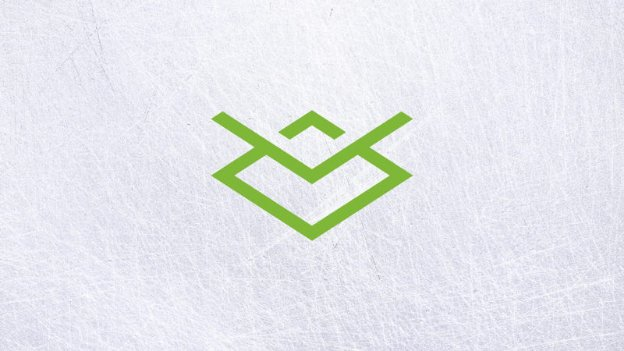

# Daedalus Wallet launches for Ethereum Classic
### **The Grothendieck team’s Daedalus integration for the Mantis client is now live**
 22 December 2017[ Jeremy Wood](/en/blog/authors/jeremy-wood/page-1/) 5 mins read

[ Daedalus Wallet launches for Ethereum Classic - Input Output](https://ucarecdn.com/297e62ba-536e-42b9-9e1b-310616040825/-/inline/yes/ "Daedalus Wallet launches for Ethereum Classic - Input Output")

### [**Jeremy Wood**](/en/blog/authors/jeremy-wood/page-1/)
Founder

- 
- 
- 

I am pleased to be able to write about the latest release from [Team Grothendieck](/en/projects/ethereum-classic/#team "Grothendieck Team") in conjunction with [Team Daedalus](/en/projects/daedalus/#team "Daedalus Team"). It's called the Daedalus release and it combines the functionality of the highly thought out [Daedalus Wallet](tmp/daedaluswallet.io "Daedalus Wallet") and the Mantis Ethereum Classic Client.

The previous release of the Mantis client was the [beta release](/en/blog/mantis-ethereum-classic-beta-release/ "Mantis Ethereum Classic Beta, iohk.io") in August and since then we've been busy both supporting the Daedalus integration and improving the code base, making it ready for production. 

We are now delighted to make our first release candidate available. [Download](https://github.com/input-output-hk/mantis/releases "Download Daedalus") the Daedalus Mantis integration for Windows 10 and MacOS. 

Make sure to check the downloaded binary file against the fingerprint listed on the download page!

The installer installs both Mantis backend and Daedalus wallet and sets up a secure connection between them using an SSL certificate. 

The Mantis part of the integration has been packaged with a Java Virtual Machine included to allow fast and easy setup of the client. This initial release has focused on the basic wallet to wallet transfer function and enjoys the safety features Daedalus is known for. This is still very new software, it is *not recommended* to use this wallet for any high value transactions because we consider this release to be a live test. For users who already use Daedalus Wallet for Cardano, these are currently separate products: one targeting ETC users and one for Cardano users and *should not* be installed side by side. Near future releases will provide a more integrated experience. 

Ethereum Classic, for all it strengths, suffers from the same synchronization issue as other blockchains – it takes an impractically long time. Reducing this time will be a priority for future releases but at the moment it's quite impractical to wait for days to sync up the chain, and a synchronized chain is required to allow use of the wallet. 

The solution for this is to use our prepackaged bootstrap databases. Anyone familiar with the beta release will remember the bootstrap databases we provided to users to circumvent the download wait. 

The easiest way to get a bootstrap database is through the installer. The installer will download a bootstrap database, check that there's enough free space (~33GB) and then check the downloaded file’s fingerprint. All that being done, it will unzip the file to the appropriate database folder and then clean up after itself. This process can take as little as fifteen minutes or in the worst case several hours depending on the network and disk resources available. The compressed bootstrap file itself is of the order of 10GB.

The log file, located by default in the $HOME/.mantis/logs folder gives a step by step account of the download process.

Upon successful completion, starting the Daedalus wallet will show an almost synchronized database which should take less than an hour to complete its synchronization, depending on how many days pass between when the database was created and installation time.

The second way to install the bootstrap database is to make sure Mantis is stopped and then [download the file](https://github.com/input-output-hk/mantis/wiki/Bootstrap-Database-Download-Links "Matis Bootstrap Database, Github") and unzip it into the $HOME/.mantis/leveldb folder. Remember to delete or move the previous contents of the folder. When Daedalus is restarted, it will pick up the database and the wallet should be up to date in less than an hour. Again, the time will depend on how old the bootstrap database is at the time of download.

To protect your self against MITM attacks always compare the hash of the bootstrap database against the hash published on the [Mantis download website](https://github.com/input-output-hk/mantis/wiki/Bootstrap-Database-Download-Links "Mantis download website").

macOS users must use the manual bootstrap method for now!

Users should be aware that stopping the wallet also stops the Mantis backend and so ends the synchronization process. 

As well as the Daedalus Mantis integration we also announce release candidate 1 of the Mantis command line client. This is a continuation of the command line client we released in August. It is almost identical but where the default configuration is set up for Daedalus, the command line default is set up for "normal" use. Normal use just means that any client can connect to Mantis over HTTP rather than over HTTPS. It also is available for use on Linux and contains no prepackaged JVM.

Apart from the wallet integration, CPU mining has been added to the feature list. In the last release we provided integration with an external miner, this version allows Mantis to perform CPU mining by simply turning on a flag in [the configuration](https://github.com/input-output-hk/mantis/wiki/General-Configuration "Mantis Wiki General Configuration, Github").

At about 17.30 GMT on Monday 11 December the first block reward reduction took place, the visible effect of ECIP 1017 and Mantis handled it as expected. After block 5,000,000 the reward for mining a block was reduced by 1 ETC. It was vitally important that all clients implemented this change to prevent a network split. 

Peer discovery, maintaining a gradually changing list of good peers as discovered by asking our peers for their peers and so on is another feature added since the beta release. 

I witnessed a lot of hard work going into this code base and I'm very pleased for the whole Mantis team, Team Daedalus and our DevOps troops who wrestled tirelessly with our various continuous integration pipelines. Their hard work has culminated in a software release they can be very proud of. 

Christmas is just around the corner here in Ireland and will be a welcome break. But January 2018 will be here soon and we will start our security audit of the Mantis code base – and more technology related adventure beckons!
## **Attachments**
[ Daedalus Wallet launches for Ethereum Classic - Input Output](https://ucarecdn.com/297e62ba-536e-42b9-9e1b-310616040825/-/inline/yes/ "Daedalus Wallet launches for Ethereum Classic - Input Output")
