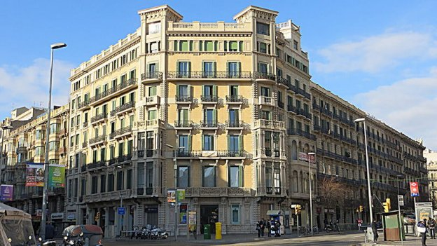

# The hotel that became the world’s first business to accept Ada
### **I visited Hotel Ginebra in Barcelona to stay a night and meet the manager**
 5 January 2018[ Olga González](/en/blog/authors/olga-gonzalez/page-1/) 7 mins read

[ The hotel that became the world’s first business to accept Ada - Input Output](https://ucarecdn.com/48bf767c-3bf7-4298-bf60-b85e3bb0bd03/-/inline/yes/ "The hotel that became the world’s first business to accept Ada - Input Output")

### [**Olga González**](/en/blog/authors/olga-gonzalez/page-1/)
Guest Blogger

[Hotel Ginebra](https://www.hotelginebra.com.es/ "Hotel Ginebra, Barcelona") is a boutique hotel in [Catalunya Square](https://en.wikipedia.org/wiki/Pla%C3%A7a_de_Catalunya "Pla%C3%A7a de Catalunya, Wikipedia"), which if you have visited Barcelona you will know is a prime location in the heart of the city. Guests can wake up in the morning to a great view of the city, but what they may not know is that the hotel has earned its place in history. It recently became the first business in the world to accept Ada, the Cardano cryptocurrency [launched at the end of September](https://bitcoinmagazine.com/articles/iohk-launches-cardano-blockchain-ada-now-trading-bittrex/ "IOHK Launches Cardano Blockchain with Ada Now Trading on Bittrex, Bitcoin Magazine"). I went to check out the hotel, to meet the manager, and to learn the story of how it came to [accept Ada](https://www.hotelginebra.com.es/welcome/ada/ "Hotel Ginebra, Ada as Payment"). Alfred Moesker is one of those who fell in love with this city. Born in the Netherlands, he had owned a hotel in Rome for years before he came to Barcelona and with his partner Yvonne Daniels took over Hotel Ginebra in 2013. Alfred and Yvonne are innovative managers who believe Ada can bring big benefits to the hotel industry, as well as to the wider world. I decided to make use of the offer to pay in Ada and found it was easy and efficient: the first of many transactions to be done, I am sure about that!

I asked Alfred what he felt about being the first business to [accept Ada in payment](https://www.cardanohub.org/en/shop-with-cardano/ "Shop with Cardano, cardanohub.org").

“Incredibly proud,” he said. “For reasons we even fail to completely understand ourselves, we are more proud about it as we have been about anything else we have done for a long time. But working with Ada just feels right to us and it is a project that we feel we can identify with, not just something we just use and then throw away later. 

In the short time since my visit, Alfred says quite a few people – including from Japan – have walked into the hotel inquiring if they can pay with Ada if they were to book a room. In a follow-up email he said: “To see how excited they get when we tell them ‘yes, you can’ is fantastic to witness.”

The hotel is in a typically Catalan building, with a regal style on the outside and a modernist feeling once you go in. It has been completely reformed on the inside and the rooms are cozy and quiet; they range from small, single rooms to big suites, so the hotel is very versatile. There are also great common spaces for guests (the use of which is included in the room price), computers with internet access, break rooms with tables and sofas, and snack rooms with tea, coffee and pastries available at all times. The staff are wonderful, kind and efficient, there’s a 24-hour reception service and they will greet you with a nice glass of wine and a chocolate once you’re settled in your room. If the location and the well-kept inside wasn’t enough to make it a great stay, the staff totally top it!

 

View of Catalunya Square from Hotel Ginebra

It’s not hard to see why Alfred and Yvonne moved to Barcelona. The hotel overlooks Plaça de Catalunya’s famous fountains and the main streets: La Rambla, where there are restaurants, museums, and shops, before you finally get to the beach; Passeig de Gràcia, if you love haute couture or want to have a taste of fancy Barcelona take a stroll around here, and Portal de l’Àngel, which leads to Barcelona Cathedral and the gothic district, and where you will find the famous Santa Llúcia fair if you’re visiting in winter). What all these places have in common, aside from being Barcelona’s heart and soul, is that they’re a three-minute walk from Hotel Ginebra.

Alfred came across Ada after reading an online article. He was just learning about Bitcoin at the time and was put off by its huge price volatility, fluctuating values not being nice and predictable for a business. He wondered instead whether alt coins might have a role to play in his business. A friend warned him that cryptocurrency was “like the wild west” because it was an emerging technology, but he preserved with his research and came across [Cardano](https://cardanohub.org "cardanohub.org") and the [whiteboard videos](https://www.youtube.com/playlist?list=PLnPTB0CuBOBxDBrD4-ZflYF6y3L3jMUOs "IOHK Whiteboard Videos, YouTube"). 

“I liked the idea behind cryptocurrency,” he said. The peer to peer principle definitely is very attractive to us personally. We have had our share of bad experiences with banks and the idea that there is something else out there that can make the system a bit fairer just sounded all too appealing.

“Then I read about the Cardano project which seemed the opposite of exciting. It featured a photo of Jeremy Wood and Charles Hoskinson, both clearly the academic type – bordering on "nerdy" in a good way! When we read how they had been carefully constructing this project in order to take out the flaws of other cryptocurrencies and offer a much more "balanced" product, we thought ‘bingo’!!!”

Alfred liked the fact that Ada had been designed to be used as a cryptocurrency and also that it was part of Cardano, a system that would “lay the foundations for many projects in the crypto industry for many years to come”. “We get a strong sense that Ada is a product that will do good in the world and that has been set up for the right reasons,” he said.

Ada could also bring big benefits to the hotel industry in Alfred’s view.

“Accepting a cryptocurrency in general opens up a new segment of the travelling global population,” he said. “Accepting Ada will very importantly give us a chance to also go back to peer to peer relations with our potential customers. Nowadays the big reservation portals have so much commercial power that you are pretty much at their mercy.”

“Imagine if and when Ada has been distributed globally. A lot more people, that now do not have a credit card or have credit rating problems and can’t easily make a hotel reservation, by using ADA will be able to make a reservation in one minute. In our opinion it will promote financial global equality, at least that seems very likely from what we see happening with the hotel reservation process and hotel industry.”

 

Alfred and Yvonne at Hotel Ginebra

All in all, visiting the hotel and meeting Alfred was a very positive experience. I spent a wonderful night in a nice hotel with kind staff in the center of the city, waking up in Barcelona’s heart at a good price and used a safe, direct form of payment. Either if you’re travelling for business or on holiday, alone or with friends or family, I can totally recommend it.

Alfred was very excited about Cardano’s potential and proud to be a part of the community. 

His words about what attracted him to [Cardano and its community](https://forum.cardanohub.org/ "Cardano Community Forum, forum.cardanohub.org") were:

“It is hard to define…it is just one of those things you come across in your life sometimes and you just know it’s right, even when you only understand a fraction of the “why” at the time. 

“What we do know is that it seems to connect us also on a personal level to what is apparently a pretty special group of people who also like this project and what more can you wish for in life?”

*This article was contributed by a guest blogger and you can show appreciation for this blog by donating Ada to Olga at the following address:*

DdzFFzCqrhtD7LSVkenGw1e14Tb86TS1PsFiTZDL9LPbz8sX7D1ZspzKPn5XmkbrxBhb7BpJrHqtNjgECYrJVw3LwWAF98LUQwiaMUfC
