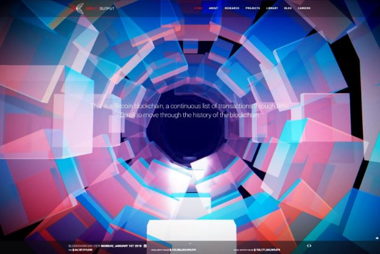

# Symphony of Blockchains
 29 January 2018[ Rouska Lundin](/en/blog/authors/rouska-lundin/page-1/) 4 mins read

[ Symphony of Blockchains - Input Output](https://ucarecdn.com/92e6b86f-f0cb-4f2c-89ca-c184d270e0a2/-/inline/yes/ "Symphony of Blockchains - Input Output")

### [**Rouska Lundin**](/en/blog/authors/rouska-lundin/page-1/)
Production Director

Kuva

- 
- 
- 

[The Symphony of Blockchains](https://iohk.io "iohk.io") is an interactive, visual and auditory exploration of Bitcoin, cryptocurrency and the blockchain. It is an ongoing research initiative with a singular aim: to help bring about greater understanding of both blockchain technology and the ever expanding (and contracting) cryptocurrency marketplace. The term ‘blockchain’ is being increasingly found in everyday language, with little explanation or understanding of the technology and its implication for the future. This work aims to explain both blockchain technology and its most visible application — cryptocurrencies. Through this visualisation we explain the concept underpinning blockchain as well as the individual transactional detail and ultimately the health of any cryptocurrency.

As the technology becomes more pervasive and it impacts on everyday life more, it’s important that we attempt to [explain it in a meaningful way](https://thenextweb.com/distract/2018/01/17/bitcoin-as-art-this-breath-taking-visualization-might-distract-you-from-the-dip/ "The Next Web - Bitcoin as Art").

At [Kuva](https://kuva.io "kuva.io"), a design studio of artists, designers and technologists, we help define new metaphors through which to understand these technologies.

In Symphony we explore the blockchain of Bitcoin as a physical structure. We examine its inherent underlying qualities by encapsulating data as crystalline forms connected in space, that are immutable and persistent. Using this as a metaphor provides a means to understand the Bitcoin blockchain. Blocks take on the properties of the data, their size, colour and orientation represent various qualities. Blocks are orientated in a spiral tracing back through time, each periodic rotation representing a day in the life of the blockchain. Their size and colour represent the total value of transactions made.

Symphony also explores the blockchain as an auditory experience. We ask a simple question: ‘what does the blockchain sound like?’. Using the frequency and timing of Bitcoin transactions as a foundation, the audio extends the crystalling structures by encoding as an sound based entity.

The background sound is an ambient soundscape created from real recordings of computer power supplies and fans to emulate the sound of Bitcoin mining.The intensity of the sound varies with the hashrate of the network.

The audio of the Merkle tree is based on the transactions of the block. A repeating loop is set to run every musical measure (a segment of time corresponding to a specific number of beats in which each beat is represented by a particular note value) Transactions are arranged in ascending order based on the time they were made. The timescale of a block from the earliest to the latest mined, is mapped from 0 to 30 seconds.

Each transaction sound is triggered and set to loop based on the mapped time value (quantized to the nearest 32nd note). As the master loop repeats, notes accumulate and build up a pattern.

The note of each transaction sound is based on the position on the y-axis, to the nearest note in the Aeolian mode.

When it came to the user experience we wanted to ensure it was effortless to explore. The concepts and technologies we’re attempting to explain are complex enough. We didn’t want users having to fathom out a complex navigation system on top of it all.

Once the blockchain is loaded users simply scroll up or down to move forward or back in time through the blockchain. Using their pointer (or finger on mobile devices) they can easily select an individual node or block in the chain to investigate it further. Once accessed, the user is presented with a view of the unique Merkle tree that identifies that specific block. In addition to the Merkle tree view, the user is presented with a plethora of information giving detail about the transaction the selected block represents. To exit the block view the user simply clicks away.

A walkthrough of the experience
## **Attachments**
[ Symphony of Blockchains - Input Output](https://ucarecdn.com/92e6b86f-f0cb-4f2c-89ca-c184d270e0a2/-/inline/yes/ "Symphony of Blockchains - Input Output")
