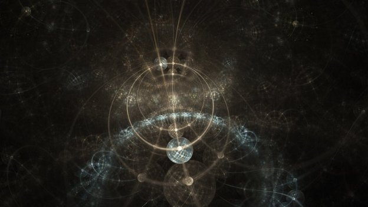
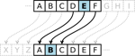
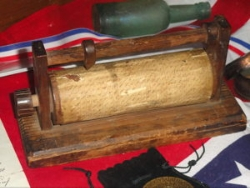
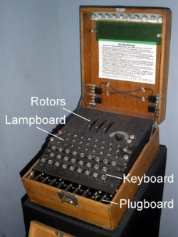

# Research program to work on hardening Cardano against quantum computers
 1 February 2018[ Charles Hoskinson](/en/blog/authors/charles-hoskinson/page-1/) 5 mins read

[ Research program to work on hardening C](https://ucarecdn.com/86547eeb-3106-4ed6-8c90-f64997ec079c/-/inline/yes/ "Research program to work on hardening C")

### [**Charles Hoskinson**](/en/blog/authors/charles-hoskinson/page-1/)
Chief Executive Officer

Founder

- 
- 
- 

At its heart, cryptography is the science of secure communication. We have all secrets, expectations of privacy and assertions of truth about messages we receive that require some notion of verification or quantification of trust. Cryptography provides us with a toolbox to better understand how to transmit and verify these artifacts of communication in the presence of an adversary. The challenge is that transmission mediums change and the capabilities of an adversary change with them. The earliest days of secret communication ranging from Caesar to the American Confederacy involved substitution ciphers and elegant physical devices to accommodate the decryption of messages.

 

A Caesar cipher substitution ([See Wiki for more details](https://en.wikipedia.org/wiki/Caesar_cipher "Caesar cipher, Wikipedia"))

The apex of these approaches was the Enigma machine used by the Nazis during World War Two.

 

A Confederate cipher wheel

As with all cryptographic algorithms, the security of such techniques is always dependent upon assumptions about the capabilities of the adversary. For example, interception of encrypted messages was a deeply personal affair involving finding the spy or messenger moving the scroll. With the invention of wireless communication, listening posts could easily collect all messages transmitted without the sender even knowing. 

Decryption without the trusted hardware device, would require the adversary to have special knowledge and the ability to perform enormous amounts of calculations. The creation of the [Bombe](https://en.wikipedia.org/wiki/Bombe "Bombe, Wikipedia") at Bletchley Park made this task automated for the first time in human history.

 

An Enigma machine

The invention of computers and later the internet has fundamentally changed the entire field of cryptography. Human and transmission limitations as well as knowledge transfer are now such that cryptography had to transform from clever algorithms and [security through obscurity](https://en.wikipedia.org/wiki/Security_through_obscurity "Security through obscurity, Wikipedia") to a science assuming an increasingly more sophisticated adversary that is usually only constrained by physics and [mathematically hard problems](https://en.wikipedia.org/wiki/Computational_hardness_assumption "Computational hardness assumption, Wikipedia"). 

For the past few decades, we’ve been converging into a reasonable model of security that is comfortable for internet connected devices. Usually security is no longer compromised by an unknown weakness in our ciphers, but rather a flaw in their use or implementation in software. 

As much of a triumph this convergence is for the field of cryptography, like Bombe in the 1940s, we are now forced to contend with a new adversary capability: [quantum computation](https://www.youtube.com/watch?v=BYx04e35Xso "Quantum Computing Magic, YouTube"). 

 

Alan Turing’s Bombe Computer at Bletchley Park

 

Part of [Google’s Quantum Computer](https://www.technologyreview.com/s/602283/googles-quantum-dream-may-be-just-around-the-corner/ "Google's Quantum Dream May Be Just Around the Corner, MIT Technology Review")

Quantum computers seem to present the challenge that fundamentally hard problems which secure our modern cryptographic algorithms [may not be hard anymore](https://en.wikipedia.org/wiki/Shor%27s_algorithm "Shor's algorithm, Wikipedia"). Should this occur, most of the modern algorithms we use will have to be phased out and replaced with fundamentally different ones. Cryptocurrencies are consumers of these modern cryptographic algorithms from the simple, such as public key systems and hash functions, to the complex, such as zero knowledge proofs and multiparty computation. As there is an explicit and ever increasing bounty for breaking the security behind a cryptocurrency, the challenge for IOHK is to imagine how to provide long-term security in the face of future adversaries, including ones that possess quantum computers. 

Therefore, we have launched a long-term research agenda to gradually harden all algorithms used in Cardano’s protocol stack against an adversary who possesses a quantum computer. The first part of this agenda is to harden our consensus algorithm Ouroboros. 

All good research agendas need strong leaders who have a proven record and thus we are extremely fortunate to anticipate the inclusion of Professor Alexander Russell of University of Connecticut, USA as a senior research fellow in IOHK research and an external collaboration with Assistant [Professor Peter Schwabe](https://cryptojedi.org/peter/index.shtml "cryptojedi.org") of Radboud University. They will play key roles in our first attempt at hardening the Ouroboros protocol for the post quantum setting.

Professor Russell (Ph.D. MIT 1996) has a deep understanding of quantum computation that spans over two decades. His work on quantum computing has focused on algorithms for algebraic problems, intractability results, and quantum-secure cryptography. He was also one of the co-authors of the Ouroboros papers and thus the combination of his deep understanding of blockchain protocol security and his expertise of quantum computation and post-quantum security put him at a unique position to lead the effort of projecting Ouroboros to the post-quantum setting.

Professor Schwabe (Ph.D. Eindhoven 2011) is one of the rising stars of the field with contributions from his work on SPHINCS to lattice signatures such as Tesla and Dilithium. He is also participating in [NIST’s competition](https://csrc.nist.gov/Projects/Post-Quantum-Cryptography "Post Quantum Cryptography, csrc.nist.gov") to harden the cryptographic algorithms used by the United States government against quantum computers.

As this is long arc research, the output will be many papers, conference discussions and iterations; however, we are excited to start the process and conversation. It is our belief that over the next 50 years cryptocurrencies will become the standard way of representing and transacting value. 

Therefore, it is essential for us to proactively prepare our protocols against the threats of the future with the hope that Cardano can enjoy the durability that TCP/IP and other long-lived protocols have demonstrated. We also believe it is essential to structure the conversation within the cryptocurrency community to involve university partners and domain experts as soon as possible in order to avoid common mistakes, incomplete solutions, and have access to the best available knowledge. 

In the short term, the first output of this workstream will be to choose and properly parameterize a post-quantum signature scheme for Ouroboros Praos as well as examining our protocol against the capabilities of an adversary in possession of a quantum computer. Our hope is that this work will be finished and implemented before the end of 2018 in Shelley’s first major upgrade.
## **Attachments**
[ Research program to work on hardening C](https://ucarecdn.com/86547eeb-3106-4ed6-8c90-f64997ec079c/-/inline/yes/ "Research program to work on hardening C")
