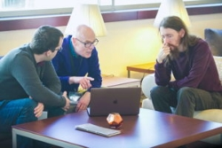
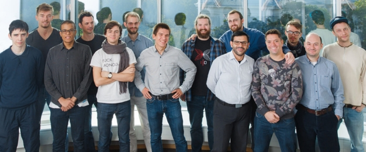

# IOHK celebrates a successful Global Summit
### **Cardano development in focus at Lisbon**
 14 February 2018[ Jeremy Wood](/en/blog/authors/jeremy-wood/page-1/) 8 mins read

[ IOHK celebrates a successful Global Summit - Input Output](https://ucarecdn.com/32cfa852-a7cc-46a8-a601-d0fea14aeb7c/-/inline/yes/ "IOHK celebrates a successful Global Summit - Input Output")

### [**Jeremy Wood**](/en/blog/authors/jeremy-wood/page-1/)
Founder

- 
- 
- 

January got off to a busier start than normal for IOHK because on top of all the usual research and development being carried out, pretty much the entire company traveled to Lisbon for our latest meetup. These week-long events are always hectic and challenging – where everyone comes together to push forward work on projects - but they are also fun, allowing people to meet face to face, sit down over a meal, and get to know each other. Now that we've had time to take stock of the week, what strikes me most is the tremendous amount of energy and effort going into all the work IOHK is doing. We made leaps forward on the [various components of Cardano](https://cardanoroadmap.com/ "cardanoroadmap.com"), such as the [treasury](https://www.youtube.com/watch?v=Hyh3h_yX-S0 "Bingsheng Zhang, Cardano Whiteboard, Treasuries, YouTube") and delegation. During the week there was a planned schedule of talks, workshops and meetings, organized in the style of a conference, but aside from that program, there were an incredible number of spontaneous discussions taking place. There were continual requests to book meeting rooms, or for 15-minute pow-wows in coffee breaks. Walking around the hotel, you'd always stumble upon small groups of IOHK people sitting around laptops in deep discussion.

 

Lisbon was a great opportunity to hear about the enormous strides being made by IOHK Research. Professor Aggelos Kiayias, IOHK Chief Scientist, set out plans for [Ouroboros](/en/research/papers/#9BKRHCSI "Ouroboros: A Provably Secure Proof-of-Stake Blockchain Protocol, iohk.io"), the proof of stake protocol that underpins Cardano, which has been been rigorously constructed based on first principles and has undergone academic peer review. Further development of the protocol aims to speed it up, offer sharding, and eventually allow assets to flow between connected sidechains. 

Aggelos says: "It was a very work-intensive week where almost all of the IOHK work threads converged under a single roof here in Lisbon. In terms of research, substantial progress was made on all our high priority objectives including incentives, delegation, wallet security, multi-sig capabilities, sidechains and smart contract support."

The development of Cardano took centre stage during the week. Delegation, a core mechanism of Cardano, was a subject of much discussion in three major meetings that were a continuation of discussions held in Edinburgh last year. Delegation is a mechanism that allows stakeholders to delegate their stake to other parties, such as stake pools, and in return receive some reward for doing so. It fulfils an equivalent function to mining in proof of work protocols and so must offer some benefit to those who delegate their stake. The considerations for creating a delegation scheme are complex and great care must be taken to ensure requirements are balanced fairly, from user privacy to the incentives offered.

 

Dr Philipp Kant, Director of Formal Methods, said the team is making progress so delegation can move beyond its initial description in a research paper to operation in real life. "In the last weeks we've had various meetings, where we reviewed the mechanisms that we have for delegation in Cardano, to make sure that we can fulfill all the requirements, including rewards for stakeholders who delegate. This week, having everyone in one room, we got to the point where we have a proposal," he says. "What I think we gained is that we've converged on good a scheme to use."

The delicate task of working through tricky problems was also highlighted by Dr Neil Davies, who along with Peter Thompson is leading work on Cardano's network layer, to make sure that its distributed system can deliver high performance even when scaled to millions of users. "There are complex issues when you're trying to construct a new way of organizing how people exchange value, to ensure it will be sustainable in the long term," he says. "This week was the quickest way of getting everybody up to speed, to see everyone's progress and review it among peers. We took a few knotty technical problems and had technical discussion to agree the way forward."

Everyone who came along to Lisbon said meeting in person had real benefits. Professor Philip Wadler, IOHK area leader for programming languages, is working on [Plutus](https://github.com/input-output-hk/plutus-prototype "Plutus Prototype, Github"), a new language for programming smart contracts on Cardano that is inspired by Haskell, the language he pioneered and in which Cardano is built. Phil says: "Getting everyone in one place has been a real aid to kickstarting what we're doing with Plutus. We've considerably upped the person power involved and I'm excited to see what happens."

Phil also believes that IOHK's championing of peer reviewed research could have profound implications for the cryptocurrency field. "I found Charles's opening talk to be really inspiring, he says. "It's amazing that peer reviewed research isn't the standard in the industry but it's really exciting how IOHK has made that work and turned that into part of the value proposition. If that does nothing else but get others to pick that up, that would be fantastic."

It wasn't just Cardano development that was pushed forwards in Lisbon. 

Partners were also present, including [ZenCash](https://zensystem.io/ "zensystem.io"), the [Cardano Foundation](https://cardanofoundation.org/ "cardanofoundation.org"), and representatives from [Emurgo](https://emurgo.io/ "emurgo.io"). 

Michael Parsons, chairman of the Cardano Foundation, says: "Coming to Lisbon for the IOHK Global Summit was a rewarding experience on many levels, work, social, and cultural. I had great conversations with many IOHK executives and technology leads and enjoyed participating in a group Cardano webcast. IOHK organized a scenic Lisbon city tour followed by a chance to sample the local Portuguese cuisine, the fresh sea bass was spectacular! All in all, an impressive and worthwhile event expertly coordinated by IOHK, our development partners; I look forward to the next one."

Emurgo had two representatives present in Lisbon. One of them, Shunsuke Murasaki, said it was a chance to talk to the software developers working on Cardano and provide a bridge to development teams in Vietnam and Taiwan working on future applications. "I found this week to be very educational and inspiring," he says. "Emurgo has good partnerships and we will provide technical updates to our partners on Cardano development to accelerate their activity."

For Eileen Fitzgerald, Head of Programs, the week focused on everything from looking at software development methodology to having conversations with new people. "It was great to have everyone finally agreeing on where we are going, consolidating on how we are moving Plutus forward and the K Framework, the Daedalus roadmap, resources, and the direction for the next year," she says. She spent time developing the project management office, which she believes is the only project management office in the world focusing on blockchain development. 

Of course, the week was a lovely reminder of how far we've come in the little over two years since the company was founded. More than 100 people working on IOHK projects were in Lisbon. That compares to about 35 people who were at the last meet up, in Malta. And the time before that, in Riga, we numbered fewer than 20 people. IOHK is now a much bigger organization and has recently been doing a lot of work to reshape its structure to adapt to having more people, more moving parts, and more projects. 

 IOHK in Riga 2016

 IOHK in Malta 2017

 IOHK in Lisbon 2018

And in the presentation from Charles Hoskinson, he set out business objectives for the next year and for the long term. Highlighting IOHK's pioneering approach to open source software development and high assurance methods he laid out how IOHK has led the way in the cryptocurrency industry. 

"We broke new ground by being first to embrace peer review, transforming cryptocurrency from something regarded as amateur and suspect by the academic community into a rapidly emerging area of study within cryptography."

And Cardano's position as IOHK's flagship product was acknowledged.

"If we pull it off, it becomes the financial stack for the developing world capable of handling three billion users. That's the goal of Cardano," he said. "That will require an enormous amount of good technology. We had to bring all these people together to build a project like this. Cardano is the best protocol in the world. In the coming months, Cardano will get better, feature richness will come, and it will be an incredible product."

There was also time for relaxation, with several social outings, group dinners and a visit to the beautiful national park of [Sintra](https://en.wikipedia.org/wiki/Sintra "Sintra, Wikipedia"), all expertly organized along with the general program by Leonidas Tsagkalias, Costas Saragkas and Tamara Haasen. Conversations about work were never far away though! 

I'm looking forward to the next IOHK company meet up where I'm sure there will be even more people in attendance, and we will be able to look back and take stock of even more groundbreaking research and development. IOHK has already begun to set the standard for cryptocurrencies and reshape the way the industry works, so get ready for more exciting developments during the year ahead.
## **Attachments**
[ IOHK celebrates a successful Global Summit - Input Output](https://ucarecdn.com/32cfa852-a7cc-46a8-a601-d0fea14aeb7c/-/inline/yes/ "IOHK celebrates a successful Global Summit - Input Output")
