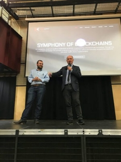

# Cardano’s goals for Africa and the developing world
### **Charles Hoskinson addresses packed crowd at LSE**
 24 February 2018[ Jane Wild](/en/blog/authors/jane-wild/page-1/) 6 mins read

[ Cardano’s goals for Africa and the developing world - Input Output](https://ucarecdn.com/e55a2505-75b9-45c2-bf4d-ea18c06d02df/-/inline/yes/ "Cardano’s goals for Africa and the developing world - Input Output")

### [**Jane Wild**](/en/blog/authors/jane-wild/page-1/)
Content Director

- 
- 

[The London School of Economics](http://www.lse.ac.uk/ "London School of Economics") has a long history of links to Africa. Founded in 1895 four years before the outbreak of the [Boer War](https://en.wikipedia.org/wiki/Second_Boer_War "Second Boer War, Wikipedia"), the school launched into the debates of the era. Some of the first leaders of newly independent African nations studied at LSE and its progressive and anti-imperialist stance saw the school play a part in the anti-apartheid movement. With that history, the university was an apt location for Charles Hoskinson to introduce Cardano’s next steps - for its technology to serve the developing world, starting with Africa. The talk, organised by the [Cardano Foundation](https://cardanofoundation.org/ "cardanofoundation.org") and the LSE blockchain association at the school’s Saw Swee Hock Centre, was twice oversubscribed. 

Before the doors opened on Tuesday evening there was a buzz of anticipation in the long queue of hundreds of people, mostly in their twenties and thirties.

To the packed crowd, Charles set out the vision for Cardano that will begin to unfold in Africa this year. 

"You have to go to talk to people in the countries you want to help. The only way you are going to the change the world is you have to go there. You’re not going to be the one doing it, you have to be humble enough to let the people there do it."

Using a model already tested during the past year with [pilot courses in Athens and Barbados](https://cryptocoin.news/news/more-blockchain-ready-developers-needed-iohk-trains-students-in-haskell-code-3491/ "More Blockchain Ready Developers Needed. IOHK Trains Students In Haskell Code, cryptocoin.news"), IOHK will bring skills to the region. Training in the programming language Haskell, in which Cardano is built, will be provided to budding developers. At the end of the course they will either be hired to contribute to Cardano, or will plough their talents back into the local economy. As an example of IOHK’s approach, the Barbados course was held in association with the University of the West Indies and was the first time that Haskell was taught in the country. The classes were even attended by Professor Philip Wadler, one of the creators of Haskell, who is helping to develop Cardano.

 

Charles Hoskinson with Michael Parsons, 
Chairman of the Cardano Foundation

"The next class will probably be done in Ethiopia, we are already in negotiations to do that," Charles said. "You have to create a base of people in the country who have an incentive to care and actually understand how the tech works."

Just as important will be to engage local government and explore opportunities for working together. Pilot schemes using Cardano could test potential applications, for example relating to land registry, identity, or voting.

The key to enabling blockchain use in Africa is to run successful trial projects, showcasing blockchain technology as a cheaper and more efficient method of doing things. "A proof of concept can show why it’s faster and better. It can show it can be rolled out, show people can make a lot money from it, then everyone says ‘me too’, and competition drives a tsunami wave of people in, including my blockchain competitors," Charles said.

There was a powerful case for blockchain in Africa, he argued. Blockchain technology has great potential to unlock the wealth of countries through the tokenisation of natural resources, labour or property. "Tokens aren’t just good for CryptoKitties, it turns out you can do real things with these platforms, so let’s go try that."

"If you count the locked up liquidity in these countries it’s in the trillions of dollars. It’s a great paradox that there’s tremendous potential value in places and if only it could be accessed and given to the people in some fair way then poverty would melt away and these would become some of the wealthiest countries."

It would not be easy, but blockchain adoption would inevitably take place, Charles said. Local politicians would have to receive a financial incentive to support the technology, perhaps through a pre-mine. Then there are other hurdles to cross in Africa, such as patchy internet coverage that hampers connectivity to the blockchain. To address this, IOHK is exploring satellite coverage and estimates the cost at $50 to $100 million. Trusted hardware offers a second solution, by allowing offline, offchain transactions through Bluetooth that can register on the blockchain when connectivity is regained. 

Another hurdle is to provide points where local currency can be cashed in or out. To this end, IOHK is looking at how a network of ATM terminals could be installed at affordable cost and which can operate off grid. And finally, a longheld aim of cryptocurrency has been to develop a value stable currency, which is pegged to fiat such as the dollar, and offers businesses stability and protection against the price volatility of cryptocurrency. Charles announced that IOHK was starting a research agenda into value stable currencies, and although there would be "no silver bullet", he promised a series of experiments and hard work on the subject. 

"So that’s what Cardano is doing for the developing world," said Charles. "We have a moral obligation to try and explore this tech and get it to as many people as possible."

The talk was followed by a wide-ranging question and answer session, with questions on everything from the future of blockchain in China, to transaction fees on Cardano, to establishing regulated cryptocurrency businesses.

The audience had a mix of backgrounds, from serious Cardano fans who had watched hours of videos online, to the cryptocurrency curious.

Timo, 27, is a student from Salzburg at Regent’s Business School in London. Having been interested in cryptocurrency for more than a year, he says he’d watched [Charles’s Ted talk](https://www.youtube.com/watch?v=97ufCT6lQcY "The future will be decentralized, YouTube"), seen his interviews and and then bought Ada. "The project is very serious compared to others, it’s evident from the team, the web presence and the many interviews Charles has given."

 

Charles Hoskinson speaking at LSE

"Blockchain is the most revolutionary technology since the internet," said his friend, Thomas, 23, from Antwerp, who first learnt about cryptocurrency last year from his father during a marathon three-hour, late evening conversation. "That sparked my interest, and I then came across Charles’s videos and found him a brilliant mind. I like the approach that Cardano is taking to tackling the problems blockchain is having right now - it’s also academic and involves people from universities, there is objective option there."

Others were there to find out more about cryptocurrency. Ana, 24, is a postgraduate student of law at LSE who came along to the talk. She is interested in writing her dissertation about smart contracts because she sees blockchain as an newly emerging discipline within law. "I want to understand more about blockchain," she said. "The legal aspect is very interesting and there are a lot of issues to tackle. For example, is it legitimate to have contracts that self-execute, if you don’t have a court or a judge involved?"

More information is coming soon on IOHK and Africa strategy, and will be outlined by the Director of African Operations, [John O’Connor](/en/team/john-oconnor/ "John O'Connor, iohk.io").
## **Attachments**
[ Cardano’s goals for Africa and the developing world - Input Output](https://ucarecdn.com/e55a2505-75b9-45c2-bf4d-ea18c06d02df/-/inline/yes/ "Cardano’s goals for Africa and the developing world - Input Output")
