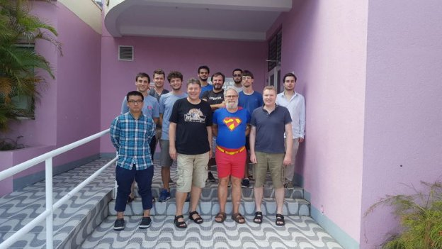
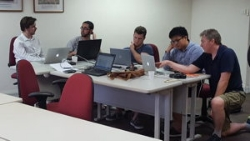

# Haskell and Cryptocurrency Course in Barbados
### **Two graduates share their experience of IOHK's functional programming course**
 7 April 2018[ Lars Brünjes](/en/blog/authors/lars-brunjes/page-1/) 7 mins read

### [**Lars Brünjes**](/en/blog/authors/lars-brunjes/page-1/)
Education Director

Education

- 
- 
- 
- 

The IOHK Haskell and Cryptocurrency course in Barbados brought together students and professionals who were interested in learning the Haskell programming language. The course ran for eight weeks at the University of West Indies. Barbados was the second time the programme was offered, after a successful inaugural course held in Athens last year. The goal of the course is to extend the computer science training of participants and introduce them to Haskell, an elegant functional programming language, [in the context of the cryptocurrency industry](https://www.nasdaq.com/article/fostering-the-next-generation-a-growing-need-for-crypto-education-cm937830 "Fostering the Next Generation A Growing Need for Crypto Education, nasdaq.com"). Haskell is the language used in the Cardano cryptocurrency, and it was chosen because of the security benefits it offers.

The course was designed and taught by Haskell and functional programming experts, including [myself](/en/team/lars-brunjes/ "Lars Brϋnjes, iohk.io"), and Dr. Andres Löh of Well Typed and [Dr. Marcin Szamotulski](/en/team/marcin-szamotulski/ "Marcin Szamotulski, iohk.io"), Haskell Developer at IOHK. Visiting lecturers included [Prof. Philip Wadler](/en/team/philip-wadler/ "Philip Wadler, iohk.io"), one of the creators of Haskell, and IOHK Area Leader in Programming Languages, and Cardano SL developer, [Darryl McAdams](/en/team/darryl-mcadams/ "Darryl McAdams, iohk.io"). The instructors aimed to strike a balance between theory and practice, teaching the students both theoretical background of functional programming in Haskell in particular (Lambda Calculus, System F, Category Theory, etc), but also introducing them to popular libraries and important techniques for solving real-world problems (networking, parsing, resource handling, and more). At the end of each course, students are given the opportunity to apply for positions at IOHK and continue their professional career in Haskell.

Here are the stories of two students who attended the IOHK Haskell and Cryptocurrency course in Barbados:

**Jordan Millar - Jordan is currently a chemist with an M.Sc. in organic chemistry from Oxford University.**

Upon hearing that IOHK was offering a free Haskell and Cryptocurrency course in Barbados I decided it would be foolish to not enroll. The stars aligned for me as Barbados is a stone’s throw away from Trinidad and Tobago, my home, and I was acutely aware of IOHK’s approach to cryptocurrency.

My programming experience prior to this course was limited; I predominantly had written scripts in Python over the last two years. Only a few weeks prior to the course, I had become interested in Haskell through a functional programmer I happened to meet.

 

Haskell students in class

IOHK piqued my curiosity because at the time, they were the only company in the cryptocurrency space driven by research. This resonated with me as I had first-hand experience with research and development, albeit in a different field. I work in organic chemistry, and am currently working with a cleaning product manufacturer on their formulations. I appreciate the importance of developing a model, trying to break it yourself, and then having people smarter than you also trying to break it. In particular, if these networks are destined to hold hundreds of billions of dollars, you cannot afford to construct these networks in the ad hoc manner we have often seen before. With this in mind, I set off to Barbados to learn more about Haskell and IOHK’s methodology.

The course was a whirlwind tour of Haskell starting with data types all the way to type families and everything in between. We charged through a series of topics and on a weekly basis were given a problem sheet to complete. Dr. Lars Brünjes and Dr. Marcin Szamotulski were exceptional teachers. They delivered the content effectively and gave additional clarification when required.

The course was challenging, especially because I had missed the first week due to logistical issues. That being said, I came to find that Haskell is an elegant and concise programming language. IOHK flew Philip Wadler to Barbados to give a couple of lectures! What stood out to me the most was his demonstration of the Curry-Howard correspondence. It was fascinating to see the link between mathematical proofs and programs. IOHK’s Darryl McAdams also visited us in Barbados and took us through compilers in Haskell. The elegance of Haskell really shone here in my opinion as she effortlessly created a simply typed programming language during class.

It wasn’t all work and no play; IOHK sponsored many dinners and outings while we were in Barbados. This rounded off the course nicely as everybody had time to socialize outside of the classroom. To top it off, Charles Hoskinson took time out of his incredibly busy schedule to come and see us in Barbados. Having only seen Charles in YouTube videos, it was a privilege to hear him share his future plans and vision for IOHK in person. If you thought his conviction transmitted effectively through his interviews online, wait until you hear him in person.

All in all, it was a great experience. To anybody reading this, I highly recommend enrolling in this course if you get the chance to!

**Rob Cohen - Rob divides his time between his information security consulting firm Callidus Security and serving in the cyber security field in the US military. He graduated from Columbia University in 2015 with a BA in Computer Science and Mathematics.**

I was fortunate to be invited to attend IOHK's eight-week course, "Haskell and Cryptocurrency" in Barbados in early 2018. Prior to the course, my only experience with functional programming had been in a Compilers course I had taken in college and some toy projects I had built as experiments. As a result I knew this course would be challenging, and it turned out to be exactly the kind of deep-dive crash course on Haskell and functional programming that I was hoping for. This course was demanding, requiring dedication in the classroom and diligence in applying those concepts in our assigned homeworks and group projects.

 

Haskell students going fishing

The course covered a variety of topics, from the basics of IO and higher-order functions, to lambda calculus, optics, free monads, GADTS and Generic Programming concepts (and much more). Beyond the theory, what I found most rewarding in the course was working with my fellow classmates on our group projects. One project my team worked on involved building the early stages of a working Bitcoin client in Haskell! Working on larger-scale projects like that really helped Haskell come alive for me. Furthermore, guest lectures by Phil Wadler and Darryl McAdams from IOHK's Plutus team were pleasant surprises as well.

This course was not easy; there were times where I really felt my mettle was challenged. However, I stuck with it and pushed through. Now I not only have a deeper understanding and appreciation of the theoretical underpinnings of Haskell, but I came out as a developer with a stronger constitution as well. I am grateful to Lars and Marcin (the course instructor and teacher assistant) for all their hard work on the course. They put a tremendous amount of effort into the course materials and it showed. There were frequently times where their diagrams and explanations were better than Haskell's own official documentation!

The highlight of the course was the opportunity to work closely with such incredible developers from all around the world. My classmates hailed from Japan, Ireland, Argentina, Poland, Germany, Sweden, the USA, and the Caribbean. It was truly remarkable to have so many people from all over the world working together in one room trying to figure out how to learn Haskell. To my fellow classmates, I am deeply grateful for your support and camaraderie during the course. I salute you all for your dedication and hard work. I also look forward to our (spearfishing) reunion someday!

I can safely say that I've been bitten by the Haskell bug, and I look forward to being a member of the Haskell/functional programming community for years to come. I highly recommend this course to anyone who is interested in learning about Haskell and functional programming.
