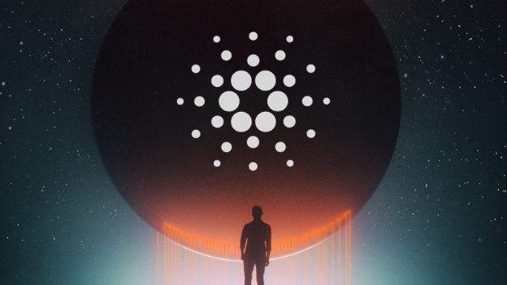
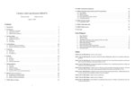
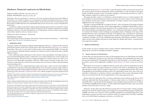

# A Brief Update on Cardano Development
### **Processes are evolving under the project management team**
 9 April 2018[ Charles Hoskinson](/en/blog/authors/charles-hoskinson/page-1/) 10 mins read

### [**Charles Hoskinson**](/en/blog/authors/charles-hoskinson/page-1/)
Chief Executive Officer

Founder

- 
- 
- 

After returning from my yearly global sojourn, I wanted to update the Cardano community on the status of the project. Since the beginning of the year a lot has happened. Cardano continues to grow at a rapid pace and the project is evolving into a new stage. The Byron release back in September of 2017 was an experiment for IOHK. It's the first cryptocurrency we have launched as a company. It's the first time we've had to manage public release cycles, segregated stakeholders (the general public, exchanges, developers, etc). Furthermore, the Cardano project has half a dozen software companies collaborating on it, thus we have to invest a huge amount of time in coordinating, communication and timezone overheads.

Since the September release, we've learned a huge amount about all of these processes and also in dealing with the needs of our broader community. We certainly haven't achieved a Nirvana-like state of perfection, but processes have definitely improved.

I'd like to share some of these improvements as they are mostly hidden from the general public, yet have a huge impact on our ability to deliver a long-term roadmap. First, since September, IOHK has built a tremendous amount of [project management capacity](/en/team/#pmo "PMO team, IOHK"), led by [Elieen Fitzgerald](/en/team/eileen-fitzgerald/ "Eileen Fitzgerald").

Under her department, Eileen has managed to capture business requirements, draft project charters, improve our resource allocation and budgeting processes, improve development estimates, get better weekly reporting and manage the inter-dependencies between projects. We have also had an increasingly easier time managing third-party relationships, like our [partnership with Runtime Verification](https://www.youtube.com/watch?v=iavSKtqjVNA "Grigore Rosu, Runtime Verification, youtube.com") for the K framework, IELE, and smart contract research.

Some of the outputs of these processes are that we are moving to regular release cycles for Cardano, with the first cycle starting next week on Friday. Our hope is to cut a develop branch for release and then run the release through a rigorous QA cycle currently planned for one month. Over time, this cycle can be shortened through automation and parallel processes speeding up delivery. Updates will become more frequent, higher quality and encumber less user disruptions.

The goal of the project management department is to ensure when we give a date for delivering a feature, a release or a major update that the date and quality are delivered. This goal is one of the hardest to achieve for a software company and much more so given the nature of the software we build, but it's also incredibly important for those who rely upon us for their own commercial interests.

Over time our project management methodology will become increasingly public and eventually will be ported into a public GitHub repository. We'd like IOHK to follow a creative commons process that other software companies and projects in our space can benefit from, and add to, as they pursue their own projects. We'd like to explore lighter weight versions of the processes for DApp development so that our developer community can follow best practices.

Second, working with exchanges and others, such as Ledger, we've been systematically redesigning Cardano's architecture, APIs and other components to be more friendly for those who wish to use our software. For example, you can see our new APIs [here](https://cardanodocs.com/technical/wallet/api/v1/ "cardanodocs.com").

Another output has been moving our development towards a specification-driven process. The first component of the Cardano Settlement Layer to be ported into this process is our wallet backend, with the following formal specification:

**Figure 1: Cardano SL's Formal Wallet Specification**

The goal is that each part of Cardano will be specified in a format similar to the one above. These specifications are implementation independent, will eventually be analyzed using formal methods and can be used as a basis for test suites and improvement proposals. 

We are aware that many want to build their own mobile clients or modified software. To this end, we've been exploring the best way of discussing a [unified backend architecture](https://github.com/input-output-hk/cardano-sl/blob/c68f3873658c00cbe0bffa6866ce8b36eea4bb13/docs/proposals/unified-backend-architecture/tech-spec.md "Unified Backend Architecture Tech Spec, Cardano SL, github.com"). I would personally like to see dozens of wallets and great user experiences materialize for Cardano, but I'd also like to make sure that these experiences are useful, secure and easy to deploy.  

Over the coming months, large chunks of Cardano's code will be ported over to, or replaced with, these specification-driven designs. This likely won't be directly noticed by our users. Rather, users will experience indirect symptoms, for example things getting faster, like wallet recovery from seed, fewer issues connecting to the network, a smaller memory and disk footprint as well as other improvements.

As we now have the talent, processes and [clear roadmap](https://cardanoroadmap.com "cardanoroadmap.com"), Byron will continue to rapidly improve and become more feature-rich. The release we are cutting next week to QA will include paper wallets, much faster wallet restoration and numerous fixes. We expect it to clear QA in mid-May and for updates to be released to our users monthly thereafter. 

Third, the most anticipated [upcoming release is Shelley](https://www.youtube.com/watch?v=GLciKKGPeTg "Duncan Coutts,  Cardano: Shelley Update. March 2018, youtube.com"). Shelley is a massive project with many workstreams and scientific dependencies. It also contains many social processes involving community coordination and management. Effectively, Shelley is about turning over the network fully to the users thereby decentralizing as much as possible. 

The work we have done with Byron has given us a great deal of knowledge operationally, about the best way of iterating towards Shelley; however, special care has to be placed on consensus. IOHK has developed a custom, proof of stake protocol called Ouroboros for Cardano. It has never been used in a cryptocurrency before and has a completely original design. 

Thus we have been extremely focused on a proper deployment of Ouroboros to the general public. Byron is running a version of Ouroboros with delegation locked to core nodes under the control of IOHK, the Cardano Foundation and Emurgo, and block rewards turned off, but when Shelley comes this cannot continue. Staking rights will be returned to Ada holders and delegation will be fully under their control. 

To be clear, Ouroboros isn't a forced, delegated, proof of stake protocol like EOS or Bitshares. It's a pure, proof of stake protocol where for epoch elections every active Ada account is factored in. Anyone who holds Ada in a normal address in the global UTXO has a probability of being elected as a slot leader regardless of the amount of Ada they hold.   

However, the reality is that most will not want or have the ability to host consensus nodes and consistently show up to fill the slots they have been elected to commit. Thus, we developed a delegation system and the concept of stake pools for those users. 

Briefly, anyone can run a stake pool. There isn't a minimum threshold of Ada or a special club. Rather, there will be a blockchain-based registration system and a special transaction type to register a stake pool on-chain. Registered pools will be listed in the delegation center of Daedalus and pulled directed from the Cardano blockchain thereby preventing censorship or bias. 

Over the last few months, we've had to invest a huge amount of careful design and security thought into the process of delegation. There are dozens of factors and scenarios to consider, from cold staking to automation of rewards. But we have converged on a reasonable design for the Shelley release, and a paper will be released soon on [eprint](https://eprint.iacr.org/index.html "ePrint, IACR").

The summary is that Ada holders can create a delegation certificate for the Ada they hold and register it on the Cardano blockchain. This process in effect separates stake rights from the spending keys for their Ada addresses. Thus the delegation certificates can live in Daedalus, but the spending keys could be kept offline on a paper wallet or ledger device for example. 

Delegation will be done through a special transaction and from a user experience viewpoint, via the delegation center in Daedalus. A user can find a stake pool they wish to delegate to, select it, and click a "delegate" button. It's just that simple. As we launch Shelley testnets, we'll experiment with different user experience flows, from length of delegation to partial delegation (splitting stake between pools).

Another advantage of this process is that unlike Bitcoin mining pools, as our protocol natively understands delegation, it can automatically pay rewards to those who delegated without having to trust the pool operator. At the end of each epoch, our goal is to close the reward pool through a special transaction, paying all those who delegated proportionally to their delegation amounts.

Some benchmarks and threshold will have to be conducted over the coming months to optimize for space and prevent penny-flooding attacks. We will also need to explore different user experiences including notifications and other user interface considerations. 

There are natural questions to ask. How will we ensure that when Shelley launches there will be enough stake pools to ensure a reasonable amount of decentralization? How will these pools establish their brand and reputation? We considered these concerns and decided to open enrollment for a collection of beta testing stake pool operators. 

The goal with this process is to identify a set of 50 to 100 independent entities that are geographically well distributed who would like to run a stake pool as a business. The process will progress as follows:

1. Collect as many applications as possible at <https://staking.cardano.org/> until the end of April
1. Process and winnow applications until we have a good set of 50 to 100 candidates
1. Invite the candidates into the IOHK slack and begin discussions about hardware configurations, deployment strategy, docker images, etc
1. When the Shelley testnet is launched, invite the stake pools to register and work closely with them to beta test various scenarios and experiences  

These beta testers will not get a special advantage or consideration when Shelley launches. They are necessary to test Shelley's design and ensure our assumptions and choices are reasonable as well as improve deployment strategy and documentation. When Shelley launches, there will be a grace period where all those who desire to register a stake pool can do so and Ada holders will be free to choose to delegate to anyone they want. 

Once the grace period expires, auto-delegation will be turned off and rewards turned on: Cardano will be fully decentralized. 

In closing, Cardano is a huge project. There are so many brilliant minds, great engineers and parallel efforts that it's difficult to capture all of it in a single post, much less just convey our progress. What's amazing to me is that we have really great processes established and are daily moving forward (a fan made a great website showing our daily commits: <https://cardanoupdates.com/>). 

What's also amazing to me is how quickly our scientific research is moving from the lab to code. Ouroboros has gone through over a dozen revisions and now is converging to a state where we can bootstrap from the genesis block without a checkpoint (an industry first for proof of stake). Our sidechains research is state of the art and a paper is coming in May. 

We have also brought game theorists and programming language theory experts together. The output has been incredibly innovative with new accounting languages like Marlowe and an increasingly richer theory for incentives for stake pools, network maintenance and other topics requiring an honest majority for cryptocurrencies to run properly.

**Figure 2a: The Marlowe Programming Language** 

**Figure 2b: The Marlowe Programming Language** 

I'm astounded how we are able to think in systems now and by the quality of the people on the Cardano project. It's taken years to build this team and go from dream to regular status reports. I look forward to achieving our milestones and seeing Cardano change the world. 

Artwork, 

[Mike Beeple](http://www.beeple-crap.com)
