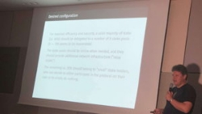

# A Cardano technical talk in Hamburg
### **Philipp Kant and Lars Brünjes explain incentives, stake pools and formal methods**
 14 May 2018[ Jane Wild](/en/blog/authors/jane-wild/page-1/) 8 mins read

### [**Jane Wild**](/en/blog/authors/jane-wild/page-1/)
Content Director

- 
- 

Cardano is a project that is unique in its vision, scope and design, and its world-class team is working at the frontier of computer science. As development progresses we're contacted on a daily basis by people from all around the world who want to learn more, and so IOHK was pleased to make its first trip to Germany recently to talk about Cardano. [Dr Lars Brünjes](/en/team/lars-brunjes/ "Lars Brünjes, iohk.io") and [Dr Philipp Kant](/en/team/philipp-kant/ "Philipp Kant, iohk.io") are senior members of the Cardano team and they were invited to the monthly Hamburg meetup Blockchain Mania last month to give a technical talk. Lars is Director of Education at IOHK and leads work on incentives, a key part of Cardano, while Philipp is Director of Formal Methods, the robust development approach that is the gold standard for IOHK development.

In the year since this Hamburg meetup launched its audience numbers have blossomed from 20 to well over 100 under the direction of founders Omri Erez, an android developer by background who now has a blockchain startup, and Kiriakos Krastillis, who is Head of Software Engineering at PwC Digispace in Hamburg. The crowd was keen and knowledgeable, including entrepreneurs and developers (and some Haskellers). They wanted a deep dive into technical aspects of Cardano, with a Q&A after each presentation.

Philipp took the audience through an introduction to Cardano, highlighting a few of the key features in development. [Plutus](https://github.com/input-output-hk/plutus-prototype "Plutus Prototype. github.com") and the [IELE Virtual Machine](https://github.com/runtimeverification/iele-semantics "IELE Semantics, github.com") are essential components of smart contracts, while sidechains will help the system scale. A treasury will secure future development by giving users a mechanism to decide upon and pay for changes. At the heart of Cardano is [Ouroboros](/en/research/papers/#9BKRHCSI "Ouroboros: A Provably Secure Proof-of-Stake Blockchain Protocol, iohk.io"), the algorithm that underpins the Ada cryptocurrency. Developed by a team of researchers led by [Professor Aggelos Kiayias](/en/team/aggelos-kiayias/ "Aggelos Kiayias, iohk.io") of the University of Edinburgh, Ouroboros is the first proof-of-stake algorithm to be provably secure and was accepted to the leading cryptography conference, Crypto 2017. It is an efficient alternative to the energy-intensive proof-of-work protocol that underpins Bitcoin.

Producing excellent research is the first objective. The next is to take that cryptographic research, which is expressed in academic language, mathematical formulae and proofs, and turn it into another language – Haskell code that a computer can understand. Additionally, the research papers will not account for factors that arise during real-world operation, issues relating to databases or networking for example.

Turning the papers into machine-executable code is a lengthy and precise process, and one it is highly desirable to conduct carefully. IOHK is adopting formal methods in its development process to create software that is robust and reliable. This is an approach used in areas such as medicine and aerospace, where improperly implemented code could result in casualties. In the area of cryptocurrency, we've repeatedly seen flaws in code exploited and losses in the hundreds of millions of dollars.

The process of moving from paper to code is done in a series of small steps, rather than any big leap, Philipp explained. 

The first step is transcribing the paper into an executable specification, and further steps refine this specification, adding all the necessary details.

Attention is paid to each design decision, and each step can be tested to make sure the code is correct. IOHK does this by using psi calculus. This is a family of process calculi that is a toolbox we are using to formulate Ouroboros Praos. We can embed psi calculus into Haskell, which allows us to run simulations and export code to a proof assistant such as Coq or Isabelle so proofs can be checked.

It is important that we have a good handle on the performance of the system. Before the launch of Cardano, Philipp oversaw benchmarking, tuning the parameters of the system to ensure it could perform well under various conditions. While this process is helpful to ensure the system is set up in a way that ensures stable operation, it is preferable to have a method for predicting the performance early on.

To achieve this, we use the Delta Q formalism, where each atomic operation carries is assigned a probability distribution for delay and failure. Those can be combined, either through simulation, or algebraically, to determine the expected overall performance of the system. Adding Delta Q annotations to the executable specification right at the start of the development process will show performance impacts of design decisions, and also provide a baseline for the benchmarks: instead of just measuring the performance, and trying optimisations to improve it, we can compare the results of benchmarks against a prediction, and tell whether we have a performance bug. If we additionally measure the Delta Q of individual parts of the program, we can even see which parts behave unexpectedly and should be optimised.

 Philipp Kant (left) and Lars Brünjes (right) at the Hamburg event

Incentives are core to the design of Cardano and the related topic of staking has been one of the most keenly discussed among the community. Lars is leading work on Incentives, and the team includes Professor Aggelos Kiayias and Professor Elias Koutsoupias, at Edinburgh and Oxford universities respectively. Lars explained how well-designed incentives shepherd users through the system and encourage them to make choices that are not only in their best interests but lead to the smooth operation of the cryptocurrency as a whole.

In Cardano it is important that stake holders are online so they can be part of the election for who gets to create the next block in the blockchain, and to create that block if they win. The incentive for taking part in Cardano is Ada, as a reward for being part of the process and creating a block. By comparison, in Bitcoin's proof-of-work system, stakeholders compete to solve cryptographic puzzles, with one winner taking a reward for creating a block. However, in Cardano, users may not have the time to be online or take part in the election process, so they can delegate their stake to others who can do it for them. Those who do take part then pay a share of the reward back to the users who did not participate. Simply holding Ada gives you stake, and if you delegate your stake, you still retain the monetary value of Ada and can spend it as you wish.

 

Lars Brünjes on incentives in Cardano

Lars explained that about 80% of stake should be delegated to stake pools, that optimally number about 100. Stake pools must be online, and provide infrastructure for the network in the form of relay nodes. The leftover 20% of stake would belong to small stakeholders who either participate on their own or decide not to. 

There are three types of address in staking, each associated with two cryptographic key pairs: one for payment, one for staking. A base address has a staking key linked directly to it; a pointer address links to a delegation certificate on the blockchain, and an enterprise address is for exchanges, who may not use the funds entrusted to them to stake.

Delegation of staking rights from one staking key to another is done by means of a delegation certificate, which can be published on the blockchain as part of the metadata of a transaction, in which case a pointer address can refer to it. Such a published certificate is called a heavyweight. In case of conflicting certificates, later in the blockchain wins. The fees for creating a heavyweight delegation certificate are the transaction fees for the contained transaction. A lightweight certificate is not published on the blockchain, but instead included in block headers to prove staking rights for the address that was elected slot leader. It also contains a "serial number" to break ties.

To set up a stake pool a registration certificate is created and embedded in a transaction that pays the pool registration fees to a special address. The certificate contains the staking key of the pool leader. People wishing to delegate to the pool must create (heavyweight) delegation certificates delegating their stake to that key. And using combinations of base and pointer addresses and "chains" of delegation certificates, a large number of scenarios can be covered, including: regular user wallets; offline user wallets with cold staking; wallets with enhanced privacy; staking pool wallets, and enterprise wallets for exchanges.

Transaction fees are an important part of Cardano's incentive scheme. When Ada is sent, a small fee is paid for the transition, to validate it. These fees help prevent Distributed Denial of Service (DDoS) attacks by imposing a financial barrier for any adversary intending to flood the network with spam transactions. The fees also provide funds for Cardano's incentives.

Incentives are distributed each epoch, the operation of Cardano's Ouroboros algorithm being divided into epochs that each last five days. Transaction fees are collected for the blocks created during each epoch, pooled along with Ada from monetary expansion, and the total is distributed to stakeholders, according to the stake they own. 

For more details on incentives, transaction fees and staking, Lars' presentation is available in full: [Incentives in Cardano](https://ucarecdn.com/ae552456-38d0-4da3-9ae5-0c658588df82/-/inline/yes/ "Incentives in Cardano Presentation").

Follow [IOHK](https://twitter.com/InputOutputHK "IOHK Twitter") online for more details of progress on Cardano development, and watch out for a forthcoming video from the first Cardano developer meetup in London.
