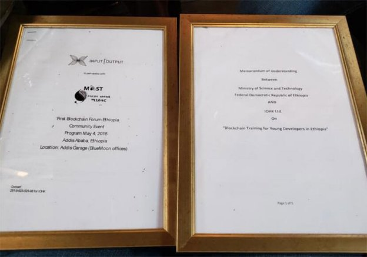
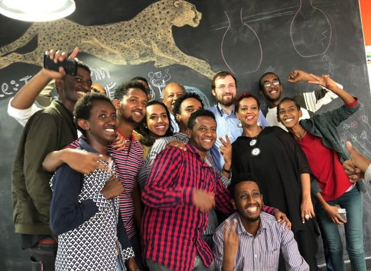
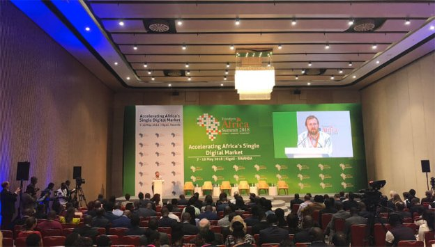
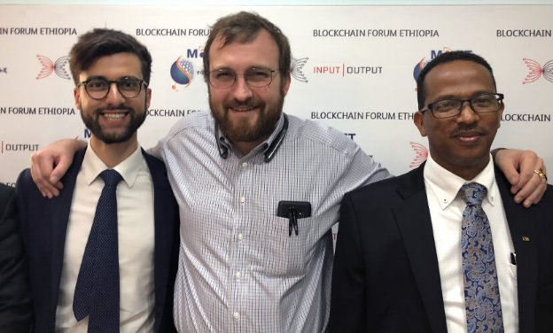

# Vision for blockchain in Africa is becoming a reality
### **Ethiopia and Rwanda keen to realise promise of the technology**
 29 May 2018[ John O'Connor](/en/blog/authors/john-oconnor/page-1/) 7 mins read

[ Vision for blockchain in Africa is becoming a reality - Input Output](https://ucarecdn.com/ffc4b9ae-32dd-4755-a6a8-fa8407414d0b/-/inline/yes/ "Vision for blockchain in Africa is becoming a reality - Input Output")

### [**John O'Connor**](/en/blog/authors/john-oconnor/page-1/)
African Operations Director

Commercial

- 
- 
- 
- 

The hope of bringing the benefits of blockchain to Africa has been around even longer than IOHK itself. Founder Charles Hoskinson talked about the promise of the technology driving financial inclusion on the continent in a [TEDx](https://www.youtube.com/watch?v=97ufCT6lQcY/ "The future will be decentralized, Charles Hoskinson, TEDxBermuda") speech in 2014. The vision encouraged me to join the Cardano project. This month, IOHK signed an MoU with the Ethiopian government to train and hire junior software developers and use Cardano in its agriculture industry, a step towards this promise being realised. Now the real work begins, as we look to use Cardano to solve real problems in Ethiopia and beyond.

The IOHK team flew into Addis Ababa, the capital, on May 3 for Ethiopia’s first blockchain forum, which we jointly organised with the Ethiopian Ministry of Science and Technology. As Director of African Operations, my last two months in Ethiopia have been a whirlwind of interaction with government, universities and the local technology scene. It was a pleasure to have those that I’ve met join us on stage to discuss what blockchain can do for Ethiopia.

We did not arrive with solutions, but with a commitment to find them. IOHK’s Alan McSherry who leads the Cardano Enterprise team, came out to gather business requirements for permissioned applications of Cardano, as did 13 other members of the IOHK team. Seeing the ideas that emerged from the dialogue between IOHK and the ministry validated our launch in Ethiopia, and our belief in a productive and mutually beneficial relationship. This belief is enshrined in the MoU Charles signed with the Minister of Science and Technology, Dr Getahun.

MoU’s are non-binding but are taken seriously in Ethiopia, because they represent a required first step before entering into contractual obligations. In the MoU, we stated our intent to train and hire Haskell developers from a new office in Addis Ababa. The Ethiopian government stated its intent to help us to deploy [Cardano in Ethiopian agriculture](https://bitcoinmagazine.com/articles/where-coffee-just-grows-connecting-ethiopian-agritech-blockchain/ "Where Coffee Just Grows: Connecting Ethiopian Agritech to the Blockchain, Bitcoin magazine"). This training course is the first of its kind in Africa. We expect to start in September 2018 with an inaugural class of 30 women developers. All of our trainees will leave with the ability to create blockchain applications to help drive tech-enabled growth in Ethiopia. Those who excel will be hired by IOHK and not only contribute to Cardano code, but help build the blockchain agriculture applications we are exploring in partnership with the government. With 80 million Ethiopians working in this industry, the opportunity for blockchain to make an impact is huge. Coffee is Ethiopia’s largest export, and there are many sophisticated companies along the supply chain who have a deep understanding of the product.

We are in active discussions with many such companies to develop, refine, and implement the technology. Proving the origin of coffee is one such application. I’m also excited about using smart contracts to incentivise smallholder coffee farmers to adopt more productive farming practices (I’ll be writing more about some of our projects like this in the coming weeks). Some 80% of Ethiopia’s population is under the age of 30, and GDP growth is 10% a year. With the right support from government, Ethiopia could transform into an incredibly powerful, technology-enabled economy. Ethiopia’s national animal is the lion, and if that lion has been sleeping, it is now waking up.
### **Community day**
The day after the conference IOHK spent time with many of Ethiopia’s most promising entrepreneurs and the tech community. IOHK worked with Ethiopian accelerators ICE Addis and Bluemoon to have local startups pitch their existing startups, and how they were planning on leveraging blockchain technology. The judge was, of course, Charles.

 Charles meeting entrepreneurs in Addis

This was a highlight of the trip for me. After a pitch Charles would mischievously state that he had a few questions, before delivering a grilling that would have a Harvard MBA looking for the nearest exit. The startups held up fantastically.

SÂÂince I began talking to local entrepreneurs in Addis two months ago I’ve received many messages from local companies interested in learning more about the technology. The first [Cardano Addis meetup](https://twitter.com/InputOutputHK/status/981138485846466561 "Excited to announce that @cardanocom's first meetup in Africa took place in Ethiopia..., twitter.com/InputOutputHK") was the beginning of a process of fostering understanding and adoption of the technology. The pitches showed me that these startups have not only begun looking at blockchain, but have puzzled out how it can add value to their businesses. Our colleagues in Cardano’s commercial entity Emurgo shared my view, and are in discussions about investing in a cohort of blockchain-enabled Ethiopian technology startups.
### **Rwanda**
The next leg of the trip for the IOHK team took us to Kigali, Rwanda, where Charles was talking at the Transform Africa Summit.

 Charles speaking at the Transform Africa Summit in Kigali

The summit aimed to bring together global and regional leaders from government, business and international organizations to collaborate on new ways of shaping, accelerating and sustaining Africa’s digital revolution. Blockchain was a key focus for the conference organisers, and we were honoured to have been invited and recognised for the efforts we are beginning to make in the region. Rwanda is truly a miraculous example of what can be accomplished when a country is united in its purpose and its government has embraced the principles of accountability, efficiency and openness.

The opportunity for IOHK to help enable this transformation is incredibly exciting. There are many countries where the promise of a technology that can bring transparency to government processes would be met with trepidation. It is huge credit to Rwanda that they seek to not only participate, but promote the technology’s adoption through the Transform Africa Summit.

And so on to strategy. Whilst we expect to have operations across many African countries in the future, focusing our initial efforts on Ethiopia and Rwanda will be a powerful start. Ethiopia has a government that is eager to engage in digital transformation and though early in that process, has the ability to deploy the technology across the country. The applications we are discussing could benefit tens of millions of people. Rwanda on the other hand has a population a tenth the size of Ethiopia. However they are leading Africa in their commitment to support innovative technologies. Ideas can be tried and tested. If they fail, lessons will be learnt and the next attempt will be better. This principle is the central driver of innovation, and Rwanda has embraced it.

 Charles and John with Dr Getahun, Minister of Science and Technology

After a whirlwind few weeks I’d like to thank everyone who has allowed us to reach this point. I thank ICE Addis, Bluemoon capital, as well as Impact hub in Kigali for hosting events with us and connecting me with the local entrepreneurship. I thank the IOHK and Emurgo teams who flew out to be on the ground and help us establish our work. But most importantly, I’d like to thank Yodahe Zemichael from the Science Technology and Information Centre and Dr Getahun Mekuria, Minister of Science and Technology. You have been more agile, proactive, and enthusiastic partners than we could have hoped for. We look forward to working with you.
## **Attachments**
[ Vision for blockchain in Africa is becoming a reality - Input Output](https://ucarecdn.com/ffc4b9ae-32dd-4755-a6a8-fa8407414d0b/-/inline/yes/ "Vision for blockchain in Africa is becoming a reality - Input Output")
