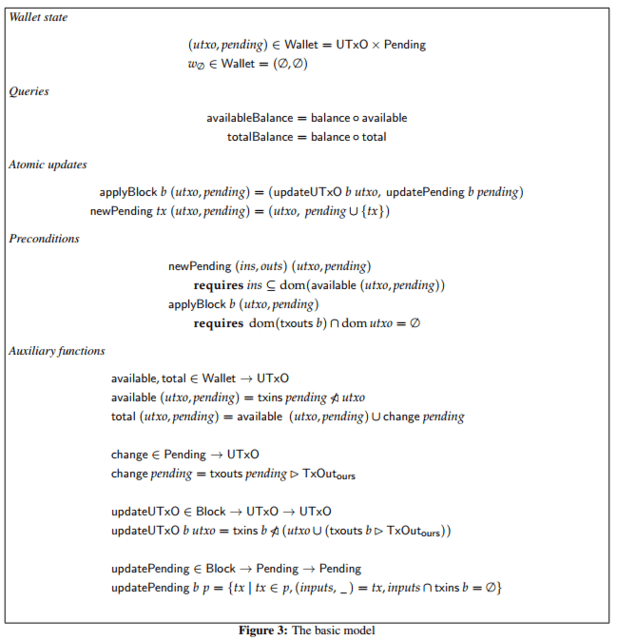
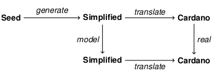

# Semi-Formal Development: The Cardano Wallet
 4 June 2018[ Edsko de Vries](/en/blog/authors/edsko-de-vries/page-1/) 17 mins read

### [**Edsko de Vries**](/en/blog/authors/edsko-de-vries/page-1/)
Software Engineer

Well-Typed

- 
- 
- 

*Please note: this post originally appeared on the [Well-Typed blog](http://www.well-typed.com/blog/2018/05/semi-formal-development/ "well-typed.com").*

**TL;DR:** A combination of formal modelling and testing using QuickCheck is a powerful tool in the design and implementation of high assurance software. Consistency of the model can be checked by testing invariants, and the real implementation can be tested by comparing it against the model. 

As part of our consulting work for IOHK, Well-Typed have been working with IOHK on the design and implementation of the new version of the Cardano cryptocurrency wallet. As a crucial component of this process, we have written a [semi-formal specification of the wallet](https://cardanodocs.com/files/formal-specification-of-the-cardano-wallet.pdf "Formal Specification of the Cardano Wallet, cardanodocs.com"): a mathematical model of the wallet along with invariants and lemmas about how it behaves.

We refer to this specification as “semi-formal” because while it states many of the wallet’s properties, and proves some of them, it by no means proves *all* of them. As we will see, however, we can use QuickCheck to test such properties, producing counter-examples where they fail to hold. Not only is this an invaluable tool during the development of the specification itself, it also gives us a very principled way of testing the real implementation, even if later we *do* prove all the remaining properties as well.

In this blog post we will take a look at the specification and see how it drives the design and testing of the new wallet. We will show parts of the formal development, but only to give some idea about what it looks like; we will not really discuss any of its details. The goal of this blog post is not to describe the mathematics but rather the approach and its advantages.

Note: all figure, invariant and section numbers used in this blog post refer to [version 1.1 of the specification](https://cardanodocs.com/files/formal-specification-of-the-cardano-wallet.pdf "Formal Specification of the Cardano Wallet, cardanodocs.com").
## **Background: UTxO-style Accounting**
Regular bank transactions transfer from and to bank accounts. For example, a transaction might transfer $100 from Alice to Bob. Transactions in cryptocurrencies such as Cardano or Bitcoin are a little different. The to part is similar, except that there might be multiple “outputs”; for example, a transaction might transfer $70 to Bob and $30 to Carol. The *from* part however works in quite a distinct way; transaction inputs are not accounts but *other transactions*. For example, let’s call the transaction that transfers $70 to Bob and $30 to Carol “t1”.

t1 	inputs:	…

`	`outputs:	$70 to Bob, $30 to Carol

Now suppose Bob wants to transfer $50 to Dave. He can create a new transaction that says “take the first output of transaction t1, transfer $50 to Dave and transfer $20 back to me”

1

.

t2	inputs:	first output of t1

`	`outputs:	$50 to Dave, $20 to Bob

It is important that Bob transfers the $20 “change” back to himself, because a transaction output can be “spent” (that is, used as an input) only once. This style of transactions is called “UTxO” style; UTxO stands for “Unspent Transaction (Tx) Outputs”.

The *blockchain* is basically a long list of such transactions. The corresponding formal definition looks something like this.

## **Wallet**
The cryptocurrency’s *wallet* is a piece of software that monitors the state of the blockchain, keeps track of the user’s funds (more precisely, their UTxO) and enables them to create new transactions to be included into the blockchain. The wallet is the primary means by which users interact with the blockchain. Note that the verification of these new transactions and the decision whether or not to include them into the global blockchain is not up to the wallet; how this happens is beyond the scope of this blog post.

A formal specification of the wallet is a mathematical abstraction that strips away all irrelevant detail and just focuses on the core functionality of the wallet. In the basic model of the Cardano wallet, we stripped down the wallet state to just the wallet’s UTxO and its set of pending transactions; the specification is small enough to fit on a single page.

Such a model is simple enough to be studied in-depth and support mathematical proofs of its properties. Yet it is accurate enough to be an invaluable guide in the design of the wallet and be the base for unit tests that drive the real implementation. It can also be used to study where we most need to worry about performance and how we can address those concerns.
## **Balance**
As an example of one of the trickier aspects of the wallet’s design, we will discuss reporting balance in a bit more detail. It may be surprising that reporting balance is non-trivial, but even for regular bank accounts we already have two notions of balance. After Alice transfers $100 to Bob, her online bank account might tell her

- Your **current balance** is $1000.
- There is a pending transaction of $100, so your available balance is $900.

Unlike regular bank transactions, UTxO-style transactions involve *change*; this leads naturally to *three* notions of balance. If we take as example transaction t2 above, Bob’s balance might be reported as

- Your **UTxO balance** is $1070.
- There is a pending transaction t2, so your **available balance** is $1000.
- However, transaction t2 returns $20 in change, so your **total balance** is $1020.

Note that the change from t2 becomes available only when transaction t2 has been included into the blockchain.

Although there are user interface questions here (how should we report these different kinds of balance to the user?), from the wallet design perspective this is not yet particularly difficult. The real complexity comes from the fact that there may be temporary disagreement about which transactions are included in the blockchain (such disagreements are known as “forks”; how they arise and are resolved is again well beyond the scope of this blog post).

Let’s stick to the above example, and suppose that t2 is pending, but there was disagreement about t1. After the disagreement got resolved the wallet discovers that t1 is not actually present in the blockchain after all (perhaps it will be later). The wallet’s *available* balance is now still $1000, but would it really make sense to report its *total* balance as $1020? It would be strange to have the total balance be *larger* than the UTxO balance; not wrong per se, but confusing nonetheless.

In the specification we therefore define the concept of *minimum* balance: the minimum (UTxO) balance of the user “across all possible futures”; this is the only balance the user can be certain of. In the example, this is the future in which neither t1 nor t2 ever make it into the blockchain, and hence we report $1000 as the minimum balance (note that it can never happen that t2 is included but t1 is not, since t2 depends on t1). While this concept makes intuitive sense, in order to make it precise and be able to compute it we needed to introduce the concept of “expected UTxO”: unspent transaction outputs that the wallet *expects* will become available in the future but haven’t yet.

Of course, even without a formal specification it is possible that we could have come up with this concept of minimum balance and a way to compute it. But having the formal model allows us to think much more clearly about the problems, remove all the clutter that surrounds a “real” implementation of the wallet and focus only on the core ideas.
## **Internal consistency: invariants**
When we introduce a novel concept such as “expected UTxO” into the specification, there is a tricky question: how do we know that what we specified is right? Actually, since we introduced the concept ourselves, the question of whether it was “right” or not is not particularly meaningful. Instead we ask: is what we specified *useful*?

One way to answer this question is by stating invariants. Invariants are properties that we expect to be true at all times. For example, for the basic model shown above (Figure 3) we have the following invariant:

Invariant 3.4. txins pending ⊆ dom utxo

What this invariant says is that the pending transactions can only spend from the wallet’s unspent outputs. Intuitively, this makes a lot of sense: the wallet should not allow the user to spend funds they don’t have. As we have seen however in the previous section, this invariant does not always hold when we take disagreements about the blockchain into account! When Bob submits transaction t2, spending an output of transaction t1, and only later discovers that actually t1 should not have been included in the blockchain after all, he will have spent an output that is not in his UTxO.

The concept of expected UTxO comes to the rescue, again. The invariant for the full model is instead:

Invariant 7.8. txins pending ⊆ dom (utxo ∪ expected)

In other words, pending transactions can only spend available outputs or outputs that we expect to become available (because they were previously).

Another useful invariant that helps further solidify our intuition about what we mean by expected UTxO says that an output can never be in *both* the actual UTxO and the expected UTxO

Invariant 7.6. dom utxo ∩ dom expected = ∅

After all, it would be strange to say that an output is expected if we already have it in our wallet. Stating invariants like this allows us to make our intuitions about the concepts we introduce precise, and proving them gives us strong guarantees that our specification makes sense and is internally consistent.
## **Semi-formal development**
Formally proving invariants such as the ones discussed above can be time consuming and requires mathematical training. Naturally, doing the proofs would be ideal, but the main point of this blog post is that we push this approach a long way even if we don’t. After all, we program in Haskell precisely because we can easily translate back and forth between Haskell and mathematics.

To translate the various wallet models from the specification, we use the approach we described in a previous blog on [Object Oriented Programming](http://www.well-typed.com/blog/2018/03/oop-in-haskell/ "OOP in Haskell, well-typed.com") in Haskell (indeed, we developed that approach specifically for this purpose). For instance, here is the Haskell translation of the basic model:

mkWallet :: (Hash h a, Ord a, Buildable st)

`         `=> Ours a -> Lens' st (State h a) -> WalletConstr h a st

mkWallet ours l self st =

`  `(mkDefaultWallet (l . statePending) self st) {

`      `utxo       = st ^. l . stateUtxo

`    `, ours       = ours

`    `, applyBlock = \b -> self (st & l %~ applyBlock' ours b)

`    `}

applyBlock' :: Hash h a

`            `=> Ours a -> Block h a -> State h a -> State h a

applyBlock' ours b State{..} = State {

`    `\_stateUtxo    = updateUtxo ours b \_stateUtxo

`  `, \_statePending = updatePending   b \_statePending

`  `}

updateUtxo :: forall h a. Hash h a

`           `=> Ours a -> Block h a -> Utxo h a -> Utxo h a

updateUtxo p b = remSpent . addNew

`  `where

`    `addNew, remSpent :: Utxo h a -> Utxo h a

`    `addNew   = utxoUnion (utxoRestrictToOurs p (txOuts b))

`    `remSpent = utxoRemoveInputs (txIns b)

updatePending :: Hash h a

`              `=> Block h a -> Pending h a -> Pending h a

updatePending b = Map.filter $ \t -> disjoint (trIns t) (txIns b)

It deals with more details than the specification; for instance, it explicitly abstracts away from a specific choice of hash h, as well the types of addresses a. It is therefore a bit more complicated than the spec, but it nonetheless follows the specification very closely. In particular, it is still a model: it does not deal with any networking issues or persistent storage, may not be particularly performant, etc. In other words, this is not intended to be the design of the *real* wallet. Having this model is nonetheless incredibly useful, for two reasons. The first is that we can use it to *test* the real wallet; we will discuss that in the next section.

The second reason is that we can use the model to test the invariants. For example, here is the translation of Invariants 7.8 and 7.6 from the previous section to Haskell:

pendingInUtxoOrExpected :: WalletInv h a

pendingInUtxoOrExpected l e =

`  `invariant (l <> "/pendingInUtxoOrExpected") e $ \w ->

`   `checkSubsetOf

`    `("txins pending",

`      `txIns (pending w))

`    `("utxo ∪ expected",

`      `utxoDomain (utxo w) `Set.union` utxoDomain (expectedUtxo w))

utxoExpectedDisjoint :: WalletInv h a

utxoExpectedDisjoint l e =

`  `invariant (l <> "/utxoExpectedDisjoint") e $ \w ->

`   `checkDisjoint

`    `("dom utxo",

`      `utxoDomain (utxo w))

`    `("dom expected",

`      `utxoDomain (expectedUtxo w))

As for the wallet implementation, the Haskell translation of the invariants deals with more details than the spec; in this case, one of the main differences is that the infrastructure for these invariants is designed to give detailed error reports when the invariants do *not* hold. Nonetheless, the main part of the invariant is again a direct translation of the specification.

The big gain is that we can now use QuickCheck to test these invariants. We generate random (but valid) events for the wallet (“apply this block”, “submit this new transaction”, “switch to a different fork”) and then check that the invariants hold at each point. For example, in the first release of the wallet specification there was a silly mistake: when the wallet was notified of a new block, it removed the *inputs* of that block from the expected UTxO, rather than the *outputs*. A silly mistake, but easy to miss when just reviewing the specification by hand. A proof would have found the mistake, of course, but so can QuickCheck:

Wallet unit tests

`  `Test pure wallets

`    `Using Cardano model FAILED [1]

Failures:

`  `test/unit/Test/Spec/Models.hs:36:

`  `1) Wallet unit tests, Test pure wallets, Using Cardano model

`       `predicate failed on: Invalid [] InvariantViolation {

`           `name:     full/utxoExpectedDisjoint

`         `, evidence: NotSubsetOf {

`                 `dom utxo: ..

`               `, dom expected: ..

`               `, dom utxo `intersection` dom expected: ..

`             `}

`         `, events:   {

`                 `state: ..

`               `, action: ApplyBlock ..

`               `, state: ..

`               `, action: NewPending Transaction{ .. }

`               `, state: ..

`               `..

`               `, action: Rollback

`               `..

`             `}

`         `}

Not only does this tell us that the invariant did not hold; it actually gives us the specific sequence of events that lead to the wallet state in which the invariant does not hold (as well as all the intermediate wallet states), and it tells what the domain of the UTxO and the expected UTxOs are in that state as well as their intersection (which should have been empty but wasn’t).
## **Testing the real implementation**
As mentioned, the Haskell translation of the wallet specification is still a model which ignores a lot of the real world complexity that the full wallet implementation must deal with. Even the datatypes that the model works with are simplified versions of the real thing: transactions don’t include signatures, blocks are not real blocks but just lists of transactions, etc.

Nonetheless, we can use the model to test the real implementation also. We can *translate* the simplified types of the model to their real counterparts. Since we have QuickCheck generators for the simplified types *and* we can test the model because we have an implementation of it, we can test the real wallet as shown in the following commuting diagram:

In words, what this means is that we use the QuickCheck generator to generate wallet events using the simplified model types and then do two things:

- We execute the model on the simplified types and translate *after*.
- We translate *first* and then execute the real wallet on the translated input.

Either way, we end up with two final answers (both in terms of the real Cardano types), one executed in the model and one executed in the real wallet. We can compare these two, and if they match we can conclude that the real wallet implements the model correctly. Since we check this property at each step and we know that the invariants hold in the model at each step, we can then also conclude that the invariants hold in the real implementation at each step.

For example, when a bug in the full wallet meant that change from pending transactions was sometimes double-counted (in the case where pending transactions use the change of other pending transactions as inputs, a case that can only happen in the presence of forks), the generator will be able to find a counter-example to the above commuting diagram, and then give us the exact sequence of wallet events that leads to a wallet state in which the real wallet and the model disagree as well as the precise value that they disagree on.
## **Conclusions**
Software specifications, where they exist at all, are often informal documents that describe the features that the software is intended to have in natural language. Such specifications do not lend themselves easily to verification or even testing. At the other end of the spectrum, fully formal specifications where every property is verified mathematically are costly and time consuming to produce and require specialized expertise. They are of course the golden standard, but there is also a useful middle-ground: by specifying the model and its properties formally, we can test its properties using QuickCheck. Moreover, we get a model in which we can reason about the core functionality of the application and which we can then *compare* against the real implementation.

IOHK’s development of the new wallet is open source and can be found on GitHub. Excitingly, IOHK have recently hired someone to start work on the Coq formalization of the wallet specification, which will put the whole specification on an even stronger footing. Of course, that does not make any of the existing work useless: although it will become less important to test the invariants in the model, having the QuickCheck generators available to check the real implementation is still very valuable. Moreover, having the QuickCheck tests validate the invariants before we attempt to prove them formally can also save valuable time if we discover early that an invariant is not, in fact, true.
## **References**

"Formal specification for a Cardano wallet”, Duncan Coutts and Edsko de Vries 

GitHub repository for the new wallet

-----
\1. We ignore transaction fees for the sake of simplicity.

Artwork, 

[Mike Beeple](http://www.beeple-crap.com)
