# A major brand refresh for Cardano *
### **How IOHK Creative redesigned the brand with form following function**
 7 June 2018[ Richard Wild](/en/blog/authors/richard-wild/page-1/) 9 mins read

### [**Richard Wild**](/en/blog/authors/richard-wild/page-1/)
Creative Director

Creative

- 
- 

In January, [Charles Hoskinson](https://www.youtube.com/watch?v=Ja9D0kpksxw "Charles Hoskinson Whiteboard, youtube.com") messaged to say he’d come across an online video that he wanted us to check out. I took a look at the link he sent, and found that it was indeed eye catching. A cryptocurrency fan had studied Cardano, and had made an animation of its [development history](https://www.youtube.com/watch?v=YtSfJqP04cQ "History of Cardano, Git vizualisation"). The data visualisation showed each piece of Cardano code appear on the screen as a brightly coloured node, at the time it had been written over the past two or so years. From only a handful in number, over time they mushroomed on the screen, resulting in a complex structure with many interconnecting parts.

This sparked an idea at IOHK. We’ve had our fair share of trolls, making false accusations online that Cardano is "vapourware", i.e. that we have no product. This animation wasn’t just beautiful, it was functional, because it destroyed those claims completely. Using data freely available from the development website [GitHub](/en/projects/cardano/ "Cardano, GitHub"), where Cardano developers had registered each piece of code as it was written, you could not only see how active they had been, but that Cardano was for a long period the most intensely developed cryptocurrency of all. We wanted to see where we could take this idea.

The visualisation made by a user named Crypto Gource 

The design team had recently started a project to refresh our brand across the portfolio of Cardano websites. We would overhaul the design of each website and the information it displayed. We would make the websites more intuitive to use and convey data more effectively and in an information-rich way. This would give users the big picture but also allow them to drill down to understand details in a way that had not been done before with any cryptocurrency project.

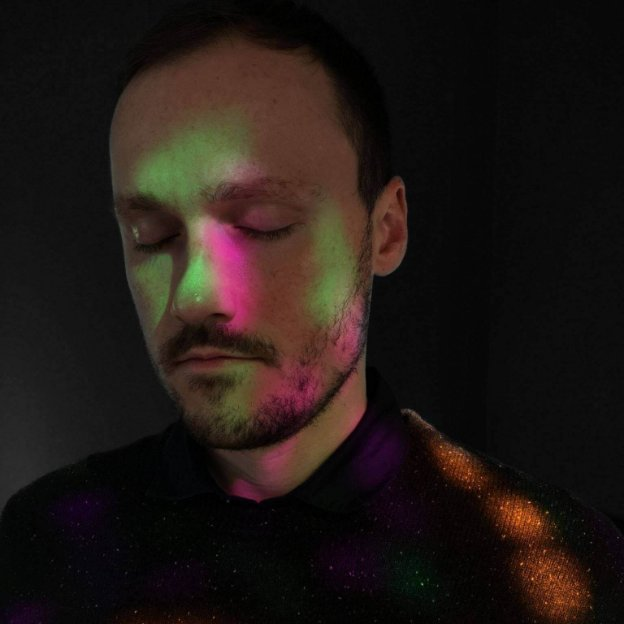

Scott Darby and Juli Sudi from IOHK Creative

Because the animation had been so captivating but also served a useful purpose, we decided to make it an intrinsic part of our design refresh and [Scott Darby](/en/team/scott-darby/ "Scott Darby, IOHK Team"), IOHK creative coder, got to work. Meanwhile, visual designer [Juli Sudi](/en/team/juli-sudi/ "Juli Sudi, IOHK Team") would lead the rest of the work, and create a recognisable look and feel for the brand. 

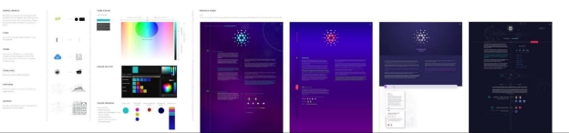Evolution of the initial designs
## **Groundwork**
Juli says: "The first steps for me were finding a style direction and creating core visual elements that could be shared across the pages and serve as a backbone of further design efforts." 

She chose iconography and experimented with colour pallets and layout styles. For each potential direction she created a test design using the base theme in different ways, such as varying the icon style, typography, spacing, colour swatches and gradient options. The test versions were shared with the team to gather feedback and to choose the elements to be taken further. 

After many experiments and ideas, we landed on the principle that the design should be very functional. Colours would represent something rather than be chosen just because they were pleasing. The form should follow the function. We approved a direction that was still a rough concept, but was an agreed starting point for building up the new design.

 

Felix Koutchinski
## **Community Involvement**
Next, Juli began a discussion with a community member and graphic designer from Stuttgart, Germany, named Felix Koutchinski. He had come to our attention after he wrote a [blog about the Cardano roadmap](https://www.koutchinski.de/blog/2018/3/12/cardano-roadmap "Cardano roadmap blog") design. His feedback became important and we worked with him closely. The community should be involved in everything we do because ultimately this technology is theirs.

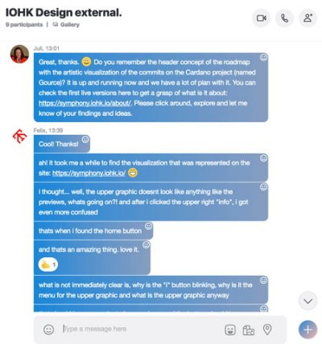 

Chatting to Felix in an external Skype group

Discussion with Felix highlighted many points that we had overlooked about the roadmap. Without a filtering function, it was hard to find the information you were looking for. Sorting the tasks by progress or recent update was a high priority for visitors to the site. The development milestones did not follow each other chronologically but progressed in parallel, which called for a different style of navigation saving users' time moving down the page. We should show completed development more clearly. There should be a summary explaining each part of the project. Users should be able to filter content by category, such as development phase (Shelley, Goguen etc) or by whether the work was complete or not, or by who carried out the work (IOHK, Cardano Foundation, Emurgo).

Below, you can see three layouts. The first is the roadmap as it was, the second is Felix’s design, and the third is the new layout we settled upon. 

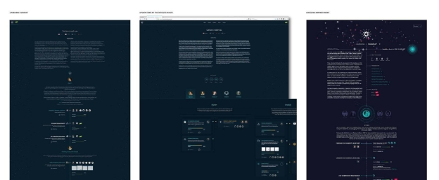

As these ideas were developing, Juli was also working on a colour pallet and style guide, below.

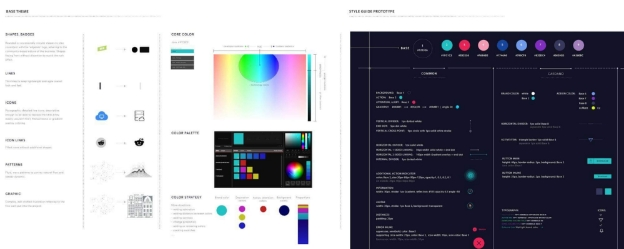
## **Medusa**

\*

Meanwhile, Scott had been working on a proof of concept for Medusa. He studied the main source of the [repository](https://github.com/acaudwell/Gource "GitHub, Gource"). Crypto Gource's original video was offline, however we decided that Medusa would show updates as they were made in real time. Scott says: "This is a dynamic, living artwork, created from a Git repository directory structure. The visualisation is continually evolving in real time based on developer commits. Each time a commit is made, the edited files light up."

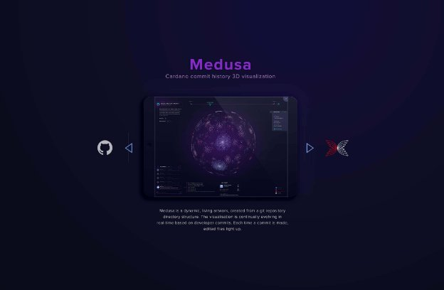

Files that have been recently edited are coloured red and dormant files are blue. We chose to make our visualisation 3D in contrast to the original 2D animation. We also found great ideas that we borrowed from [cardanoupdates.com](https://cardanoupdates.com/ "cardanoupdates.com"), a website produced by a community member.

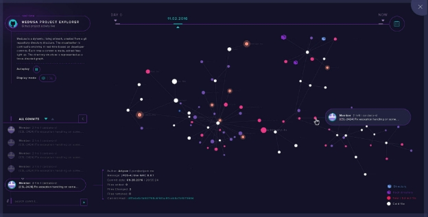

Medusa will feature on each Cardano website. For the best experience view Medusa on desktop with the latest version of Google Chrome, Mozilla Firefox, Opera, or Safari. Every development project has a different GitHub file structure, and Medusa will represent this and act as a unique fingerprint for each one. The full-screen view with rich interactive functionality is available by clicking on the glowing button in the header of the Cardano roadmap. In future we will include more features. These will offer viewers a means to explore the code, and understand more about the development in a way that is not only useful, but beautiful too. 

## **Bringing it all together**
At this point, senior full-stack developer [Tomas Vrana](/en/team/tomas-vrana/ "Tomas Vrana, IOHK Team") began to work with Juli on bringing the designs to life in production. Tom helped refine the designs so they would work well in practice. One example was that if a user filtered content by the partner responsible for the work, it would not make sense to have a column displaying developer commits because Emurgo and the Cardano Foundation do not produce code. Medusa is still very much in its infancy, and at best a working proof of concept. Over time, we will be rolling it out across all devices, and bringing more functionality and intuitive widgets to the UX.

Tomas Vrana and Alexander Rukin

The Cardano roadmap wasn’t the first time we deployed the new designs – they were used on the [Symphony of Blockchains](https://symphony.iohk.io "Symphony of Blockchains, iohk.io") and [Cardano Testnets](https://testnets.iohk.io "Cardano Testnets") websites that recently launched.

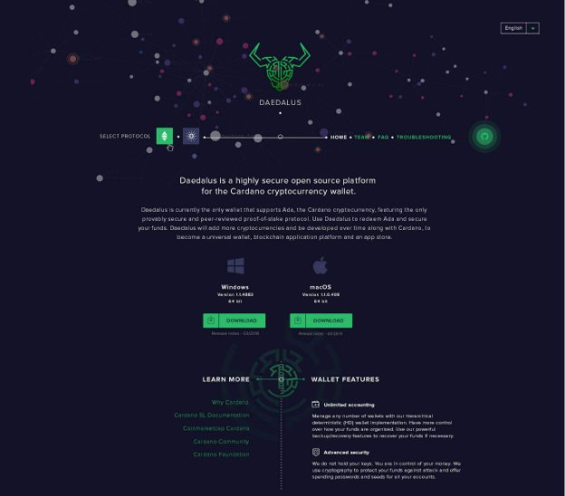New Daedalus website design with Medusa, coming soon

[Alexander Rukin](/en/team/alexander-rukin/ "Alexander Rukin, IOHK Team") took Juli’s designs and very quickly built the new [Cardano testnet](https://testnet.iohkdev.io/goguen/ "Cardano testnets") website that launched at the end of May. The wonderful thing about these new designs is that you can take and translate them for various uses. The content of the testnet website is very different from the roadmap and Alexander did a great job adapting the designs. Alexander is also responsible for the design of Daedalus. 

[ New Cardano testnet website](https://ucarecdn.com/b364183e-8d12-46d2-8688-347384476514/)

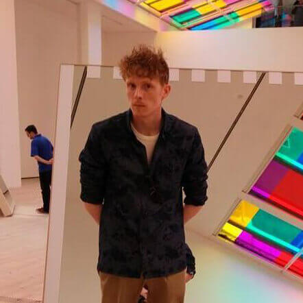

Full-stack developers Jonathan Smillie, George Clark, and project manager Robert Moore

[George Clark](/en/team/george-clark/ "George Clark, IOHK Team") and [Jonathan Smillie](/en/team/jonathan-smillie/ "Jonathan Smillie, IOHK Team"), who are full-stack web developers and designers, teamed up to give extra firepower to the testnet website launch. For the first time, Cardano is offering smart contract functionality for testing, and George and Jonny pulled long hours to ensure the website was successfully launched. An added challenge was that the new designs were delivered under a tight deadline, and project manager [Robert Moore](/en/team/robert-moore/ "Robert Moore, IOHK Team") helped enormously to get us to the finishing line.

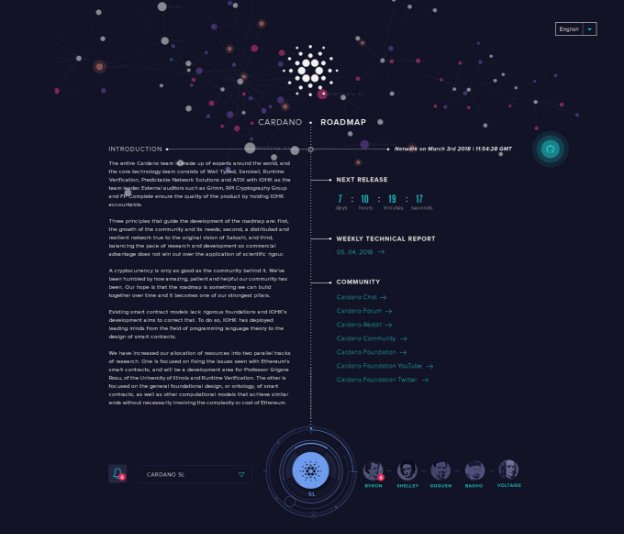

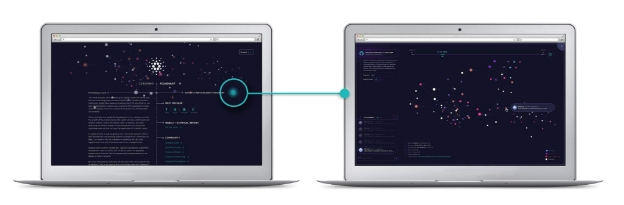New Cardano roadmap with Medusa

Today, we launch the refreshed [Cardano roadmap](https://cardanoroadmap.com "cardanoroadmap.com"), where you can see the result of all the work described above. You can view the new features, from exploring the list of developer commits, to receiving notifications when the roadmap is released each month. 

We’d love to hear your feedback, please let us know what you think. We may even end up working with you as we have done with other community members. 

Now for the first time Cardano has a real brand identity that exactly represents the project in a visual way. We will be rolling out this restyle across the rest of our assets, including [Why Cardano](https://whycardano.com/ "Why Cardano") and [Cardano docs](https://cardanodocs.com/ "Cardano docs"). Follow IOHK’s [Twitter](https://twitter.com/InputOutputHK "IOHK, Twitter") and [YouTube](https://www.youtube.com/channel/UCBJ0p9aCW-W82TwNM-z3V2w "IOHK, YouTube") to stay updated. The redesign will completely redefine how you understand IOHK projects, and evolves how we communicate as a company. 

At IOHK we believe that Cardano is not just a development project: it is distributed systems, it is social science, it is a political movement, and among other things, it is also a design challenge.

New intuitive navigation 
New layout gives a better perspective to the information presented

Join in the discussion about the [redesign project on the Cardano Forum](https://forum.cardano.org/t/iohk-announces-a-major-brand-refresh-for-cardano-and-reveal-new-gource-visualisation/12861 "IOHK announces major brand refresh for Cardano, forum.cardano.org").

\*This blog has been edited to reflect the change of name for the project from Gource to Medusa.
