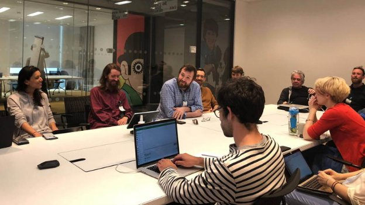
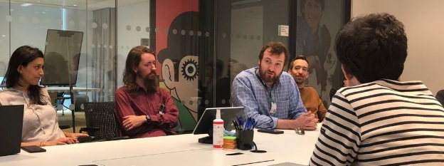

# IOHK make a visit to Google’s London offices
### **Googlers keen to talk Cardano and the future of cryptocurrency**
 28 June 2018[ Jane Wild](/en/blog/authors/jane-wild/page-1/) 57 mins read

### [**Jane Wild**](/en/blog/authors/jane-wild/page-1/)
Content Director

- 
- 

Cryptocurrency is one of the most discussed topics of the moment, and whatever people think about it, they all want to know what’s next for the technology. An audience that was no different was at Google, where Charles Hoskinson was invited to talk about Cardano and the future of cryptocurrencies. At the meeting, held at Google’s London headquarters last month, Googlers around the world dialled in to hear the presentation and put questions to IOHK’s chief executive, and to Duncan Coutts, IOHK Director of Engineering. As you might expect from a company that has laid much of the ground for today’s technological landscape, Googlers asked some of the most incisive and informed questions Charles has had on his speaking tour this year. After a brief introduction from Charles on IOHK and Cardano, the floor was opened to questions. Cardano development raised much interest, and Charles explained how its consensus protocol, Ouroboros, uses staking as a means to encourage people to join and help run the network. Development milestones were in focus too, such as one expected in July, when a [test network](https://testnet.iohkdev.io "Cardano Testnets") will be opened to developers who want to play around with smart contracts on the IELE virtual machine. Later this year, full decentralization of the network is expected, as part of the Shelley phase of development, and Charles explained the background to all these topics. 

There followed questions about how developers could get involved with Cardano, and about the K framework, which is part of IOHK’s test smart contract capability; how cryptocurrencies will cater for privacy, and of course, about where cryptocurrencies are headed. After the session, Googlers were kind enough to take the IOHK team up in the glass lifts to the top of the building and on to the roof, to enjoy the spectacular view across London.

Read the conversation, below.

**Q. I have a question about Ouroboros and staking: is the number of tokens on offer sufficient to convince people to join the protocol and help run the network?**

**Charles**: We published a preliminary monetary policy. The ceiling is 45 billion tokens and the current number in circulation is 26 billion so we have a little bit of room to work with inflation there, plus there's transaction fees as well to subsidise transaction validation.

First, Proof of Stake (PoS) is an extremely cheap protocol to run, especially Ouroboros, if you compare it to mining. The odds are that the operational costs will be so much lower that you really don't need to pay as much. But it's a broader and more abstract question: how do you handle fees and incentives and stake pools and delegation and then get all those incentives engineered in a way that you have reasonable game theoretic reasons to believe that the system is going to behave as intended? That's a really hard question. So we have two individual work streams. One is led by Elias Koutsoupias, an algorithmic game theorist at Oxford and a Gödel prize winner. He's working on the incentives question, trying to create models and understand inaudible first example – if you want to delegate and run a collection of stake pools, how many ought there to be and what are the economics of that?

 

Outside Google HQ, London

Then, the other side is, if I'm going to try to convince people to delegate, they ought to get a reward, so how much should that be? And then you have to do some empirical calculations – what is the operational cost of the network? You don't want to pay too much more inaudible but you also want to pay enough to incentivise people to run 24/7 nodes to maintain the system. It's an interesting question, but with the inflation that we've proposed we have more than enough wiggle room to work with. Not only will people participate, they'll probably make windfall profits relative to operational costs, given the way these markets work.

We opened up registration for stake pools last month and were looking for 100 applicants for a beta test, but got 1,500 applications – 15 times more people expressed interest than we expected.

As with all monetary parameters in a beta system, these things can be adjusted depending on facts and circumstances, but the reality is that the driver here is the price of the underlying asset – the token – and markets tend to converge on that. The short answer is, it's probably going to work out; the long answer is that we're probably not going to have the right model to begin with. We're either going to underpay or overpay and it's qualitatively going to be pretty obvious, based on participation of the network. The odds are that we’re probably going to overpay in terms of rewards.

**Q. On all the projects that you are driving, are there specific milestones that will for sure be completed this year?**

Look at [cardanoroadmap.com](https://cardanoroadmap.com "cardanoroadmap.com"), for Cardano-specific projects. Month by month, it gives an update on where we're at. We also do weekly reports and we try to be as transparent as possible about where we're at. Our goal is to release the next major version of Cardano some time this year, called Shelly. We are working really hard towards that. It might slip, but the odds are that it won't. It's a difficult project. Shelley is true decentralization of the network. At the moment we're running our proof of stake protocol in a forced delegation model. So all the PoS mechanics are there and the stake rights have been delegated to nodes that IOHK and two other entities control, so it's a federated network. We did this because we're not insane. You don't go and invent a protocol in the academy, turn it on and say 'Good luck everybody'. Instead, you have training wheels on your bicycle. You say, 'Let's launch this system in a federated format and gradually decentralise the system once we have momentum and assurance that what we've done is correct'. And also when we've trained up hundreds of people to run stake pools and participate in the staking process so there's a bit of redundancy and a much more natural unlocking of the system. So, over six to nine months, that process will continue and hopefully all the Shelly mechanics will roll out.

In parallel, we are releasing [testnets](https://testnet.iohkdev.io "Cardano Testnets") for smart contracts. The first one will be released at the end of the month, and this is done with something called the KEVM. We worked with Runtime Verification at the University of Illinois Urbana-Champaign, and they took the operational semantics of the Ethereum Virtual Machine and wrote them in a meta language called K. What the K framework allows you to do is implement a correct-by-construction version, just from the semantics of the virtual machine. So it's really cool. What we were able to do is actually take the K semantics, build a VM, connect that to a fork of Ethereum and we're now turning that on at the end of the month to test that this framework is working and you can run smart contracts on it. We also have another virtual machine that we built specially for Cardano, called IELE. And those semantics are publicly available in GitHub. We have a paper that we are submitting for peer review. That testnet will launch some time in June or July – that gives people who live in the Ethereum world and write smart contracts the chance to play around and deploy code on our system and look at our gas model and get a better understanding of how our system works. And then, over time, testnet iterations will occur and eventually we'll pull these two systems together.

 

IOHK arriving at Google HQ, London

One of the architectural features of Cardano is the separation of accounting and computation. With Ethereum they are bundled together, your peanut butter is in your jelly. And that's fun from an implementation standpoint; it's simpler to maintain, but it creates a lot of problems. If you screw up parts of your computational model you'll also inadvertently block your ability to spend money. Also, computation carries a much higher liability than accounting does. For example, Bitcoin versus Ethereum in terms of transactions. In Bitcoin, if I send Jane a transaction and Philipp a transaction, buying a laptop from Jane and weapons-grade plutonium from Philipp – the miner in the system would have no way of differentiating between those two transactions, they're fungible. We don't know the actors, they are just transactions. But if we're running code, you might be able to differentiate between Crypto Kitties and Silk Road. There is some precedent if you look at Tor exit nodes having legal liability and being arrested for trafficking, child pornography or copyright violations. Computation, if you can discover the difference between what Jane and Philipp are doing, has higher liability. In our view, architecturally, it's a good idea to separate them and it also gives you a lot of flexibility because you can have multiple computational models, like we're backwards compatible with Ethereum and we had a different model and we have a functional model and you can do a lot of cool stuff with that. The downside is that you have to maintain the state of many ledgers at the same time and you also have to figure out how to move value between the ledgers, which we're going to do because of our interoperability mandate. We decided to take this on but it adds complexity to the system, a lot more work to do. That will be gradually rolled out in stages through testnets and it's quite a bit of work.

**Duncan**: There's the compartmentalization aspect of it. Ethereum is monolithic, it bundles together all of the features, so if one thing breaks the whole thing breaks. If there's some fundamental flaw you haven't found, not only have all your ERC20 tokens gone but so has ether itself. There's no compartmentalization between those things. But if you have, in essence, a Bitcoin-style simple settlement layer and then you do your EVM stuff and equivalent to EVM on different blockchains that are linked you can move money between them but they're otherwise compartmentalized. If for some fundamental reason there's a flaw found in the EVM that destroys that, well, that's very sad but it doesn't destroy the settlement layer. That's a big advantage. And it means, as Charles says, you can add new ones of these things that can be somewhat experimental because that lets you evolve the system a bit.

**Charles**: We wrote, I think, the first formalization of sidechains. There was a sidechains paper written in 2017. So what a sidechains transaction is for those who don't know it, I like to call it interledger transactions. So you have a source ledger, a destination ledger and an asset. So basically what you're trying to do is initiate a transaction, where the destination ledger can answer two questions about the transaction. One, is that the asset does exist from the source ledger, and two, that the asset from the source ledger has not been double spent. The foundational question you're asking is how much information does the destination ledger need to possess to be able to validate that transaction and verify those two questions? We wrote a model, first for proof of work, called ‘Non-interactive Proofs of Proof of Work’ that explains how to do this, and now we've extended that model to Ouroboros and the proof of stake world and we have a paper that we've just submitted that contains details on how to construct these types of proofs and what these transactions look like. There are still questions about how large the proofs are going to be, relative to the size of the ledger, and there are questions about validation time, and also generality. The proofs we scoped work with our particular consensus algorithm, but we'd like to make these things work for all ledgers, not just a particular type of ledger, so there's a lot of work to be done there. But it's the first time it's been formalized. The concept has been enumerated in a paper that was written in 2014, by a competitor of ours called Blockstream, but they didn't write a proper academic paper and submit it for peer review. That's considerably harder, there's a lot more to think about when you're rigorous about these things. In the long term, it's a great thing to think about for scalability and interoperability, and also testing because you can now deploy versions of your chain with different parameters and it's easy to move value between them and you can let people vote with their feet.

**Q. How will Cardano overcome the first-mover advantage of Ethereum? Do you see multiple smart contract platforms co-existing in the space or will there be one prominent winner?**

So how many Java, C++ or Go developers are writing code on Ethereum? You can't, Ethereum doesn't support any of these languages. They can't even run a single viral app on the platform. If you look at the top 10 languages, none of them works on the system, so, by definition, all those developers aren't developing for the system, they have to go and learn new tools and new stuff. With Cardano, first off, we're backward-compatible, 100%, we're running an EVM. So you can take your Solidity code and your Web 3 stuff and all the things you've come to know and love about Ethereum, and you can run it on my system, and it's faster, cheaper and safer to run it on my system because we have a better consensus model. Second, through our work with the University of Illinois, through Runtime Verification – Grigore Rosu and his team – we're working on something called semantics-based compilation. Should this be successful, we can take any K-defined system and translate it to run on our machine. All you have to do for a new language is just write the semantics in K, one time, and then K framework takes care of the rest of it. It's a hard, high-risk, high-return project, but at the end of the day, we will end up one way or another supporting mainstream languages. Part of it is backwards compatibility, part of it is supporting mainstream languages, part of it is recognising that the vast majority of real applications aren't running on Ethereum at the moment. The other thing is that smart contracts are not monolithic and you write and run your entire application on a blockchain and the reality is you have to add a server-client component to it. Let's think of it like a poker game, maybe you trust random number generation to the server, but other things like player matching and account managing, these things are almost certainly not going to run on your blockchain, you're dumb if you're going to do these types of things. They're probably going to run on some sort of server back-end. It's more of, I treat a smart contract as a computational service. So it's silly to say, 'Oh well, only one platform and one token's won', it's akin to saying Internet Explorer's won and we all have to be Active X developers, god help us. I'm not loyal to IE, or Amazon Web Services. Rather, I have to ask, what's the cheapest, best, most secure environment for me to run my computation in for my users? Our strategy is be backwards compatible, support more languages, especially mainstream languages in a better way, have a better user and developer experience, and be smarter about the ecosystem in which these contracts live. So we make it easier for the server to come into play, to use multiple ledgers and have a good app platform to deploy these types of things on, and we'll definitely get a lot of growth there.

The other thing is that very few people today write smart contracts. They play with these things, but very few people are smart contract developers. If 99% of developers aren't in the ecosystem, how can you say a person has first-mover advantage? It's nuts.

**Q: In 2014 I played around with the K framework for a university project, but I found it to be extremely slow.**

**Charles**: Yes, because there is a K to OCaml back-end, but we're building a K to LLVM back-end, which should be about 100 times faster.

**Q: But is that enough? Because it was outright impossible to run a reasonably large project with thousands of lines of code.**

**Duncan**: This is one of the problems that Grigore is trying to solve. As you say, executing the operational semantics directly is very slow. Runtime Verification are basically trying to do a compiler approach, which they believe will be fast.

**Charles**: It's still a big unknown, exactly how much performance is necessary – and can we get within an order of magnitude of handwritten code? One proof of concept is the testnet that we're launching at the end of this month running a version of the Ethereum Virtual Machine built in K. You can run smart contracts on the KEVM and compare them to an Ethereum testnet and see the performance delta between the two. But it's also important to understand that the open source K framework components that you use and the version that Grigore uses are different. Grigore built a second set of software for his private company, Runtime Verification, that he uses for contracts he's had with Boeing and Nasa, and I think that's about 100 times faster than the one that you used. But even so, there's still a big performance delta that needs to be ameliorated. We have quite a large team, there's 19 people involved in that contract. Some of those people are allocated specifically for performance. Now let's say that we can't quite bridge that performance, there's probably a lot of things we could do to cheat and improve things a bit, including handwriting certain things, or abandoning semantics-based compilation for more traditional techniques. But it's still a big unknown. This is also why we have a multi-computation model, so in addition to the IELE framework and the K framework, we also have an alternative approach called Plutus.

**Duncan**: We think that most of the computation time in most of the smart contracts goes into crypto primitives. So you don't have to have the world's fastest interpreter to interpret those smart contracts. Plutus – people like me with a programming language background look at the EVM and Solidity, and say ‘It looks like the people that wrote this didn't have much experience with programming language design’. There’s an academic discipline to the design of programming languages, and that didn't seem to inform the design of Solidity at all. That shows up, in things like if you miss one error code then your smart contract loses everybody's money. So we have two smart contract platforms that Charles has mentioned, the backward compatibility story, byte-for-byte compatibility with the K version of the EVM and then IELE, which is EVM style, but fixing a lot of the obvious problems. That gives us the story of how you compile Solidity programs to IELE and KEVM. In addition, we have a smart contract platform that is based on programming language research, in particular functional programming. We have an approach based on a functional core language, which is actually executed, based on system inaudible and then two languages which are compiled into that core language. The core language is what's executed on the consensus nodes. That's the inaudible equivalent of the EVM. We don't call it a VM, it's just an intermediate code, that's the equivalence, and then two languages initially that compile into that. One is called Plutus, which is a functional, Turing-complete language very similar in many ways to Haskell but simplified and cut down. Then there is a non-Turing-complete DSL (domain specific language) that is aimed specifically at financial applications. It's based on a paper from around 2001, ‘Financial Smart Contracts’, that lets you express all the normal and even exotic financial contracts that people tend to write, but it does it in a much simpler way so they can be easily analysed and understood. The point is, if your application fits into the domain of that DSL then you would get much shorter and simpler, easier-to-analyse programs, but alternatively, you can go to the general purpose, Turing-complete functional language and in both cases, it's a two-layer language approach. If you look at existing Ethereum applications they don't just run on the blockchain, as Charles said, it's a blob of Javascript that runs on the client, and some Solidity code that runs on the back-end. Your programming model is this two-level thing anyway, but there are two different languages, in many ways like our web stack. Our web stack has grown over time, one language runs on the back-end and another on the front-end, and these multi-language things are not that easy to do, especially when they have grown accidentally. Because we can see that, we are taking a more deliberate approach, and saying, let's design an explicitly two-level language so this bit will run on the blockchain, this bit will run on the client, but they are very similar languages. So what we're actually doing is Haskell on the client and Plutus on the blockchain. And Plutus is very similar to Haskell, so what you will see is one program with one file... one program with embedded snippets that run on the chain and an out-of-context inaudible layer that happens off-chain. That should give a better, more integrated development experience and we aim to be able to do things like analyzing the stuff that runs on-chain, so you can demonstrate the safety properties of the on-chain code.

**Charles**: And performance should be equivalent to Haskell, because they share a common core.

**Duncan**: Right, and the Haskell code will be run through the Haskell compiler.

**Q: How can a software developer that is excited about your project get best involved with it? Do you have any plans for educating developers or creating developer-relation type of roles at IOHK?**

**Charles**: I really admire what you guys did with Dart. I love the developer experience effort that Google put into it and there are things to take from that.

It's difficult with a cryptocurrency that is very rigorous in its approach. You're starting with white papers written by cryptographers and the notion of formal specifications and you're trying to implement these and prove correctness, to figure out: when and how do you open that project up to successfully collaborate with one-source developers? We are hiring people specifically to work with the exterior community and try to communicate how we are running a project and how we are writing things and how we welcome third-party contributions. There is a lot of technology in our stack, we're making material enhancements to K, so anyone who wants to contribute there definitely should. We have Electron in our stack, so we are using Chromium and Node.js for our wallet front-end so there's a lot of things going on there with the Daedalus wallet, and we'd love contributions there. And, of course, there's the Haskell back-end. We are reimplementing some of that back-end in Rust, and experimenting with Rust and web assembly in the browser, so a Chrome-based wallet. So there's a lot of tech there and it depends on the core competency of the person and what exactly they'd like to contribute. We have yet to build an easy-to-use, formal external process, to make it friction-free for external developers to come and assist us and it's going to be a high priority in the second half of this year to figure out how we do that.

Another thing is that if an open-source project is to be successful, especially with these types of protocols, we do need competition. When I was running Ethereum, multi-client models were very important for us, so we ended up implementing Geth and the C++ client. And then, later on, Gavin Wood split off and created the Parity client for Ethereum. Now, this was great because it really forced us to specify the protocol properly, and we could no longer say, 'Well, the code is this specification,' because you're inaudible of ambiguity there. So we worked hard at proper documentation, and we'd like a similar environment to materialize, and it would be great to see some alternative projects grow. But at the moment, the best you can do is go to our forums, go to our GitHub repository, and you can, of course, open issues and email our developers. And if you're really interested in making open source contributions, we'll try to find a way to integrate you. And long term, we'll have a formal process for that's really easy for people to connect with. And also, again, it's depending on the particular level you want to contribute to. For example, we do formal specification verification work, so if you're an Isabelle or Coq developer and you want to work with us, that would be great. If there's like five people there, we'd probably be able to do that, right? But, levity aside, it would be fun to find people there. And other things, like if you want to build applications in our system. We are launching testnets soon, so it would be much appreciated for people to write software to deploy in our system and try to break it because that helps our system get better. So that's the best non-answer to your question that I can give!

**Duncan**: At the moment, our code is all open, it's on GitHub. This is one of those projects that's open source but not yet open, collaborative. It's not easy at the moment for us to collaborate with people because we're not yet using GitHub with its issue tracker; we have a private issue tracker at the moment, for example. So this is one of the things where we aim to get there, for there to be documentation that's easy for other people to look at and understand and make contributions and for us to accept. So the goal is to get there, but we are not there yet. You can go and read all the code, but you can't see what the open tickets are, the documentation's a bit patchy. So that is where we'd like to get to, to be able to direct people and accept contributions from anyone really.

 

IOHK videoconferencing with Google HQ

**Charles**: We are going to try to annotate a lot of the design decisions in the system. For example, we recently released a formal specification for our wallet back-end. I think it's the first time it's ever been done for a UTxO wallet, and we're going to create YouTube lectures, going through section by section on that and putting it up specifically with the aim of educating developers how our design decisions work and what the system's all about. So as we specify each component of our system, we're going to try to do that. We have an internal department called [IOHK Education](/en/education/ "IOHK Education, iohk.io"), led by a mathematician named Lars Brünjes that specializes in that, so over time, you should see more accessible documentation materialising. Hopefully, that will encourage people who have the capacity to contribute to come in. We are also discussing how we open up our issue tracker. We made the decision to have a private issue tracker in the beginning because there's a lot of, usually, security concerns or open discussion about what direction to go in because the protocol is still very young. So we just figured, I'll just leave that all private and not worry too much about it. But we do have a moral obligation, as an open source project, to try to get project management and issue tracking into a more open domain. So there is a lot of open discussion about that. And once those things get into the open domain, it will considerably easier for open source contributions to occur.

**Q: We have another question on privacy. Are there any plans to implement private transactions in the style of Monero or Zcash?**

**Charles**: Yes, so Monero uses a primitive called ring signatures, and Zcash uses a snark primitive. So privacy is a complicated topic because you're actually talking about three things. You're talking about the privacy in terms of linkability, so, if I look at a transaction or an address, what's the probability that I can relate it to a known identity? So basically, go from anonymous or pseudonymous to known, the linkability dimension of it. Then there's the obfuscation of amounts. So you might not be able to easily connect the addresses or transactions to people, but if it's a public ledger, you could certainly see what's the most expensive transaction, and it creates kind of a priority cue for deanonymization. Say, 'Ah, well, there's a $10 million transaction that happened today, let's go and find who has that with a wrench to rob him’. And then there's the network side of things, so can you obfuscate the use of the protocol or try to prevent people from being able to understand what you're doing with the protocol? So there are existing solutions in all three of these. Like ring signatures and Zcash cover the first category. Confidential transactions, for example, covers the second category. And the third are covered by technologies like Dandelion. So first, you have to understand that privacy is a spectrum, and also, it is one that carries considerable regulatory discussion. For example, Japan just announced that they're probably going to de-list all the privacy coins. So if we wish to be in the Japanese markets and we were to embrace Monero-style privacy, there's a very low probability that Japanese exchanges will list Ada, which is a high priority for us.

On the other hand, privacy is a moral right. If you don't have privacy in your system, you're basically creating a system that your entire financial history is publicly known back to the beginning of time, since the system's inception, which is dystopian to the max. So the best way of resolving this is to develop out some really good privacy options and implement them as improvement proposals, and then take advantage of the governance part of the system. So when voting is available, we can actually have alternative proposals and say, 'Well, if you wanted to have ring signature style privacy with the whole banana, here's how we would do that.' And how much public support do we have for that among Ada holders? And, basically, have a referendum and see which one wins out, and then you can see where in the spectrum you fall. But the important thing is, people need to be informed. If you maximise privacy, you will inadvertently make the protocol illegal within certain jurisdictions and limit market access within certain jurisdictions. If you make the protocol more open, you are inviting more dystopian people to track what you're doing and use it against you. So we'll let the community decide that, but we do have active research. For example, on Dandelion, we've been funding that team at UIUC, and they're creating a version of Dandelion that will come out this year. We also have had discussions with people who have been formalising the Monero cryptography primitives and trying to make them more efficient and better bound to security and better bound to privacy. There's one project out of UCL that was done by Sarah Meiklejohn, and there was one out of China that was done, some professors in Beijing and a few other places – I think it's called RingCT 2.0. So there's certainly a lot of good tech, and we know how to implement that technology, but it's now mostly in the hands of a social phenomenon rather than someone like me making that decision on behalf of the ecosystem.

There's another thing that's seldom mentioned, which is the idea of backdoors. We used to live in the inaudible debate, or, either you give an unlimited-use private backdoor to a trusted actor like the FBI, or you don't. But there can be a spectrum with these things. For example, we can put a backdoor in the system, but it has to be constructed with mono-cryptographic primitives, and the use of it requires majority consent of the system, and it's publicly known if it's used. So would you be willing to invest in a currency that says only a certain group of people, if they come together and they have near-universal consensus inaudible and you know that they've used it, and it can only be used on a particular person instead of the entire system, is that a reasonable compromise? So I think that more-nuanced discussion has to be had, and there is certainly a lot of tech that's being developed to accommodate these types of things. In fact, the inventor of the Snark, Eli Ben-Sasson, has recently started a for-profit company, and he's developed technology like this to augment Zcash to be able to provide these types of backdoors which are auditable and publicly verifiably when used and, in some cases, one-time used, depending on how they're deployed. So we'll certainly be a member of that conversation, and eventually, we'll settle on something, and it's inaudible of how much privacy's required. Closely related to it is also the place of metadata and attribution. So under what contexts should you attach mandated transactions, and how do you do that, and how do you share it? This is really important for compliance. If you look at exchanges, they have KYC (know your customer) and AML (anti-money-laundering) reporting requirements, and because of that, they've inadvertently become data custodians where they hold tons of personally identifiable information about their customers. They don't want to hold it, but they have to because of the law. It would be much better having a minimum viable escalation model where you are allowed to have a challenge-response type of a query where you ask questions about your customers, like, are you a US citizen or not? And you can get some verification of that. But you don't have to have that data necessarily.

The example I like to use is that, in the US, you have to be 21 or older to drink. How we usually verify that is we look at your driver's licence. And because I see that document, I know your address, I know your driver's licence number, I know exactly how old you are and how fat you are, how tall you are, the colour of your eyes, the colour of your hair. That's a bunch of information you don't need to know, but you inadvertently know because of the way that you've done verification. It would be much simpler to be able to just ask a query: are you over the age of 21? And have a response of 'yes' and know that that response is correct. Then I've learnt nothing about you other than that particular question, and we leave it at that. And the proof itself is the sufficient burden for the merchant. So we're certainly involved in that conversation. We have a lab at University of Edinburgh that studies these types of things, a privacy and verified computation lab. It's led by a former Microsoft person, Markulf Kohlweiss, who worked on the Everest project and other things. And privacy is in the remit of the lab, so we'll come up with some options, and then we'll democratically validate those options. And whichever one the Ada holders have decided, we'll implement into the system. And by the way, this takes time, several years.

**Q: We actually have a couple of submissions on future outlook. I'm going to read off this. What do you think is the next big thing in the crypto space, outside of your own roadmap? For example, let's say Hashgraph? And related to that, after scalability and sustainability, which do you think will be the next challenge? And what do you think will be your next big ticket, either in the crypto space outside of your current projects, such as Hashgraph?**

**Charles**: I think the magic is that there are a lot of concepts that have been sitting on the academic shelf for 25, 30 years, or emerging trends that we're seeing in hardware or software that can now be dragged into the cryptocurrency space. I'll give three examples: one is multi-party computation; two is trusted hardware; and three is a lot of PL programming language concepts. So in terms of multi-party computation, these protocols or the concept of multi-party computation have been known about since the 1980s, but only recently have the protocols become efficient enough to run on consumer hardware. So, for example, let's look at poker, that's kind of the canonical example. This is a perfect example of something that you probably don't want to run in an Ethereum-style virtual machine. You're not talking about poker games with 100,000 players; you're talking about poker games with five players, 10 players, 15 players, so you don't have a very large set of people. And, really, what do you care about in poker? That people can cheat, and that at the end of the game I'm going to get my winnings and losses. That's basically it. And you don't particularly care if that data gets committed to the blockchain. Why should it be there? It's a game. We're using blockchain as a broker and a payment system, so we're using it to find each other and to make sure that we get paid, but outside of that, what I really care about is I played the game. I don't particularly care about the metadata, or if I do, there's a way of capturing it that's far more efficient. So if you look at the Ethereum-style solutions, they say, 'Oh well, who cares? We're still going to write it as a smart contract and all the same, your poker game, even though you're only playing with five people, is the business of every single person on the entire network and competes for resources with every single person.' So I think there are much more intelligent ways of doing things off-chain, and multi-party computation provides an avenue for that, so we're exploring it. But then, there are also projects like Enigma, out of MIT Media Lab that are exploring these ideas as well. And so I'm really excited to see the intersection of MPC multiparty computation and blockchain, and I think you can do a lot of cool things, not just poker but things like decentralised exchange or even general-purpose computation.

 

Charles and Duncan at Google HQ

Trusted hardware is really cool too because it's the closest thing we have to magic. And I think it's the only way we have for offline, off-chain payments. So let's say you live in Africa. I was just in Rwanda and I was just before that in Ethiopia, and it would be really crazy for me to go around Addis Ababa and say, 'I'm going to solve all your problems with my magic internet money which requires you to be online all the time to use, when you don't even have a stable internet connection.' They'll just look at me like, 'Okay, crazy white person. Go away.' So the reality is that it would be nice to be able to have a trusted enclave that you can store the private key within that enclave so that you get certain guarantees like the balance associated with that key is correct, you haven't double spent it, and when you transact it, you can move the private key from one enclave to the other and then get a proof that it was destroyed on the enclave that you had. Now, if you can do this – and trusted hardware can potentially allow you to do this – then you can transact offline. Because what I can do is just walk over to someone who has a cellphone or a hardware device and tap it with my hardware device, and, basically, we just move the private key from one device to the other device and transmit over a proof of destruction, and suddenly, they've just got paid. Now, from the blockchain's perspective, no transaction has happened. It's basically like staying the same; nobody knows that you've swapped the private key. But from the person who's received that perspective, they've just been paid as if I've handed them $20. And none of this had to sync, it's just all offline. So that's really exciting me because that extends cryptocurrencies into an environment that they're not meant for and allows us to do things in the maximal privacy because you don't even know if your transaction's happened, that's the most private way of doing a transaction, and there are all kinds of things you can think about. You can even extend that to an offline ATM, for example. So if you can pay people offline, why can't you have an ATM that's offline and it can dispense cash and so forth? So trusted hardware, I think, is pretty magical, and there's a lot of other things you can do with that. But we have a lab that is looking at these things, and there are companies like Rivetz, for example, and Intel's involved with a protocol called Sawtooth, which is associated with the Hyperledger project, and the range of solutions from IOT (internet of things) all the way down to attestation of data and so forth. So that's exciting to me.

And then in terms of PL concepts, and Duncan can probably elaborate better than I can on this, but what excites me the most is this idea of making formal specification sexy. There are some projects historically that have had huge impacts, but they've been extremely time consuming and incredibly expensive. Like seL4, for example, which was a microkernel that was verified. I think it took like 10 years or something like that?

**Duncan**: *Not quite that much, but it was a lot larger.*

**Charles**: It was like five years, or a big chunk of time, and then millions of dollars were spent on it. So when you talk about formal verification software, you tend to have this vision that you're Nasa or you're SpaceX or you're Boeing and you have massive budgets and thousands of engineers, and you have horizons of time that almost any rational person wouldn't invest in normal consumer software, like five years, 10 years, 15 years and so forth. If you look at the smart contract, the smart contract is a small piece of code. Of all canonical examples you'll be able to pull in Solidity, they're not very large, they're like several hundred lines of code, and they have usually pretty well-defined business requirements backing smart contract. So you can have a reasonable discussion about the semantic gap between what you intended on doing and what you actually ended up doing. So this is probably the perfect example of where you'd want to use some form of formal specification approach and verification approach to verify correctness. The other thing is there is high assurance in that if you get them wrong, hundreds of millions to billions of dollars can be lost, and also, you kind of have a very well-defined environment that these things happen to be executing in, so it's like the perfect storm for formal specification and verification. So I'm very excited about where we can take older techniques, modernise them and drag them into our space in a lightweight way.

**Duncan**: And if we're successful, that not just having everybody write Solidity programs, then we can start with smart contract languages which are amenable to formal analysis because they're designed with it in mind, based on proper PL research rather than just Solidity, which was accidentally designed.

**Charles**: Right. And also, what's nice is that competition is really brewing in this space. Tezos, for example, with Michelson, and I think it's Liquidity is the name of the language there, and they're definitely pushing hard. Simplicity is another language that's being developed by Blockstream, by proper PL expert Russell O'Connor. And there are other examples in the spaces, end protocol is one, using concepts from F. There was an attempt to port Idris to run on Ethereum, and there's been some formal verification work that's occurring around Ethereum, particularly by a guy named Yoichi Hirai using Lem and a few other things. So there's definitely some effort that's been put into this, and that's really exciting. If you study PL, these techniques tend to be on the fringe, and they tend to be isolated, small groups that work on these things, and nobody pays much attention to them, and when they do, they usually roll their own solution and it's proprietary in-house or it's for a particular project, and then you move on after it's done. The fact that we're now trying to take specification verification concepts and bring them into the mainstream and make them accessible to everyday programmers is a really new concept, and that's really exciting, and I think it bodes incredibly well for software correctness. And I'm really excited about where that can go. So those are the three things: multi-party computation, trusted hardware, and PL stuff.

In terms of things like Hashgraph, you asked about that, there's a lot of hype, guys, about DAGs (directed acyclic graphs) and hype about 10,000 transactions or 100,000 transactions per second, and my opinion is, most of this stuff is junk, either because it's been deployed in a very unrealistic environment or because it doesn't have a proper trade-off profile or because the protocol was designed without any Byzantine resistance or... you know, you have Byzantine actors or the protocol fails. And I'm very sceptical. There are some real protocols that do shard and have great performances, like, for example, OmniLedger is one and Thunderella is another, and these are protocols built within the academic world by academics, based on protocols that are already proven, or at least have some peer review behind them. So without a doubt, such things can exist, but usually when it's happening with things like IOTA, which is based on a technology called Tangle or Hashgraph, is you see a wave of hype come along. The ICO comes, pots of money get raised, and then people psychologically buy into it, and no one really bothers to check if what they've implemented is right or wrong. The other thing is, you don't really need to build a system where one chain runs 100,000 or 200,000 transactions per second; to be frank, you're doing it wrong. Because even if you have that raw processing power, how do you move all that data? You need a network player to do that. And second, where do you store all that? If your security model is everybody has a copy of the blockchain and you're running 100,000 or 200,000 transactions per second, how big do you think your blockchain is going to be in a year? And so, yeah, Google can store it, or the NSA (US National Security Agency) can store it; pick which one you want. It's either California or inaudible, you know, which facility you want your blockchain in. But you necessarily federate the network when you demand this type of performance.

So to me, it makes a lot more sense to have a multi-layered model where you have lots of sidechains. You have overlay protocols, things like payments channels or state channels, and you try to keep your transaction rate within a reasonable envelope. What I am excited about though is the notion of data sharding. I'd like to see ways of breaking up a blockchain and storing it like you would a torrent or storing it like you would a decentralised database. And there are some projects like Siacoin and Filecoin and others that are incredibly well funded, and they have real computer scientists behind them. In fact, Sia, for example, their core paper was given the best paper award at the Eurocrypt conference. They beat our paper; I was pretty upset about that. But that's a high bar compared to where we were just two or three years ago with the first wave of those technologies, like Storage and MaidSafe. That's my long-winded answer. Next question.

**Q: I think it's a shorter question. You guys are focusing on the development of the platform, obviously, and making it available for developers as soon as possible, but do you think it might be beneficial to team up maybe with some sort of a real world project to be implemented as a new test case, as a proof of concept, let's say, of scalability of Cardano, and implementing that application as just basically a showcase?**

**Charles**: Yeah. It's kind of like we're building the Xbox. So the question is, what's our Halo?

**Q: Yeah, exactly.**

**Charles**: What are our games? What is the catalogue? So we do have a business development arm, and we also have a partner called [Emurgo](https://emurgo.io/ "emurgo.io"), which is a venture fund in Japan that seeks out projects to deploy on Cardano that will act as these proofs of concept. And we've had some degree of success. We haven't been looking, but we've seen that there's an overwhelming demand for pilots. I was just in Ethiopia and talking with the Ministry of Science and Technology, who we signed an MoU with, they have a very strong desire to do supply chain management on blockchain for coffee production. Now, this is a really big market. There are a million and a half farmers, there are massive amounts of stuff going on in those supply chains, so that would be a great stress test for the platform. But then, there's an open question: what ought to run on the main network and what ought to run on a private permissioned ledger? Hyperledger exists for a reason, and IBM is not dumb. They created a really good product to service the needs of the enterprise. So part of Cardano's remit is not just to look at what should run in a single universal environment that's maximally decentralised, but ask, what can you deploy in a private setting? The canonical example I like to look at is the exchanges. So if you right now look at the way that exchanges handle tokens, basically, they have an address, you send your Bitcoin to that address or your Ether to that address and they have some sort of storage policy between hot wallets and cold wallets. They try to arrange it in just the right configuration, so even if the hot wallet's compromised, the majority of funds stored there aren't lost, which is fine but it's not optimal. It would be much better if you used a sidechain transaction and you sent your token to a private ledger. Because you're already trusting the exchange with your money, so you're not really getting any extra security by being on the main network; you're actually losing security because what you're doing is saying to the exchange, 'You can't put in proprietary business logic to better protect my tokens.' Like, for example, the ability to reverse transactions and so forth in the event that the system gets compromised.

So part of Cardano is to study the relationships between permissioned ledgers and permissionless ledgers and then find linkage points between these two things. So for high-stress applications, things that are ... let's say supply chain management in the coffee industry when you have a million farmers and hundreds of thousands of transactions every day and bloats and tons of data and IOT components putting sensor data on, it makes no sense in hell to run that thing on a big network and have it compete for resources with everybody else. It's just not economically viable. It makes a lot more sense to just have the washing stations and the government and other people run consensus nodes and have a permissioned ledger there and then create some sort of linkage between the two systems. If anything, you hash the ledger regularly and store it on the main ledger; that can be an example of that. So you kind of have your cake and eat it too. You have a blockchain-esque environment, you get the timestamping, you get the automobility, you get the immutability and the record within the reason of decorum, but then you also get very low-cost operation and predictable performance of operation and a much easier time custom-tuning the ledger towards your business logic in your system. So we are looking for pilots like that, but we're also looking for smart contracts to come on to our system, and when Plutus is fully available, we'll be pushing like hell to get lots of people to come and do things. The advantage that we have, because we chose Haskell as our code basis, we kind of work with everybody in the Haskell space. I take it there's like, what, four or five major Haskells that we don't work with at this point. We work with Tweak and FP Complete, and Well-Typed and others. So we kind of know everybody there, and we have a very good brand footprint in the Haskell space. So once Plutus is available, there's going to be probably a large group of Haskell developers who are curious to be able to write smart contracts in a language like Plutus. So that will create a wave of innovation.

We can also spark innovation by creating cohorts of people that are trained developers in our system. So we have an education arm, and we do classes. We did one in Athens, we did one in Barbados, and we're soon doing one in Ethiopia. By the way, that class will be all-female developers; the government requested that. And we teach them Haskell and smart contracts. So once they learn these things, the target platform, they'll write software for us on our system, and they'll write lots of prototypes and so forth. So it's a collection of these types of things. Some of the things you need to do to brand and showcase the system, but they don't necessarily need to be run on the main network, they should be run on permissioned ledgers. Some things you do need to run on the main network, and you have to also have channels of them with which to attract developers to your system, and we have been pursuing that as a company, and our partners have also been pursuing that as a company. But it's important to point out there's overwhelming demand; there are lots of people who want to be doing things with us, and we have to tell them ‘no’ because we don't have the capacity at the moment.

**Q: I'm curious ... this is kind of a fuzzy area, but what do you see as the role of cryptocurrency in society? Right now, there's so much talk of 'Lambo' and 'to the moon', and a lot of what's going on is purely speculative work. Are we going to have our grandmothers using this on a day-to-day basis? Is this going behind the scenes? What do you think?**

**Charles**: Well remember, not too long ago the internet revolution was treated the same way. People were making fabulous amounts of money from vaporware products, and the market collapsed. But on the ashes of that, you got the Googles and the Facebooks and the YouTubes and so forth. So cryptocurrency technology, when you decompose it into its fundamental components, is a discussion about trust and coordination, identity, reputation, the representation of value and the movement of value. These are the core components of cryptocurrency technology. So if you look at society and markets, all of these things require an opinion on how these things ought to fit together. Now what ends up happening is, you look at the default configurations we have, almost always there is some sort of middle-men of necessity, not of desire. You don't put Bob in charge, make him the gatekeeper, because you like Bob and he happened to have built the business around it, and because his business is operating well, it becomes a core component of the way the market structure works. A great example would be eBay. Nobody really likes eBay, but eBay is eBay, you kind of have to deal with them. So you need a marketplace, you need a reputation system, you need a way of organising your buyers and sellers, you need a payment system and so forth, and eBay happened to be the winner of that fight, now they have a monopoly and they just kind of run that. Similarly, with YouTube, there's more than one person, sorry guys, that have some issues with YouTube and getting demonetised and so forth, and maybe you guys feel you're doing a good job – some people don't, but no matter what, YouTube's YouTube, it's just of scale. Uber's another example of that.

So there are hundreds of these things that when you start really looking carefully, you notice, in the flow of money, in the flow of commerce, in the flow of insurance, in the flow of commodities in every facet of life. So what cryptocurrency tech is all about is saying, can we reinvent this marketplace where we can get rid of that central broker and directly connect the buyer and seller, allow them to somehow coordinate, somehow trust each other and have a successful commercial transaction? Now a lot goes into that. You need to have things like reputation, you need to have things like insurance, you need to have a payment system, you need to have a value stable currency, which we still don't have, you need to have credit, you need to have the ability to do settlements that you don't even have the full amount of money for – it's called eventual settlement, where I'm going to pay you but I don't have the money on hand to pay you quite yet. It happens quite a lot in the world. You need to have an invoicing system. You need to have lots of stuff. But just because we don't have all the basic components doesn't mean there's no merit to the system. It's just like with the internet, you needed to have the cookie, you needed to have the certificate, you needed to have the browser, you needed to have good web languages, you need to have high-speed internet to be able to get things quickly to people. Eventually, you needed to have mobile internet and so forth. But once these infrastructural components got put in, the internet got great and changed our lives. And so, I view cryptocurrencies much the same way.

Now there is the natural question to ask of where does the token fit in all of this? Because everything that I've mentioned doesn't really require Bitcoin; it just requires protocols and rails and so forth. So what the token acts as is some sort of incentive mechanism for people to maintain these particular types of systems. It's not necessarily what the instrument of value's going to be. The token just decides who gets to be in control at the end of the day, especially in proof-of-stake systems; it's very explicit in this respect. I think any of the proof-of-work systems are eventually going to die out because they're not sustainable or competitive in the long haul, but on proof of stake the token's about who gets the vote, who gets to decide who's in control. And I think what's going to end up happening is you're going to have the liquification of value and the tokenization of value, and we're going to converge to a universal wallet notion. So in life, you have lots of stores of value: you have commodities and you have stocks and you have bonds, you have real estate. I have a lot of airline miles; I'm saving up enough to buy a jet. I travel 200 days a year; I've been to 63 countries, so I'm a pretty tired guy. We have currencies, you have whatever, you have hundreds of these stores of value. Now, we tend not to look at them as the same thing. We tend to look at them as silos, right? My gold is not the same as my airline miles. Why is that? They're just value, they're just wealth, and you put them all together, that's the portfolio of your wealth. So the capstone I think of where the cryptocurrency movement is going is to remove the walls between these tokens of value and give you ways of representing them that are interoperable with each other. So you can turn your gold into silver. You can turn your silver into currency, turn your currency into airline miles. And because all the payment systems are now programmable, thanks to you guys and many others, the merchant gets paid whatever the hell the merchant wants to get paid, now. So I can walk over to Starbucks, and I can have my house tokenized, and I can sell it. There's a market maker that lives in between that, and I sell one-millionth of my home and I can buy that cup of coffee, somebody bought that from me and the merchant gets paid in dollars or pounds.

So that's where I think this is all going, that it's going to have this ecosystem of tokens that live. The tokens that are connected to the command and control of the protocols I think will survive because they become basically like a prediction market in the sense of the utility and value of that protocol to society. It's almost as if you could tokenize BitTorrent or something like that and say, 'Okay, here you go. This is the value of BitTorrent to society.' And that's one thing, but then you're going to have tokenization of concepts, you're going to have tokenization of stores of value. And that's what you're going to end up spending on the system. So those can be government-issued, they can be synthetic in that you somehow create a value-stable cryptocurrency, they're called stable coins and they're traded as if they're dollars, even though they're not issued by a government. They can represent loyalty, you can be selfish, like you can organise your labor as an engineer and say, 'I can take 40 hours of pre-paid labor, and people can buy it on the open market.' You can do all these types of things. That's where we're going, I think, with this entire system. And that's really cool to have a single unified global market, you have a much finer-grained way of handling trust and coordination, having universal identity and reputation space, so people can get backed and get into the system. You can know how to do business with your counterparty in a safe way, and then to have value become liquified and fluid. Now, who's going to win that fight? I have no idea. I'm betting on myself, you know, with my protocol, but I'm not insane enough to believe that we'll probably universally win, nor should we. It should be diverse inaudible.

**Q: Great, Charles. Well, this has been very informative. Thank you so much for joining us at Google today and taking time out of your busy schedule.**

**Charles**: Oh, one thing I forgot to mention, real quickly, we're passing out these flyers. We don't have them in your offices. Unfortunately, Richard hasn't mastered teleportation yet.

**Richard**: We have a little meetup going on tomorrow – The Symphony of Blockchains(/projects/symphony/ “Symphony of Blockchains”) that we mentioned to you. If any of you guys on the screens are coming to London tomorrow, we'd love you to come and join in if you've got free time tomorrow afternoon. Charles will be talking, Lars Brünjes as well on the delegation scheme, and we'll also be showing some art. Free bar, so come and join us if you can.

**Charles**: And I want to explain real quickly that IOHK has a secret third division. So we're an engineering company and a science company; we're also a design company, and our head of our design office is right there. His name is Richard Wild. So it was really important to me that in addition to getting the science right and getting the engineering right that we actually find ways of representing and visualising what we're doing. So it's not just good enough to write code, the code has to be alive. You have to see it and be able to touch it. So our art department tries to visualise things. And so, we started with Bitcoin and we said, 'How do we visualise a block explorer?' So block explorer just tells you the history – what's in this block and how many transactions were in it, how many fees were paid, etc. Wouldn't it be so cool to put that into a three-dimensional, navigable art piece that's on our website and eventually VR'd and you can walk through it and so forth? It makes it far more accessible to the general public because these concepts, as much as I happen to love them, are really boring. But if you have a piece of 3D art, then you can put that in a gallery and people can see this. And also, it gives you a visual way of representing things. Like, we asked a question of, what is a healthy network? Before Bitcoin Cash came, we had a big crisis in Bitcoin where every block was full, you had to wait hours for transactions to be able to confirm, sometimes days, fees were very high, it cost you $25 to buy a cup of coffee in some cases, so it's not a very healthy state of affairs. So it would be nice to visualise that. You could just look at a blockchain and say, 'Boy, it's a red day. It's not a good day. Normally we have green days, but, no, this is bad. Bitcoin's not healthy right now.' So it would be really cool to do that and allow people to be inspired and understand that.

Also, when we talk about concepts like IOTA or Hashgraph, which are directed acyclic graph-based structures versus a blockchain-based structure, how are they different, conceptually speaking? It's one thing again to talk about the graph theory, it's another thing to actually show people a picture or show people a model. And so, all the art we do is interactive. We use Three.js and WebGL and these types of things. So if you go to our website, you can see some of the art we've done, including the Symphony of Blockchains. And the event we're having today is the first of its kind, and certainly not the last. And there are goals to build up a large portfolio of art. And eventually, we're going to try and create incentive systems for the general public to be able to create these types of things and be able to make money from it and so forth. So you're all welcome to come. Free beer and interesting people to meet.

**Q: Great. Thanks a lot Charles.**

**Charles**: Cheers.

The above is an edited transcript of the discussion at Google’s London offices on May 14, 2018.
