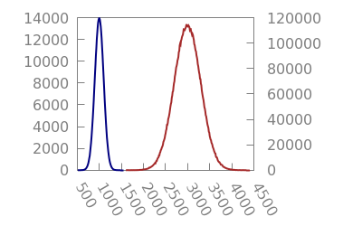
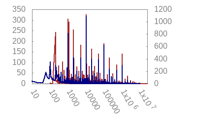

# Self Organisation in Coin Selection
 3 July 2018[ Edsko de Vries](/en/blog/authors/edsko-de-vries/page-1/) 18 mins read

### [**Edsko de Vries**](/en/blog/authors/edsko-de-vries/page-1/)
Software Engineer

Well-Typed

- 
- 
- 

The term "self organisation" refers to the emergence of complex behaviour (typically in biological systems) from simple rules and random fluctuations. In this blog post we will see how we can take advantage of self organisation to design a simple yet effective coin selection algorithm. Coin selection is the process of selecting unspent outputs in a user's wallet to satisfy a particular payment request (for a recap of UTxO style accounting, see section "Background: UTxO-style Accounting" of my [previous blog post](/en/blog/semi-formal-development-the-cardano-wallet/ "Semi-Formal Development: The Cardano Wallet")). As Jameson Lopp points out in his blog post [The Challenges of Optimizing Unspent Output Selection](https://medium.com/@lopp/the-challenges-of-optimizing-unspent-output-selection-a3e5d05d13ef "The Challenges of Optimizing Unspent Output Selection, medium.com"), coin selection is thorny problem. Moreover, there is a surprising lack of academic publications on the topic; indeed, the only scientific study of coin selection appears to be Mark Erhardt's masters thesis [An Evaluation of Coin Selection Strategies](http://murch.one/wp-content/uploads/2016/11/erhardt2016coinselection.pdf "erhardt2016coinselection.pdf, murch.one").

Note: by a slight abuse of nomenclature, throughout this blog post we will refer to a user's set of unspent outputs as that user's UTxO.
## **Dust**
An obvious strategy that many coin selection algorithms use in some form or other is "try to get as close to the requested value as possible". The problem with such an approach is that it tends to create a lot of dust: small unspent outputs that remain unused in the user's wallet because they're not particularly useful. For example, consider the "largest first" algorithm: a simple algorithm which considers all unspent outputs of the wallet in order of size, adding them to a running total until it has covered the requested amount. Here's an animation of the effect of this algorithm:

  

**Figure 1.** Simulation of largest-first coin selection. Main histogram shows UTxO entries; inset graph shows UTxO balance in blue and UTxO size in red, histogram top-right shows number of inputs per transaction, graph bottom right shows the change:payment ratio (more on that below). Graph at the bottom shows the distribution of deposits (blue, left axis) versus payments (red, right axis). In this case, both are normally distributed with a mean of 1000 and 3000 respectively, and we have a deposit:payment ratio of 3:1; modelling a situation where we have frequent smaller deposits, and less frequent but larger payments (withdrawals). The wallet starts with an initial balance of 1M.

There are various things to see in this animation, but for now we want to focus on the UTxO histogram and its size. Note that as time passes, the size of the UTxO increases and increases, up to about 60k entries after about 1M cycles (with 3 deposits and 1 payment per cycle). A wallet with 60k entries is huge, and looking at the UTxO histogram we can see why this happens: virtually all of these entries are dust. We get more and more small outputs, and those small outputs are getting smaller and smaller.
## **Cleaning up**
Erhardt makes the following very astute observation:

If 90% of the UTxO is dust, then if we pick an unspent output randomly, we have a 90% change of picking a dust output. 

He concludes that this means that a coin selection algorithm that simply picks unspent outputs at random might be pretty effective; in particular, effective at collecting dust. Indeed, it is. Consider the following simulation:

  

**Figure 2.** Same distribution and ratio as in Figure 1; we run the largest-first algorithm for 1M cycles, and then random coin selection for another 150k cycles. 

Notice quite how rapidly the random coin selection reduces the size of the UTxO once it kicks in. If you watch the inputs-per-transaction histogram, you can see that when the random input selection takes over, it first creates a bunch of transactions with 10 inputs (we limited transaction size to 10 for this simulation), rapidly collecting dust. Once the dust is gone, the number of inputs shrinks to about 3 or 4, which makes perfect sense given the 3:1 ratio of deposits and withdrawals.

We will restate Erhardt's observation as our first self organisation principle:

**Self organisation principle 1.** Random selection has a high priobability of picking dust outputs precisely when there is a lot of dust in the UTxO. 

It provides a very promising starting point for an effective coin selection algorithm, but there are some improvements we can make.
## **Active UTxO management**
Consider the following simulation of a pure "select randomly until we reach the target value" coin selection algorithm:

  

**Figure 3.** Random-until-value-reached, for a 1:1 ratio of deposits and withdrawals, both drawn from a normal distribution with mean 1000. 

The first observation is that this algorithm is doing much better than the largest-first policy in terms of the size of the UTxO, which is about 2 orders of magnitude smaller: a dramatic improvement. However, if we look at the UTxO histogram, we can see that there is room for improvement: although this algorithm is good at collecting dust, it's also still generating quite a bit of dust. The UTxO histogram has two peaks. The first one is approximately normally distributed around 1000, which are the deposits that are being made. The second one is near 0, which are all the dust outputs that are being created.

This brings us to the topic of active UTxO management. In an ideal case, coin selection algorithms should, over time, create a UTxO that has "useful" outputs; that is, outputs that allow us to process future payments with a minimum number of inputs. We can take advantage of self organisation again:

**Self organisation principle 2.** If for each payment request for value x we create a change output roughly of the same value x, then we will end up with a lot of change outputs in our UTxO of size x precisely when we have a lot of payment requests of size x. 

We will consider some details of how to achieve this in the next section. For now see what the effect of this is on the UTxO:

  

**Figure 4.** Same deposits and withdrawals as in Figure 3, but now using the "pick randomly until we have a change output roughly equal to the payment" algorithm. 

The graph at the bottom right, which we've ignored so far, records the change:payment ratio. A value near zero means a very small change output (i.e., dust); a very high value would be the result of using a huge UTxO entry for a much smaller payment. A value around 1 is perfect, and means that we are generating change outputs of equal value as the payments.

Note that the UTxO now follows precisely the distribution of payment requests, and we're not generating dust anymore. One advantage of this is that because we have no dust, the average number of inputs per transaction can be lower than in the basic algorithm.

Just to illustrate this again, here is the result of the algorithm but now with a 3:1 ratio of deposits and withdrawals:

  

**Figure 5.** Same algorithm as in Figure 4, but now with 3:1 deposits:payments (i.e., many small deposits, fewer but larger payments). 

We have two bumps now: one normally distributed around 1000, corresponding to the the deposits, and one normally distributed around 3000, corresponding to the payment requests that are being made. As before, the median change:payment ratio is a satisfying round 1.0.
## **The "Random-Improve" algorithm**
We are now ready to present the coin selection algorithm we propose. The basic idea is simple: we will randomly pick UTxO entries until we have reached the required value, and then continue randomly picking UTxO entries to try and reach a total value such that the the change value is roughly equal to the payment.

This presents a dilemma though. Suppose we have already covered the minimum value required, and we're trying to improve the change output. We pick an output from the UTxO, and it turns out to be huge. What do we do? One option is to discard it and continue searching, but this would result in coin selection frequently traversing the entire UTxO, resulting in poor performance.

Fortunately, self organisation comes to the rescue again. We can set an upper bound on the size of the change output we still consider acceptable (we will set it to twice the payment value). Then we take advantage of the following property.

**Self organisation principle 3.** Searching the UTxO for additional entries to improve our change output is only useful if the UTxO contains entries that are sufficiently small enough. But precisely when the UTxO contains many small entries, it is less likely that a randomly chosen UTxO entry will push the total above the upper bound we set.

In other words, our answer to "what do we do when we happen to pick a huge UTxO entry?" is "we stop trying to improve our selection". We can now describe the algorithm:

1. Randomly select outputs from the UTxO until the payment value is covered. (In the rare case that this fails because the maximum number of transaction inputs has been exceeded, fall-back on the largest-first algorithm for this step.)
1. Randomly select outputs from the UTxO, considering for each output if that output is an improvement. If it is, add it to the transaction, and keep going. An output is considered an improvement when:
   1. It doesn't exceed the specified upper limit
   1. Adding the new output gets us closer to the ideal change value
   1. It doesn't exceed the maximum number of transaction inputs.

**Figure 6.** The Random-Improve algorithm. Side note for point (2a): we use twice the value of the payment as the upper limit. Side note for point (2b): it might be that without the new output we are slightly below the ideal value, and with the new output we are slightly above; that is fine, as long as the absolute distance decreases.
## **Evaluation**
The algorithm from Figure 6 is deceptively simple. Do the self organisation principles we isolated really mean that order will emerge from chaos? Simulations suggest, yes, it does. We already mentioned how random input selection does a great job at cleaning up dust in Figure 2; what we didn't emphasize in that section is that the algorithm we simulated there is actually our Random-Improve algorithm. Notice how the median change:payment ratio is initially very low (indicative of a coin selection algorithm that is generating a lot of dust outputs), but climbs rapidly back to 1 as soon as Random-Improve kicks in. We already observed that it does indeed do an excellent job at cleaning up the dust, quickly reducing the size of the UTxO. The simulations in Figures 4 and 5 are also the result of the Random-Improve algorithm.

That said, of course the long term effects of a coin selection algorithm can depend strongly on the nature of the distribution of deposits and payments. It is therefore important that we evaluate the algorithm against a number of different distributions.
### **Normal distribution, 10:1 deposit:payment ratio**
We already evaluated "Random-Improve" against normally distributed payments and deposits with a 1:1 ratio and a 3:1 ratio; perhaps more typical for exchange nodes might be even higher ratios. Here is a 10:1 ratio:

  

**Figure 7.** Simulation of largest-first coin selection. Main histogram shows UTxO entries; inset graph shows UTxO balance in blue and UTxO size in red, histogram top-right shows number of inputs per transaction, graph bottom right shows the change:payment ratio (more on that below). Graph at the bottom shows the distribution of deposits (blue, left axis) versus payments (red, right axis). In this case, both are normally distributed with a mean of 1000 and 3000 respectively, and we have a deposit:payment ratio of 3:1; modelling a situation where we have frequent smaller deposits, and less frequent but larger payments (withdrawals). The wallet starts with an initial balance of 1M.

We see a very similar picture as we did in Figure 5. Since the deposits and payments are randomly drawn (from normal distributions), the UTxO balance naturally fluctuates up and down. What is satisfying to see however is that the size of the UTxO tracks the balance rather precisely; this is about as good as we can hope for. Notice also that the change:payment ratio is a nice round 1, and the average number of transaction inputs covers around 10 or 11, which is what we'd expect for a 10:1 ratio of deposits:payments.
### **Exponential distribution, 1:1 deposit:payment ratio**
What if the payments and deposits are not normally distributed? Here is Random-Improve on exponentially distributed inputs:

  

**Figure 8.** Random-Improve, 1:1 deposit:payment ratio, deposits and payments both drawn from an exponential distribution with scale 1000.

In an exponential distribution we have a lot of values near 0; for such values it will be hard to achieve a "good" change output, as we are likely to overshoot the range. Partly due to this reason the algorithm isn't quite achieving a 1.0 change:payment ratio, but at 1.5 it is still generating useful change outputs. Furthermore, we can see that the size of the UTxO tracks the UTxO balance nicely, and the average number of transaction inputs is low, with roughly 53% having just one input.

Moreover, when we increase the deposit:payment ratio to 3:1 and then 10:0, the change:payment ratio drops to about 1.1 and then back to 1.0 (graphs omitted).
### **Erlang**
The exponential distribution results in many very small deposits and payments. The algorithm does better on slightly more realistic distributions such as the Erlang-k distributions (for k > 1). Here we show the animation for the 3:1 deposit:payment ratio using the Erlang-3 distribution; the results for other ratios (including 1:1) and other values of k (we additionally simulated for k = 2 and k = 10) are similar.

  

**Figure 9.** Random-Improve, 3:1 deposit:payment ratio, deposits drawn from an Erlang-3 distribution with scale 1000 and payments drawn from Erlang-3 distributio with scale 3000.
### **More payments than deposits**
We have been focusing on the case where we have more deposits and fewer (but larger) payments. What happens if the ratio is reversed?

  

**Figure 10.** Random-Improve, 1:10 deposit:payment ratio, deposits and payments drawn from a normal distribution with mean 10k and 1k, respectively. 1M cycles.

In this case we are unable to achieve that perfect 1.0 change:payment ratio, but this is expected: when we have large deposits, then we frequently have no choice but to use those, leading to large change outputs. We can see this more clearly when we slow things right down, and remove any source of randomness; here is the same 1:10 ratio again, but now only the first 100 cycles, and all deposits exactly 10k and all payments exactly 1k:

 

**Figure 11.** Random-Improve, 1:10 deposit:payment ratio, all deposits exactly 10k, all payments exactly 1k (no randomness). First 100 cycles only.

We can see the large value being deposited, and then shifting to the left in the histogram as it is getting used for deposits, each time decreasing that large output by 1k. Indeed, this takes 10 slots on average, which makes sense given the 10:1 ratio; moreover, the average value of the "large output" in such a 10-slot cycle is 5k, explaining why we are getting 5.0 change:payment ratio.

The algorithm however is not creating dust outputs; the 1k change outputs it is generating are getting used, and the size of the UTxO is perfectly stable. Indeed, back in Figure 12 we can see that the size of the UTxO tracks the balance perfectly; moreover, the vast majority of transactions only use a single input, which is what we'd expect for a 10:0 deposit:payment ratio.
### **Real data**
#### **MoneyPot.com**
Ideally, of course, we run the simulation against real event streams from existing wallets. Unfortunately, such data is hard to come by. Erhardt was able to find one such dataset, provided by [MoneyPot.com](https://www.moneypot.com/ "MoneyPot.com"). When we run our algorithm on this dataset we get

  

**Figure 12.** Random-Improve, using the MoneyPot data set. There is a rougly 2:1 deposit:payment ratio. Values have been scaled. NOTE: log scale on the x-axis.

A few observations are in order here. First, there are quite a few deposits and payments close to 0, just like in an exponential distribution. Moreover, although we have many values close to 0, we also have some huge outliers; the payments are closely clustered together, but there is a 10xE9 difference between the smallest and largest deposit, and moreover a 10xE5 difference between the largest deposit and the largest payment. It is therefore not surprising that we end up with a relatively large change:payment ratio. Nonetheless, the algorithm is behaving well, with the size of the UTxO tracking the balance nicely, with an average UTxO size of 130 entries. The average number of outputs is 3.03, with 50% of transactions using just one input, and 90% using 6 or fewer.
#### **Cardano Exchange**
One of the large Cardano exchange nodes has also helped us with some anonymised data (deposits and payments), similar in nature to the MoneyPot dataset albeit significantly larger. Coming from an exchange node, however, this dataset is very much skewed towards deposits, with a deposit:payment ratio of roughly 30:1. Under these circumstances, of course, coin selection alone cannot keep the UTxO size small.

  

**Figure 13.** Random-Improve, using data set from a large Cardano exchange. There is a rougly 30:1 deposit:payment ratio. Values have been scaled. NOTE: log scale on the x-axis.
## **Conclusions**
The choice of coin selection algorithm has far reaching consequences on the long term behaviour of a cryptocurrency wallet. To a large extent the coin selection algorithm determines, over time, the shape of the UTxO. Moreover, the performance of the algorithm can be of crucial importance to high-traffic wallets such as exchange nodes.

In his thesis, Erhardt proposes "Branch and Bound" as his preferred coin selection algorithm. Branch and Bound in essence is a limited backtracking algorithm that tries to find an exact match, so that no change output needs to be generated at all. When the backtracking cannot find an exact match within its bounds, the algorithm then falls back on random selection. It does not, however, attempt our "improvement" step, and instead just attempts to reach a minimum but fixed change size, to avoid generating dust. It is hard to compare the two algorithms directly, but on the MoneyPot dataset at least the results are comparable; Erhardt ends up with a slightly smaller average UTxO (109 versus our 130), and a slightly smaller average number of inputs (2.7 versus our 3.0). In principle we could modify our Random-Improve algorithm to start with bounded backtracking to find an exact match, just like Erhardt does; we have not done this however because it adds complexity to the algorithm and reduces performance. Erhardt reports that his algorithm is able to find exact matches in 30% of the time. This is very high, and at least partly explains why his UTxO and average number of change outputs is lower; in the Cardano blockchain, we would not expect that there exist exact matches anywhere near that often (never mind finding them).

Instead our proposed Random-Improve does no search at all, instead purely relying on self organisation principles, the first of which was stated by Erhardt, and the other two we identified as part of this research. Although in the absence of more real data it is hard to evaluate any coin selection algorithm, we have shown that the algorithm performs well across a large variety of different distributions and deposit:payment ratios. Moreover it is straight-forward to implement and has high performance.

One improvement we may wish to consider is that when there are very large deposits, we could occassionally issue a "reorganisation transaction" that splits those large deposits into smaller chunks. This would bring the change:payment ratio down, which would improve the evolution of the UTxO over time and is beneficial also for other, more technical reasons (it reduces the need for what we call "dependent transactions" in the [wallet specification](https://cardanodocs.com/technical/formal-specification-for-a-cardano-wallet/ "Formal specification for a Cardano wallet, cardanodocs.com")). Such reorganisation is largely orthogonal to this algorithm, however, and can be implemented independently.
