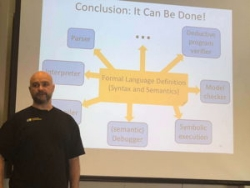

# Cardano in focus at major international event
### **Smart contracts tech wins attention as computer science innovation**
 11 July 2018[ Jeremy Wood](/en/blog/authors/jeremy-wood/page-1/) 5 mins read

### [**Jeremy Wood**](/en/blog/authors/jeremy-wood/page-1/)
Founder

- 
- 
- 

As a third-generation blockchain, Cardano incorporates state of-the-art technology that attracts the interest of computer scientists on the worldwide stage. In the past year, papers describing the consensus algorithm of Cardano have been presented at the leading cryptography conferences, and this month it was the turn of its smart contracts technology to be in the spotlight. [Grigore Rosu](http://fsl.cs.illinois.edu/index.php/Grigore_Rosu "Grigore Rosu, fsl.cs.illinois.edu"), a professor in computer science at the University of Illinois at Urbana-Champaign, and his startup [Runtime Verification](https://runtimeverification.com/ "runtimeverification.com") have been working with IOHK since June 2017 to develop new technology based on formal semantics for Cardano, including a new virtual machine. He and his colleague Everett Hildenbrandt came to the UK last week to give presentations at the seventh Federated Logic Conference ([FLoC](http://www.floc2018.org/ "FLoC")), which this year is in the city of Oxford and runs from July 6-19 with about 2000 attendees. This major conference is held about every four years in various locations around the world, and under its umbrella stages together nine major international computer science conferences. These cover topics such as formal methods, logic and programming languages. Prominent figures from these worlds come to take part and keynote speeches this year are from [Shafi Goldwasser](https://www.csail.mit.edu/person/shafi-goldwasser "people.csail.mit.edu") and [Silvio Micali](https://people.csail.mit.edu/silvio/ "people.csail.mit.edu"), the cryptographers and Turing prize winners, and mathematician George Gonthier.

 

Grigore Rosu

On Saturday, Grigore had the distinction of giving his first FLoC invited talk, at the "Logical Frameworks and Meta-Languages: Theory and Practice" workshop and his talk was about the K framework. It was a technical presentation, going into detail about the logical formalism underlying K, and matching logic, a first-order logic variant for specifying and reasoning about structure by means of patterns and pattern matching.

This technology, developed by Grigore and his start-up Runtime Verification, has been developed over the past 15 years and is used in mission-critical software that cannot afford to fail.  To this end, Runtime Verification has worked with companies including NASA, Boeing and Toyota and many others.  His collaboration with IOHK began after he was contacted by CEO Charles Hoskinson, who had spotted that the software vulnerabilities that had resulted in a number of hacks on blockchains and the draining of hundreds of millions of dollars, could have been prevented using the formal methods techniques developed by Grigore and his team.

The K framework was used to formally model the semantics of the Ethereum Virtual Machine, and the knowledge gained from this process was employed to design IELE, the virtual machine for Cardano that will be released in a test format in a few weeks' time. This is the first time this technology has been deployed within the blockchain industry. Importantly, K is a means to formally verify the code of smart contracts, so they can be automatically checked for the types of flaws that have led to catastrophic financial loss, and must be avoided at all costs.

Grigore said: "We designed IELE from scratch as a formal specification using K and generated the VM automatically from the specification. Therefore, there is nothing to prove about the VM in terms of correctness, because it is correct-by-construction."  He added: "We retrospectively analysed the EVM specification which we defined previously, and looked at all our attempts to verify smart contracts with it and then stepped back to think how should have a virtual machine been designed to overcome all those problems. We came up with IELE. This is an LLVM-like VM for the blockchain. For me as the designer of K, this is a hugely important milestone, and is the first time a real language has been defined in K and its implementation automatically generated."

On Wednesday afternoon, Grigore will give a second invited talk at FLoC, in the International Conference on Formal Structures for Computation and Deduction (FSCD), about the importance of formal analysis and verification for blockchain and virtual machines.  The presentation will be a little less technical than his first talk, and will cover Cardano, and how the tools developed by Runtime Verification allowed the automatic generation of a correct-by-contsruction virtual machine, IELE, from a formal specification.

 

Runtime Verification and IOHK

And on Tuesday at the 31st IEEE Computer Security Foundations Symposium, Everett will present on how he and the team developed KEVM. Everett said: "KEVM is a formal specification of the Ethereum Virtual Machine (EVM) in K, which generates not only a VM but also a symbolic execution engine as well as a deductive program verifier for Ethereum smart contracts. There was a big need for such a complete formal EVM specification, because the previous semantics were either too informal or incomplete. Without a formal semantics of EVM the problem of verifying smart contract is meaningless."

With three talks in total at FLoC in Oxford, it's great to see this technology recognised at such a major international event. Security is of the utmost importance in designing and producing blockchains and we at IOHK put formal methods at the heart of our design approach. K has already been used to formalise C, Java, JavaScript, PHP, Python, Rust, and using these techniques we also plan to make IELE open to developers of many languages, not just Solidity. We will also offer our own languages, Plutus and Marlowe, which are currently in development with computer scientists including Philip Wadler and Simon Thompson. 

Readers who would like to experiment with the [KEVM testnet](/en/blog/first-cardano-testnet-launches-for-smart-contracts/) can do so through our [Cardano testnets website](https://testnet.iohkdev.io/ "Cardano Testnets, testnet.iohkdev.io"). We are set to release the IELE on this same site in just a few weeks from now. Stay tuned for more updates.

Artwork, 

[Mike Beeple](http://www.beeple-crap.com)
