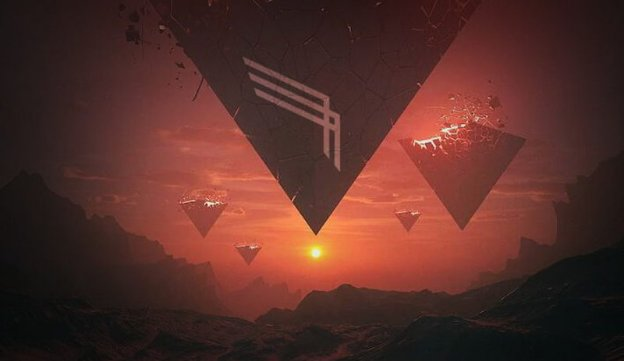
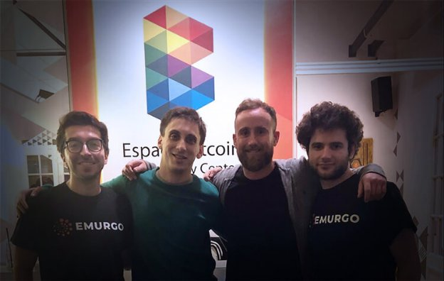

# IOHK releases Icarus to the Cardano community
### **Developers can now build their own light wallets**
 15 August 2018[ Brian McKenna](/en/blog/authors/brian-mckenna/page-1/) 7 mins read

### [**Brian McKenna**](/en/blog/authors/brian-mckenna/page-1/)
Product Manager

Operations

- 
- 
- 

Today IOHK releases Icarus, a reference implementation for a lightweight wallet developed by the IOHK engineering team. We hope that this code base will be used as a point of reference to enable developers to create their own secure light and mobile wallets for Cardano. [Icarus](https://github.com/input-output-hk/project-icarus "Project Icarus, github.com") is a fully open source code base that will be the first step in a range of open source initiatives to provide developers with a suite of tools for Cardano.

Icarus was born out of a series of proof of concepts which began back in March of this year. A small section of the IOHK engineering team were interested to find out if they could demonstrate that it would be possible to create a lightweight Cardano wallet with all the features of [Daedalus](https://daedaluswallet.io/ "Daedalus Wallet, daedaluswallet.io") but that was easy to use and fast to set up. Whilst we are improving Daedalus synchronization speeds all the time, notably in the recent 1.3 release, we wanted to see if we could build something fast for Ada users who might not require the full features of Daedalus, or might not have the bandwidth or machine requirements to easily run Daedalus. 

Therefore, investigating whether it would be possible to build a wallet where the user did not have to download the whole blockchain – and could run in a browser or on a mobile device – was worth the effort of a small dedicated team. 

To build a wallet like this, we would need to prove that we could safely and securely store private keys and execute client-side cryptographic operations in the browser. In tandem, we would need to communicate with the Cardano nodes to provide users with their current UTxO state. If this could be accomplished, it would be no mean feat, hence the name Icarus – from the beginning we knew we would be flying close to the sun.

The team set out in at the beginning of March with ambitious goals to see if, within a month, we could build a skeleton Chrome extension application and verify that Cardano cryptography could be run in the browser using WebAssembly compiled from Rust. The Rust library of Cardano primitives has been developed by Vincent Hanquez and Nicolas Di Prima, IOHK Specialised Cryptographic Engineers, and has already been used for the paper wallet certificate feature in Daedalus. 

To build this Chrome extension, we would need to successfully demonstrate we could import and track a wallet balance. Of course, we would have to do all this without sacrificing the IOHK engineering principles of quality and security. 

The demo at the end of March went well and produced a functional prototype that we could develop. Once each demo had been given, the wider IOHK engineering team had a chance to review, critique and provide feedback about the design decisions the Icarus project team was taking, which proved invaluable to the process. After proof of concept 1, it was felt that good progress was being made and another month’s effort from the team would be worthwhile.

Proof of concept 2 was delivered in mid-April. The Rust engineers had spent the intervening time extending the Rust library to support the Cardano primitives for the creation, signing, and broadcast of transactions, and providing an API so that these could be run in the browser. On the application side, we wanted to see if we could reuse the UX/UI components of Daedalus to provide a smooth user experience. Luckily, the IOHK Daedalus development team has maintained a high-quality, portable UI framework for React, called React-Polymorph, which we found to be easily portable to the Chrome extension.

Proof of concept 3 in late May involved making Icarus fully interoperable with the Daedalus wallet. The team worked to develop a new Hierarchical Deterministic (HD) address scheme that Daedalus will use in future and will ensure ongoing compatibility. One important feature we built at this point was to allow the user to enter their Daedalus wallet recovery phrase in Icarus, and for their Ada in Daedalus to be transferred to the Icarus wallet. In effect, this allows users to retrieve their Ada without using the Daedalus wallet. We also optimised wallet restoration times. Finally, after only three months and three demo’s we had a fully functional prototype lightweight Cardano wallet!

Before we could ensure this was a reference implementation we could release to the community, we wanted to ensure that it performed at scale. This, along with some code clean-up, was the main task of the final proof of concept 4 in early June. We called upon the experience of Philipp Kant, in IOHK benchmarking, and Neil Davies, leading networking, and successfully conducted a series of rigorous stress and failover tests on the architecture. 

The code base has been quality assured by Allied Testing, a leading quality assurance and testing company. We also engaged Kudelski Security, a cybersecurity consultancy, to perform a full security audit of the code – their report will be published soon.

 

L-R: Nicolás Arqueros, Alan Verbner, Brian McKenna, Sebastien Guillemot

We knew that Emurgo, the organisation that supports new Cardano ventures, was interested in releasing the first implementation of Icarus to the community. To that end, we invited two Emurgo staff – Nicolás Arqueros, chief technology officer, and Sebastien Guillemot, technical manager – to Buenos Aires to meet lead Icarus developer Alan Verbner and his team in July. The goal of this trip was to see if the code could be understood and deployed by open source community members. Emurgo provided feedback on how we could make the reference implementation ready to release as a product and they wrote a technical specification for the code base. We are excited that 

Emurgo

will soon be launching their implementation of Icarus, the Yoroi wallet, and look forward to seeing how they carry through their vision for the product.

In mid-July, Hayley McCool Smith, IOHK Product Marketing Manager, visited Emurgo at their offices in Tokyo. One of the purposes of the trip was to take part in a naming workshop which would help Emurgo bring their product to life. After spending a day working through a plethora of contenders that Emurgo had shortlisted, it was decided that “Yoroi” was the perfect fit. In Japanese, Yoroi means “great armour” and is a prominent example of the type of secure armament that Samurais would wear to protect themselves. With the name decided, it was up to the team to create a logo that would reflect a new lightweight wallet, while also incorporating the traditional Samurai meaning of the word.

 

Emurgo team in Tokyo

The Rust library that was used to bring the Cardano cryptography into the browser has spawned another IOHK project, the Cardano Rust project. (This has been known as Project Prometheus internally.) IOHK will be releasing more information on this in due course. The Cardano Rust project will maintain the open source spirit of Icarus and further extend the toolbox of Rust modules. The project will be made available to the open source community to easily build high-quality applications using Cardano. The first product of the project will be a full command line interface wallet, which you can expect to see in September.

The segmented development team and rapid iteration approach to software development has worked well on Project Icarus and we will be employing this strategy again. We are happy that Ada holders will have the ability to store their Ada in the really cool Yoroi wallet and that developers have a high-quality reference implementation on which to base their own new light and mobile wallets for Cardano. The project has also given rise to Project Prometheus which is the natural evolution of the spirit of Icarus.

We feel that we have developed, in quite a short time, a very useful quality assured and security audited reference implementation for a lightweight Cardano wallet. We encourage the open source community to fork the Icarus code base, compile it, and maybe even build your own wallet for Cardano. We welcome contributions and hope that this effort will benefit the entire community.

*This blog has been amended to update the name of the Cardano Rust project from Project Prometheus.*

Artwork, 

Mike Beeple
