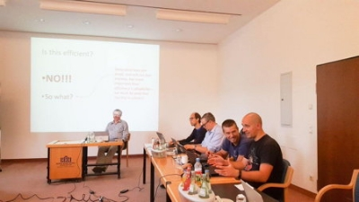

# Functional correctness with the Haskell masters
### **Training to build quality code on scientific excellence**
 26 September 2018[ Lars Brünjes](/en/blog/authors/lars-brunjes/page-1/) 6 mins read

### [**Lars Brünjes**](/en/blog/authors/lars-brunjes/page-1/)
Education Director

Education

- 
- 
- 
- 

At IOHK, we are proud of our scientific approach and close collaboration with academia. We publish in peer reviewed scientific journals and present our results at acclaimed international conferences to ensure that our protocols and algorithms are built on rock-solid foundations. Our software must reflect this scientific excellence and quality, which means that we need a process to go from scientific results to actual code written in the Haskell programming language. We therefore decided to run internal training on “functional correctness”, so that the quality of our theoretical foundations can translate into equal quality for our code. We ran the first course over four days in Regensburg, Germany, two weeks ago. This training is aimed at everybody writing Haskell at IOHK, so we decided to run four sessions, roughly based on geography – there are IOHK engineers in 16 countries. We plan to do a second session in Regensburg in November and then two more early next year in the US. The lecturers were Andres Löh, co-founder of the Well-Typed consultancy, and John Hughes, the founder of [QuviQ](http://www.quviq.com/ "quiq.com"), who are both prominent in the Haskell world.

John is one of the creators of Haskell and the co-inventor of [QuickCheck](http://hackage.haskell.org/package/QuickCheck "hackage.haskell.org/package/QuickCheck"), the Haskell testing tool. Most mainstream software companies (if they do testing at all, which, sadly, is not always the case), use unit tests. For this, developers write down a number of tests by hand, cases that they deem typical or relevant or interesting, and then use a unit test framework to run the tests and report whether they yield the expected results. QuickCheck is different. Instead of specifying a handful of tests, developers using QuickCheck state the properties that their code should have. QuickCheck then generates many random test cases and checks the property for each of these. If QuickCheck finds that a property is violated, it first tries to simplify the test, then reports the simplest failing case back to the user.

 

Haskell students in class

As a simple example, let’s say you wrote a program to sort a list of names. Using unit tests, you would check the program against a few handcrafted examples of lists of names (something like "Tom", "Dick", "Harry" and "Dora", "Caesar", "Berta", "Anton" ). With QuickCheck, on the other hand, you would sit down and carefully think about properties your program should have In the example of sorting lists of names, what properties would you expect? Well, after running the program, you should get a list that is sorted alphabetically. Oh, and that list should contain all the names you entered. And yes, it should only contain those names you entered. You can write down these properties as Haskell programs, then hand them over to QuickCheck. The tool checks your properties against as many randomly generated lists of names as you wish (usually hundreds or thousands) and identifies any violations.

In practice, QuickCheck often manages to find problems that are overlooked by less rigorous methods, because their authors tend to overlook obscure cases and complicated scenarios. In our example, they may, for example, forget to test an empty list of names. Or there may be a bug in the program that only occurs for long lists of names, and their unit tests only check short lists. John had many ‘war stories’ of this happening in real life with real customers, where bugs were only revealed after a series of complex interleaved operations that no human unit test writer would have imagined. 

Every Haskell developer has heard of QuickCheck and understands the basic ideas, but in complex real-world programs like Cardano, it is sometimes not so easy to use the tool properly. It was therefore great to have the intricacies and finer points explained by John himself, who has been using QuickCheck for 20 years and has worked with many industries, including web services (Riak, Dropbox and LevelDB), chat servers (Ejabberd), online purchasing (Dets), automotive (Autosar specification), and telecommunications (MediaProxy, Ericsson and Motorola). He helps find bugs and guarantee correctness every day. Given John’s experience, the training participants were able to spend about half of their time learning the finer points of QuickCheck from the master himself. It was tremendous fun enjoying John’s obvious enthusiasm for, and deep knowledge of, the subject. The rest of the session was dedicated to understanding the link between formal specifications, written in a mathematical style, and Haskell implementations.

 

IOHK in Regensburg

At IOHK, we work very hard on writing correct code. For example, we specify program behavior and properties using rigorous mathematics. In the end, of course, we can’t deploy mathematics to a computer. Instead, our developers have to take the specification, translate the mathematics into Haskell and produce executable, efficient code. This process is easier for Haskell, because it is firmly rooted in mathematical principles, than for most languages, but it is still a conceptual leap. The specification talks about mathematical objects like sets and relations, which have to be translated into data types and functions as faithfully as possible. Nobody wins if your beautiful mathematics is ‘lost in translation’ and you end up with bug-ridden code. For example, when mathematicians talk about integers (..., −2, −1, 0, 1, 2,...) or real numbers (such as π, and √2), how do you express this in Haskell? There are data types like Int or Double that seem related, but they are not the same as the mathematical concepts they were inspired by. For example, a computer Int can overflow, and a Double can have rounding errors. It is important to understand such limitations when translating from mathematics to code. This is where the mathematician and renowned Haskell expert Andres Löh came in. He taught the participants how to read mathematical notation, how mathematical concepts relate to Haskell and how to translate from the one to the other.

For example, Andres presented the first pages of our formal blockchain specification and talked the participants through understanding and implementing this piece of mathematics as simple (and correct!) Haskell code, which led to interesting questions and lively discussions: How do you represent hashing and other cryptographic primitives? What level of detail do you need? Is it more important to stay as faithful to the mathematics as possible or to write efficient code? When should you sacrifice mathematical precision for simplicity? 

In addition to their great lectures, John and Andres also provided challenging practical exercises, where participants could immediately apply their newly-gained knowledge about testing and specifications. Finally, there was plenty of opportunity for discussions, questions and socializing. Regensburg is a beautiful town, founded by the Romans two thousand years ago and a Unesco World Heritage Site. The city offered participants a perfect setting to relax after the training, continuing their discussions while exploring the medieval architecture or sitting down for some excellent Bavarian food and beer.

Artwork, 

[Mike Beeple](http://www.beeple-crap.com)
