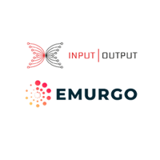

# An Open Letter to the Cardano Community from IOHK and Emurgo
### **A joint statement from Charles Hoskinson and Ken Kodama**
 12 October 2018[ IOHK and Emurgo](/en/blog/authors/iohk-emurgo/page-1/) 14 mins read

### [**IOHK and Emurgo**](/en/blog/authors/iohk-emurgo/page-1/)
To the Cardano Community, Cardano is an amazingly diverse and vibrant project that is rightfully being recognised throughout the world. Our community contains tens of thousands of engaged and passionate volunteers, advocates, contributors and fans in countries ranging from Argentina to Zimbabwe. This growth is due to our commitment to innovation, transparency, balance of power and embracing the scientific community. To IOHK and Emurgo, [Cardano](https://github.com/input-output-hk/cardano-sl "Cardano SL, github.com") is so much more than a product we work on. Cardano is a mission to deliver a financial operating system to the three billion people who do not have one.

As with all movements, occasionally issues occur that require careful and rational discussion. When the Cardano movement began in 2015, instead of launching an all-powerful foundation that would raise funds, manage development, encourage adoption and address the concerns of the community, we diligently split the governance of Cardano into three legal entities: [IOHK](https://iohk.io "iohk.io"), [Emurgo](https://emurgo.io "emurgo.io") and the [Cardano Foundation](https://cardanofoundation.org "cardanofoundation.org"). This separation of powers was to ensure that the failure of one legal entity, if any, could not jeopardise or destroy the [Cardano project](https://cardanoroadmap.com "Cardano Roadmap").
### **IOHK and Emurgo**
IOHK’s primary responsibility was and continues to be, developing the core collection of protocols that compose [Cardano](https://cardano.org "cardano.org"), from academic inception to applying formal methods to verify correct implementation. This task is enormous in scope and has led to the creation of three research centers, many peer reviewed papers, engagement with half a dozen development firms and one of the most active cryptocurrency GitHub repositories.

As a company that accepts its critical role in this effort, IOHK has attempted to be as transparent and focused as possible. That acceptance is why we launched the Cardano Roadmap website, produce many videos on our [IOHK YouTube channel](https://www.youtube.com/channel/UCBJ0p9aCW-W82TwNM-z3V2w "IOHK, youtube.com"), publish a weekly technical report, have dedicated project managers who produce videos on progress, hold special events and have AMA (Ask Me Anything) sessions.

Emurgo has been responsible for building partnerships with developers and instigating projects for the Cardano protocol around the world. Emurgo has grown from a small entity of just a few employees to a multinational effort with an ever-increasing investment portfolio.

Emurgo has been collaborating with IOHK on products such as the [Yoroi wallet](https://yoroiwallet.com/ "yoroiwallet.com"), improving the developer experience for smart contracts and DApps, and holding discussions on high-value markets to drive adoption, as well as other efforts within its mandate. These collaborations will continue to grow and become even more meaningful as we move into 2019, with Cardano achieving decentralization, multi-asset accounting and full smart contract support.

This acceptance of its role is also why IOHK has retained firms such as [Quviq](/en/blog/functional-correctness-with-the-haskell-masters/ "Functional Correctness with the Haskell Masters"), [Tweag](https://www.tweag.io/ "tweag.io") and [Runtime Verification](https://paymentweek.com/2018-7-30-iohk-launches-iele-virtual-machine-testnet-cardano-blockchain/ "VM Testnet, paymentweek.com") to help build Cardano, refine processes and speed up development. Our collective development efforts have resulted in three codebases (Scala, Haskell and Rust), some of the first examples of applied formal methods with our new wallet backend and incredibly sophisticated techniques for modeling performance and reliability with deployed distributed systems.

Finally, our protocols are based on scientific inquiry. Such work should be done by scientists who have the requisite domain experience and wisdom. Thus we have directly engaged leaders in their respective fields with years to decades of experience to write our foundational papers. We have also vetted these papers through the peer review process accepted by the computer science community.

Like every other project, IOHK’s efforts aren’t without their flaws and setbacks. The initial release of Cardano wasn’t perfect. There were many issues ranging from some users having difficulty connecting to peers, to exchanges having trouble with the Cardano wallet. These teething problems are expected to be solved with all new codebases. However, the most important observation is that IOHK has never accepted any status quo and continues to work diligently to improve the code, the user’s experience and broaden the utility of Cardano.

Like IOHK, Emurgo has had its own challenges. Navigating 2017 – during a period of utterly irrational valuations, ICO mania, many poorly led ventures as well as continued regulatory uncertainty – was difficult. As with all ventures, staffing a great executive team is also a tremendous task. But as 2018 comes to a close, Emurgo has retained some [great talent](https://emurgo.io/about/ "emurgo.io") such as their CTO Nicolas Arqueros, chief investment officer Manmeet Singh, and one of our community’s best educators, Sebastien Guillemot. Emurgo’s collaborations with IOHK have been both meaningful and productive.
### **Cardano Foundation**
The Cardano Foundation was created to promote the Cardano protocol, to grow and inform our community and address the needs of the community. These are broad aims and cross demographics and borders.

Being more specific about the needs of the Cardano community, all cryptocurrency communities need accurate, timely and comprehensive information about events, technology and progress of the ecosystem. All cryptocurrency communities need stable and moderated forums to discuss their ideas, concerns and projects. All cryptocurrency communities need liquidity and thus require access to exchanges.

The Cardano protocol also requires community-led efforts to gradually decentralize the protocol beyond what Bitcoin and Ethereum have achieved. A core focus outlined in the [Why Cardano](https://whycardano.com "whycardano.com") white paper is the desire to establish a treasury and a blockchain-based voting system for ratifying Cardano improvement proposals.

This effort cannot just rely on technological and scientific innovation. Rather, it requires a well-organized and informed community that is representative of the users of Cardano and is geographically diverse. Among other things, it is the Foundation’s responsibility to invest in the creation of this community.
### **Lack of performance by the Cardano Foundation**
For more than two years there has been great frustration in the Cardano community and ecosystem. This has been caused by a lack of activity and progress on the assigned responsibilities of the Cardano Foundation and its council. Furthermore, there has been no clear indication of improvement, despite many fruitless attempts and approaches to the Foundation’s chairman and council to change this.

Dissatisfaction and frustrations about the Foundation’s performance stem primarily from:

1. A lack of strategic vision from the council. There are no KPIs or public strategy documents outlining how the Foundation will accomplish the above goals or any discernible goal. 

1. The absence of a clear public plan for how the Foundation will spend its funds to benefit the community. 

1. The lack of transparency in the Foundation’s operations (for example publication of its board minutes and director remuneration). 

1. Material misrepresentations and wrongful statements by the Foundation’s council including a claim that it owned the trademark in Cardano. The council has even tried to assume the power to decide who speaks for the protocol, what should be deployed on the protocol and how the press should represent relationships between Emurgo, IOHK, the Foundation and third party projects. 

   Having identified the legal dubiousness and profound consequences of the Foundation’s claims in respect of trademark ownership, IOHK ceased collaboration with the Foundation until it published a fair use policy for the trademark. This process took weeks. 

   The unpredictable conduct and lack of action by the board of the Foundation has been puzzling. For example, when IOHK went to Ethiopia to [sign an MOU with the Ministry of Science and Technology](https://bitcoinmagazine.com/articles/where-coffee-just-grows-connecting-ethiopian-agritech-blockchain/), the Foundation originally agreed to attend and jointly sign. Unexpectedly, the Foundation decided to back out the week before and claimed in an email to IOHK’s communications director that it – without any basis or underlying agreement – was to be the single guardian of the Cardano brand and protocols. 

   [Read the email from the Foundation to IOHK here](https://ucarecdn.com/8cdaa61b-6725-4fd7-b135-134dd1263a6d/-/inline/yes/). 

1. Lack of financial transparency. As of October, despite several requests the Foundation has still refused to publish the addresses holding its allocation of Ada. Neither has the Foundation published audited financial statements. And, the Foundation has not provided any information on remuneration of directors and officers. 

1. The lack of a complete and diverse Foundation council. At its incorporation (September 2016) the council consisted of 4 members, with Michael Parsons as chairman. Ten days after his appointment, a council member (Mr Parsons’ stepson, Bruce Milligan) resigned. Instead, Mr Milligan became the general manager of the Foundation. His vacancy on the council, however, was never filled. Ten months after the Foundation’s incorporation, the third council member resigned, thus reducing the council from the 4 members as intended by its founders to only 2 (Mr Parsons and a professional Swiss council representative). 

   The vacancies have not been filled by the remaining council members. As a consequence, since 14 July, 2017, the Foundation has, in effect, been controlled by Mr Parsons. He has been acting as the Foundation’s de facto sole decision-maker in respect of the day-to-day business of the Foundation and ruling its staff like a monarch. For more than 15 months, there appear to have been no reasonable attempts to fill the 2 council vacancies. There appears to be no oversight and there appear to be no checks and balances beyond those required by Swiss law. 

   A sound council board in the opinion of the ecosystem should consist of several active and competent and independent members. These should be domain experts from the cryptocurrency community who fairly represent the holders of Ada and users of the Cardano protocol. They should be committed to maintaining reasonable checks and balances. Although not imposed under Swiss law, the council appointment process should ideally be open to the community and include their feedback and suggestions. 

   Despite over 90 percent of the original Ada voucher purchasers residing in Japan, the Cardano Foundation has yet to appoint anyone from Japan into a position of power. Also, the Foundation has yet to engage a lobbyist to assist with getting Ada listed on Japanese exchanges. And, the Foundation has no significant presence or personnel from Japan or even Asia. 

1. Lack of any concept of how the millions of dollars committed to the Foundation will benefit the Cardano community. Instead of working on meaningful projects such as law and policy research for ICO and STO standards for assets that will be issued on Cardano, thereby offering an alternative to Ethereum’s tokens, or studying ways to deploy Cardano’s improvement proposal process, the Foundation’s council has decided to invest its provided research capital in the [Distributed Futures](https://cardanofoundation.org/en/distributed-futures/) program. 

   No explicit case has been made as to how the Distributed Futures research will benefit the Cardano protocol or the ecosystem. No funds have been committed to commercialize the research. No apparent effort has been made by council members of the Foundation to annotate the Distributed Futures reports with specifics on how the findings will be applied to our community. 

   Furthermore, members of the ecosystem worry about potential conflicts of interest because both Robert McDowall, an adviser and contributor to Distributed Futures research, and Michael Mainelli, leader of Distributed Futures, have pre-existing relationships with Mr Parsons. Indeed, we are not aware of any process within the Cardano Foundation to analyze potential conflicts of interest and require recusal where necessary. 

1. Absence/unawareness of any meaningful internal governance system at the Cardano Foundation. In our many interactions with Foundation staff, it has never become clear how decisions are made and reviewed. It has also never been clear how the chain of command operates beyond Chairman Parsons. 
### **Our call for action**
Emurgo and IOHK are calling for the Foundation council: to voluntarily subject itself to the Swiss authorities; for a complete audit of all of the Foundation's financial transactions and major decisions to be conducted; and for the results to be released to the general public. This audit should include direct and indirect remuneration paid (in the light of actual and agreed performance or services delivered for the benefit of the Foundation) to Mr Parsons; his stepson Bruce Milligan who acted as a general manager; and his wife, Julie Milligan, who acted as an assistant to Mr Parsons.

The Cardano Foundation is an independent legal entity governed by its council, thus the Cardano community, IOHK and Emurgo cannot force the chairman to resign. Nevertheless, we can only hope that reason will persuade Mr Parsons to voluntarily step down. This would allow for regulatory oversight and avoid the Foundation continuing to be an ineffective entity.
### **Offer of IOHK & Emurgo**
The Foundation and its council have not been able to execute their purpose in promoting and supporting the Cardano ecosystem. So, to provide the Cardano ecosystem with the support and services it requires and deserves, in the Foundation’s stead, IOHK and Emurgo are committed to the following actions until at least 2020:

1. IOHK and Emurgo will begin hiring dedicated community managers for the Cardano ecosystem and assign them to growing and informing our community through meetup groups, events, educational efforts and other metrics that can be tracked.
1. IOHK is willing to hire, subject to reasonable due diligence and negotiations, Cardano Foundation personnel directly engaged in community management should they desire to leave the Foundation.
1. IOHK will work with Emurgo to start efforts in Japan to improve exchange access and community understanding of Cardano.
1. IOHK and Emurgo will scale up its educational and marketing efforts to include more content about the Cardano protocols, developer resources and USPs of our ecosystem.
1. IOHK has hired an open source community manager to draft the Cardano improvement proposal process and begin its rollout.
1. IOHK has expanded its research scope to include the areas originally forseen for the Cardano Foundation.
1. IOHK will start a research agenda to design a decentralized Foundation built as a DAO to be deployed on the Cardano computation layer. We will announce a dedicated research center at a later date.
### **Final thoughts**
First, IOHK and Emurgo’s funding for the Cardano project is fully secured, independent, and not connected to the Cardano Foundation. The Foundation is not in a position to mandate or compel changes in the operations of the Cardano platform, IOHK, or Emurgo.

Second, the original intention of separating powers within the Cardano ecosystem was to ensure that the failure of one entity would not destroy the project. This resilience has allowed us to thrive, despite the Foundation’s lack of progress and vision.

Third, the real strength of Cardano stems from its exceptional community, which continues to grow and impress us. The Foundation’s role is similar to the Bitcoin Foundation’s, in that its purpose is to add value to the community. Like the Bitcoin Foundation for Bitcoin, the Cardano Foundation is not necessary for Cardano to succeed as a project.

And last, but not least, for IOHK, Cardano is more than a product. Cardano is a mission to deliver a financial operating system to the three billion people who need a new one. Our personnel have been to more than 50 countries over the past three years representing Cardano. We will continue to do so over the coming years because we see the power of this technology and the people it can help.

As the CEOs of IOHK and Emurgo, we are deeply disappointed that we have not been able to activate and increase the performance of the Foundation. We have not been able to resolve the above outstanding matters in another way. We are also deeply disappointed that our community has been repeatedly let down by the Foundation, yet we are determined to ensure that the community will be served in the manner it deserves to be served.

Regardless of the above, we believe our best days are ahead of us. We believe Cardano will become the best technology to deliver financial infrastructure to the billions who lack it.

Charles Hoskinson,
Chief Executive Officer,
Input Output HK Ltd. 

Ken Kodama,
Chief Executive Officer,
Emurgo 

*This article has been corrected to reflect the fact that Bruce Milligan is Michael Parson’s stepson, rather than son-in-law, as previously stated.*

Artwork, [Mike Beeple](http://www.beeple-crap.com)
