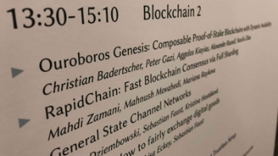

# Ouroboros Genesis presented at flagship conference
### **IOHK research on proof of stake appears at CCS in Toronto**
 18 October 2018[ Jane Wild](/en/blog/authors/jane-wild/page-1/) 4 mins read

### [**Jane Wild**](/en/blog/authors/jane-wild/page-1/)
Content Director

- 
- 

A third major paper from the Ouroboros line of research was presented at a leading computer security and cryptography event yesterday, a recognition of the contribution the work makes to the field of computer science. The paper, [Ouroboros Genesis](https://eprint.iacr.org/2018/378.pdf "Ouroboros Genesis, eprint.iacr.org"), was presented by researcher Christian Badertscher at the 25th [ACM Conference](https://www.sigsac.org/ccs/CCS2018/ "sigsac.org") on Computer and Communications Security, held in Toronto this week. The conference is five days of presentations, workshops and tutorials for hundreds of delegates, who are information security researchers, industry professionals, and developers from around the world. The annual event, organised by the Special Interest Group on Security, Audit and Control (SIGSAC) of the Association for Computing Machinery (ACM), is a forum for delegates to come together for discussions and to explore cutting edge research. 

This year CCS sponsors included the US government agency, the National Science Foundation, and major global technology companies such as Baidu, Cisco, Samsung, Google, Facebook. The hardware wallet maker, Ledger, was also present. CCS is the highest rated computer security and cryptography conference according to Google Scholar ratings, meaning that collectively, the papers selected to appear at the conference are more cited by academics than papers for any other conference.

IOHK’s paper appeared in one of the two sessions that were dedicated to blockchain, with a total of six papers on the subject overall. These included a [paper](https://arxiv.org/abs/1805.05288 "The Gap Game, arxiv.org") on what will happen with blockchains such as Bitcoin as rewards get smaller and the potential problems that stem from that. Scalability was in focus too, with a [paper](https://eprint.iacr.org/2018/460.pdf "RapidChain: Scaling Blockchain via Full Sharding, eprint.iacr.org") on scaling blockchains through sharding and another on [state channel](https://eprint.iacr.org/2018/320 "General State Channel Networks, eprint.iacr.org") networks.

 

Ouroboros Genesis Presentation

Since Bitcoin demonstrated the disadvantages of using an energy-intensive proof-of-work protocol to run a public distributed ledger, many researchers have turned to explore proof of stake. The Ouroboros research is an attempt to systematically surmount the challenges that proof of stake poses and describe a secure, efficient and sustainable protocol for blockchains. This effort has been led by Professor Aggelos Kiayias, IOHK Chief Scientist and Chair in Cybersecurity and Privacy at the University of Edinburgh’s School of Informatics. In the space of only a couple of years, the team have made significant advances. Ouroboros was the first peer reviewed, provably secure proof-of-stake protocol, and it is already running in the real world, underpinning Cardano, a top 10 global cryptocurrency. [Ouroboros Genesis](https://www.youtube.com/watch?v=LCeK\_4o-NCc "Ouroboros Genesis: A Provably Secure Proof-of-Stake Blockchain Protocol, youtube.com") is the third paper in the Ouroboros family of proof-of-stake protocols, and the third paper from this important line of IOHK research to be heard at a flagship international computer science conference. The first paper, Ouroboros, was presented at [Crypto 2017](/blog/proof-of-stake-protocol-ouroboros-at-crypto-17/ "Proof-of-stake protocol, Ouroboros, at Crypto 17, iohk.io") in California, and the second, Ouroboros Praos, was at [Eurocrypt 2018](/blog/ouroboros-praos-presented-at-leading-cryptography-conference/ "Ouroboros Praos presented at leading cryptography conference, Eurocrypt, iohk.io") in Tel Aviv. Further papers are to come from the research team, including on sharding, a means to provide scalability for Cardano. 

Using Ouroboros Genesis, new users joining the blockchain will be able to do so securely based only on an authentic copy of the genesis block, without the need to rely on a checkpoint provided by a trusted party. Though common in proof-of-work protocols like Bitcoin, this feature was previously unavailable in existing proof-of-stake systems. This means that Ouroboros can now match the security guarantees of proof-of-work protocols like Bitcoin in a way that was previously widely believed to be impossible.

 

Christian Badertscher (left) with Charles Hoskinson (right)

Aggelos said: “Ouroboros Genesis resolves an important open question in the PoS blockchain space, namely how it is possible to securely connect to the system without any information beyond the genesis block. This is a significant step forward that enables a higher degree of decentralization that seemed unattainable for PoS protocols before our work. 

“Our security analysis is also in the "universal composition" setting that provides, for the first time in the PoS space, a modular way of building secure applications on top of the ledger.”

Christian said: “It is exciting to present Ouroboros Genesis at a top security conference and very rewarding to see how theoretical research can make a significant impact on practice. Avoiding the need of a trusted checkpoint, and still being secure in a setting with a variable level of participation, has been a challenging problem to solve in the PoS space.”

Published on May 3 this year, the paper’s full title is Ouroboros Genesis: Composable Proof-of-Stake Blockchains with Dynamic Availability. The research team was comprised of Christian Badertscher, Peter Gaži, Aggelos Kiayias, Alexander Russell, and Vassilis Zikas.
