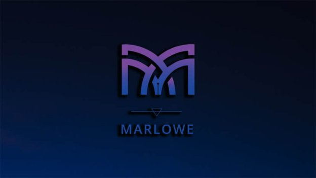

# Marlowe: financial contracts on blockchain
 11 December 2018[ Prof Simon Thompson](/en/blog/authors/simon-thompson/page-1/) 4 mins read

### [**Prof Simon Thompson**](/en/blog/authors/simon-thompson/page-1/)
Technical Project Director

Research

- 
- 

The first computers were programmed in “machine code”. Each kind of system had a different code, and these codes were low-level and inexpressive: programs were long sequences of very simple instructions, incompressible to anyone who had not written them. Nowadays we are able to use higher-level languages like C, Java and Haskell to program systems. The same languages can be used on widely different machines, and the programs’ structures reflects what they do; on blockchain, their equivalents are languages like Solidity and Simplicity. These modern higher-level languages are general purpose – they can be used to solve all sorts of different problems – but the solutions they express are still programs, and they still require programming skills to use them effectively. In contrast, Marlowe is a domain-specific language (DSL) which is designed to be usable by someone who is expert in a particular field: in the case of [Marlowe](https://github.com/input-output-hk/marlowe "Marlowe, github.com"), financial contracts, rather than requiring programming skills to use it.

Using a DSL has many advantages beyond its use by non-programmers:

- We can ensure that certain sorts of bad programs cannot even be written by designing those possibilities out of the language, and by doing this we can aim to avoid some of the unanticipated exploits which have been a problem for existing blockchains.
- We can also more easily check that programs have the properties that we want: for example, in the case of a financial contract we might want to make sure that the contract can never fail to make a payment that it should.
- Because it is a DSL, we can build special-purpose tools to help people write programs in the language. In the case of Marlowe we can emulate how a contract will behave before it is run for real on the system; this helps us to make sure that the contract we have written is doing what it is intended to.

Marlowe is modelled on financial contract DSLs popularised in the last decade or so by academics and enterprises such as LexiFi, which provides contract software in the financial sector. In developing Marlowe we have adapted these languages to work on blockchain. Marlowe is implemented on the settlement layer (SL) of the Cardano blockchain, but could equally well be implemented on Ethereum/Solidity or other blockchain platforms; in this respect it is “platform agnostic” just like modern programming languages like Java and C++. The Meadow online emulator tool allows you to experiment with, develop and interact with Marlowe contracts in your web browser, without having to install any software for yourself.

What does a Marlowe contract look like? It is built by combining a small number of building blocks that describe making a payment, making an observation of something in the “real world”, waiting until a certain condition becomes true, and so on. Where we differ from earlier approaches is in how we make sure that the contract is followed. This means not only that the instructions of the contract are not disobeyed, but also that the participants don’t walk away early, leaving money locked up in the contract forever. We do this using two tools, commitments and timeouts: a commitment requires a participant to “put their money on the table”, and through timeouts we make sure that this commitment happens in a timely manner or remedial action is taken. Putting these constructs together we are able to incentivise participants to continue with the contract once they have committed to it.

We’re working on a full release of Marlowe for mid-2019, when it will be available on Cardano SL. From today, you're able to explore Marlowe for yourself using [Meadow](https://input-output-hk.github.io/marlowe/ "Meadow: online emulation and visualisation of Marlowe contracts, input-output-hk.github.io"), and find out much more detail from our [online paper](/en/research/papers/#2WHKDRA8 "Research paper on Marlowe: Financial contracts on blockchain, iohk.io"). In the next six months we’ll be polishing the language design itself and developing a set of templates for popular financial instruments, as well as using formal logic tools to prove properties of Marlowe contracts, giving users the highest level of assurance that their contracts behave as intended.
