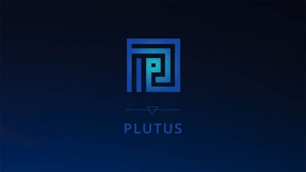

# Smart contracts language for Cardano launches at PlutusFest
### **Plutus Platform is developed by a world-leading team**
 11 December 2018[ Prof Philip Wadler](/en/blog/authors/philip-wadler/page-1/) 4 mins read

### [**Prof Philip Wadler**](/en/blog/authors/philip-wadler/page-1/)
Senior Research Fellow

Academic Research

- 
- 
- 

Today IOHK releases Plutus Platform, a smart contracts language for the Cardano blockchain. You can try out Plutus online, with no need to download or install anything, via [Plutus Playground](https://prod.playground.plutus.iohkdev.io/ "Plutus Playground, iohkdev.io"). Plutus Platform is open source. You can find code, documentation, and sources [here](https://github.com/input-output-hk/plutus "Plutus, github.com"). IOHK is unique among cryptocurrency companies for its insistence on basing its development on peer-reviewed research, and is one of the few to support rapid and reliable development by using the functional language Haskell. Plutus Platform builds upon these strengths. It has been developed by a crack team of researchers and developers, led by Manuel Chakravarty – language architect at IOHK and who is well known to the Haskell community – and myself.

At the core of Plutus Platform is an intriguing research idea, cleverly spotted by Manuel. One tends to think of programming smart contracts in a single language, e.g., Solidity for Ethereum. For example, a standard example is a crowdfunding contract. The one [here](https://github.com/zupzup/solidity-example-crowdfunding "Solidity Example Crowdfunding, github.com") consists of 81 lines of Solidity, to run on-chain. But it also contains 149 lines of Javascript, to run off-chain.

 

Programming a crowdfunder with Solidity and Javascript for Ethereum

Off-chain code provides a user interface to invoke the on-chain code. Further, because on-chain code is expensive, one wants to move as much computation off-chain as possible. The on-chain code should do the minimum required to guarantee secure functionality.

This distinction is one we’ve seen before. Web applications also run in two locations, on the server and on the client. The client provides a user interface to invoke code on the server. Further, because code on the server is expensive, one wants to move as much computation off the server as possible. The server should do the minimum required to guarantee secure functionality. The Links system, developed by me and my colleagues, was one of the first to address this problem. It allows developers to write a single source, from which is generated both code for the server (including SQL) and code for the client (in Javascript). A slew of similar systems followed.

Plutus Platform is designed similarly. It allows developers to write a single source, in Haskell, from which is generated both on-chain and off-chain code. An example appears in the diagram below. The on-chain code is written in Template Haskell, inside brackets [|| and ||], and is referred to as PlutusTx.

 

Programming a crowdfuncter with Plutus Platform for Cardano

Manuel’s observation opens a new and promising field of research. We expect the on-chain vs off-chain and server vs client distinction is echoed elsewhere, for instance the user code vs kernel code distinction in operating systems appears similar. It may be possible to discover principles that apply across different areas, or to transpose ideas from one to another. For instance, flow types have been applied to web applications to guarantee that client code cannot violate the integrity of server code, and similar ideas might be applied to guarantee that off-chain code cannot violate the integrity of on-chain code. There is much to do!

Plutus Platform code can be run in three different ways. You can try out Plutus online, without the need to download or install anything, via [Plutus Playground](https://prod.playground.plutus.iohkdev.io/ "Plutus Playground, iohkdev.io"). It lets you edit and run code, and displays the state of the blockchain in graphic form. A couple of screenshots are below.

 

 

Plutus Playground, an online emulator for Plutus Platform

Plutus Platform is open source. You can find code, documentation, and sources [here](https://github.com/input-output-hk/plutus "Plutus, github.com"). These provide an emulator, a testing environment that lets you test without the hassle of running a testnet. And finally, of course, Plutus will execute in the next generation of Cardano. All three execute the same Plutus Platform code with the same results, save that you must use Cardano to actually spend ada. Please try it out and [give us feedback](https://iohk.zendesk.com/hc/en-us/requests/new "iohk.zendesk.com")!
