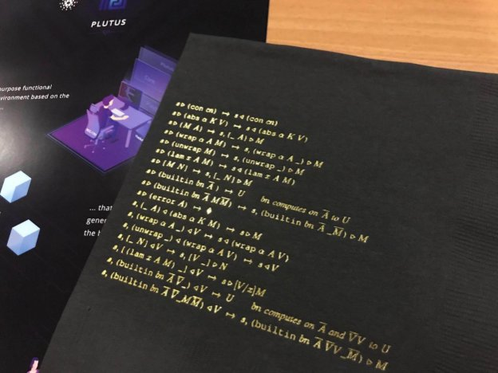

# Launching Plutus and Marlowe at the inaugural PlutusFest
### **IOHK’s new smart contract tools for developers and financiers**
 17 December 2018[ Amy Reeve](/en/blog/authors/amy-reeve/page-1/) 3 mins read

[ Launching Plutus and Marlowe at the inaugural PlutusFest - Input Output](https://ucarecdn.com/83c2ef93-c19a-4c4b-b796-239c959fb849/-/inline/yes/ "Launching Plutus and Marlowe at the inaugural PlutusFest - Input Output")

### [**Amy Reeve**](/en/blog/authors/amy-reeve/page-1/)
Technical Writer

Marketing and Communications

- 
- 

Last week IOHK hosted the inaugural PlutusFest at the University of Edinburgh. Members of the IOHK team flew in from around the world, with interested academics, developers, financiers, and members of the press also in attendance.

 Professor Philip Wadler reprises his role 
as Lambda Man, PlutusFest style.

IOHK research fellow Philip Wadler opened the event - and his shirt, in traditional Lambda Man style - followed by a keynote from CEO and co-founder Charles Hoskinson, discussing the social nature of money, and why IOHK’s rigorous formal verification methods are even more important in the face of increasing decentralization.

Professor Aggelos Kiayias also spoke about the work of the Edinburgh Blockchain Technology Lab (BTL), and how they are working in tandem with IOHK to accelerate the transition of new ideas from academia to real-world applications. During 2017 - 2018, 21 academic papers have been published or co-authored by IOHK and BTL researchers, with a further 20 already submitted and awaiting peer review.

IOHK’s language architect Manuel Chakravarty introduced Plutus itself, a general-purpose Haskell-based functional programming language, designed for simplicity and longevity. It can be used to write both on- and off-chain applications, improving data transfer, code re-use, and developer experience when writing smart contracts, and minimizing the need for hard forks in the future.

Like all functional programming languages, Plutus ensures secure, high assurance code by its very nature. During the design process, it was decided that the core semantics of Plutus should be concise and elegant enough to fit on a napkin - and sure enough, all attendees of PlutusFest received a limited edition Plutus napkin, along with Plutus t-shirts (and optional capes).

 Proof that the core semantics of Plutus fit on a (very fancy) napkin.

Professor Simon Thompson of the University of Kent also presented on IOHK’s Marlowe, a new user-focused domain-specific language designed to enable non-technical financiers to easily write on-chain smart contracts. The Marlowe research team have been working with business analysts to design smart contract templates, opening up the use of Cardano smart contracts directly to non-programmers in banks and other businesses, who will be able to automate financial transactions using cryptocurrency technology to save time and reduce costs.

Plutus and Marlowe are being launched now to allow interested developers and financiers to experiment ahead of the Cardano Shelley release in 2019. You can try out Plutus in the [Plutus Playground](https://prod.playground.plutus.iohkdev.io/ "Plutus Playground"), a lightweight, web-based emulator for writing and executing smart contracts in Plutus. For Marlowe, there is the [Meadow](https://testnet.iohkdev.io/marlowe/tools/meadow/ "Meadow") emulator to try out as well, find out more [here](https://testnet.iohkdev.io/marlowe/ "Marlowe").

Other talks during the event included a discussion of formal verification from IOHK’s director of engineering Duncan Coutts, as well as a series of academic talks covering System F-Omega and using Agda to formalize Plutus metatheory.

The event also provided an opportunity for the IOHK team, who are based all around the world, to meet and work together in person. The Plutus and Marlowe teams spent some time discussing future development directions - and in some cases, meeting each other for the first time - while the broader IOHK team took the chance to talk strategy, planning, and goals for 2019.

 From left, Grigore Rosu of Runtime Verification, Stewart Mackenzie of Fractalide, community member Robert Kornacki, and IOHK’s Lars Brünjes hard at work before PlutusFest.

If you’re interested in hearing the presentations from PlutusFest, subscribe to the [IOHK YouTube channel](https://www.youtube.com/channel/UCBJ0p9aCW-W82TwNM-z3V2w "IOHK YouTube channel") where high quality, re-recorded versions of the talks will be posted soon. A more in-depth recap is also available on the [Cardano forum](https://forum.cardano.org/t/recap-plutusfest-2018-in-edinburgh-scotland/18560 "Cardano forum").
## **Attachments**
[ Launching Plutus and Marlowe at the inaugural PlutusFest - Input Output](https://ucarecdn.com/83c2ef93-c19a-4c4b-b796-239c959fb849/-/inline/yes/ "Launching Plutus and Marlowe at the inaugural PlutusFest - Input Output")
